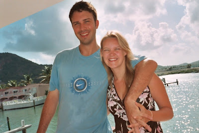

One love people.

The weather here in Antigua has yet to dip beneath 30 degrees. As a result I am pretty much a limp rag doll for much of the time but Lisette is absolutely loving it!

We've been watching pelicans fish each morning and flying fish jump from the water (prior to getting eaten) as well! You'd think they'd learn but alas they don't.

One surprising side affect of arriving in Antigua is that both Lisette and I have gone from not sleeping at all to developing some strange offshoot of sleeping sickness. Our favourite catchphrase of the moment is "I'll just have a little snooze" - we're averaging about 20 hours sleep a day at present

Lisettes ability to make friends in all places as ever knows no limits - we got to go to a \*very\* lively Antiguan church with Roxanne (one of the girls that works here) as a result of one of Lisette's "friendly chats".

Despite that, to our surprise the Antiguans as a bunch don't seem to be the most cheerful people going - one is rarely greeted with a smile... As a result a new game has been formulated called "make an Antiguan smile" - it's actually quite easy to play and remarkably rewarding!

Yesterday we went on a "Catamaran" boat (we think) to Great Bird Island. We then felt a little robbed when we discovered not a single bird on it at all! We did meet a friendly family from Darlington though.

One heart,

John and Lisette

