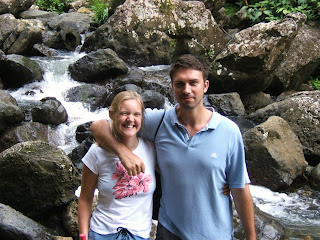

Hola Amigos! Well, last time I mailed you it was from the comfy environs of Antigua where pelicans woke us each morning as they fished for food outside our villa. Times have changed! We left Antigua after a week, handed in the keys and caught a plane to Puerto Rico. Pleasant enough place, despite it being officially a "US territory" not that many people speak English (problem since that´s all we can speak!) Despite that we packed in some fun-filled adventures: 1. we explored "Old San Juan" - a very picturesque place
2. we hiked through a rainforest
3. we went to the Bacardi factory where they make all the rum - essentially this was one big advert in the name of Bacardi but the drinks were free... Shame I don´t like rum

<!-- -->

 Now some of you may know that Lisette and I decided not to take our wedding rings with us when we went away in case they were lost or (more worryingly) stolen. But rather than travel "ring-less" we hooked ourselves up with some wooden wedding rings - well to be more accurate Lisette wore her wooden engagement ring and I bought myself a 3 dollar wooden ring which I was really rather taken with. We caught the plane last night to Panama and landed about 7pm. We caught a taxi from the airport to where we were staying that night in Panama City - an area called "Condida". The hotel looked a lot worse than it had in the picture I saw when booking. The room was the very definition of "barren" - basic furniture, curtains that wouldn´t open, windows that wouldn´t open, no hot water. All in all, a bit depressing. So, to lift our spirits, we decided to go out to dinner. After 3 minutes of walking we´d realised that we didn´t like the neighbourhood that much. No streetlights, bars on every door and window, worrying people looming in the distance - scary. It´s worth bearing in mind that I lived happily in Brixton for 4 years or so - an area that many don´t regard as salubrious. This place made Brixton look like Butlins with balloons. I´d like to tell you that things improved in the clear light of morning. They did not. It´s some measure of the way we now feel about Panama City that we consider it´s probably unsafe to wear even the wooden wedding rings now. And in fact we have decided to cut and run. I type this missive from inside the Gran Terminal bus station just outside Panama City. We´ve got tickets for the 2215 overnight bus to David (pronounced Dah-veed). We´re leaving and we´re not coming back. Consider this an all points bulletin on Panama City - if you have any love of life and love of self then I recommend you avoid this place like the plague. We were lied to by the travel book - we can only hope that Boquette (where we go after David) is an improvement on this. I do have high hopes - it is coffee country and apparently we can visit the plantations.... fingers crossed! Adios, John and Lisette 

