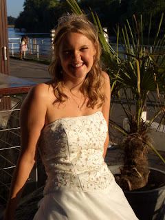
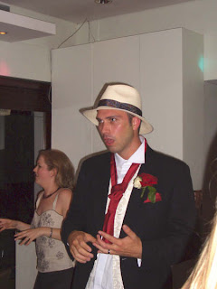

After 7 hours on an overnight bus from Panama City we made it to David (pronounced Dah-veed) this morning. Slightly eerie journey - we were woken at 2am to show officers our passports. Then at 4am I had the surprise of my life when I stirred to see a golden retriever padding past me in the aisle of the coach... I can only assume that it was on some kind of unsuccessful narcotics hunt since no-one explained (even in Spanish) just what was going on. Eventually he/she was retrieved by a man in a uniform with a very big truncheon by his side. At the time I had other worries though as hypothermia was beginning to set in. The drivers response to the heat and humidity outside appeared to be setting the air-conditioning in the coach to "stun" and to hell with the passengers. So as the journey continued all that could be heard up and down the coach were muffled curses and chattering of teeth But we made it! Arrival at 5:30 am was slightly traumatic though as my wooden wedding ring went for a wander under the bus, never to be seen again... Now on the market for another wooden wedding ring - glad I only spent 3 dollars on the last one Thought I´d pass on 2 snaps from the wedding we´ve just received: Lisette looking frankly stunning and me looking in need of a good rest... Take care peoples! 

