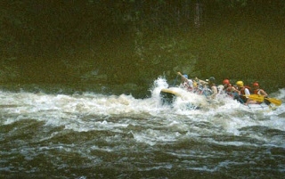

Heard that song? Well that´s me (and Lisette) right now We signed ourselves up to do some white water rafting yesterday with a dutch girl in our hostel called Petri. The people doing the organising told us that the river was somewhere between the "6th and the 9th most dangerous in the world" ..... but that due to favourable weather conditions and rainfall recently "we should be fine". A little worried but still confident we signed up and set off early the next morning. It was at this point our guide started telling us things like "if you get caught underwater you should consider whether you want to die or break a bone to get free". Marvellous. By the time we actually got in the water it was with a large number of reservations and no small amount of fear. These fears seemed quite well justified once we´d been through the first couple of rapids and come fairly close to drowning. It was at this point I noticed that the strap that was supposed to anchor my left foot to the boat was missing... And that I was developing cramp in my left leg as I furiously held fast to the side of the dinghy for dear life... But I´ll not over-egg this story - we survived. We got sunburned. We got eaten by mosquitoes. We drank plenty of river water. We fell in the river. We were thrown in the river (our guides could be politely described as "mischievous"). We got scratched, bruised and battered.... but miraculously we didn´t die or suffer extensive injuries! But we hurt so much. It´s now about 24 hours since we finished and I feel I´ve aged about 70 years. I know what it´s like to be old now. I´ve had the sneak preview. Ouch. On the plus side we have at least picked a good spot in which to recuperate. Having spent our first 48 hours in Panama comparing the place to Gotham City on a dark night we have now reach a very pleasant spot. It´s like a Swiss mountain town but without the Swiss. It´s a village high up in the Western Panamanian hills called Boquete. I highly recommend it! Ít´s coffee country and we´ve toured a nearby coffee plantation and done a coffee tasting session. My sanity is definitely returning! I´m now off to have a Latte in one of the nearby cafes - at the respectable price of 1 US Dollar... thank you very much! I don´t think this place will stay like this long though. Americans that don´t like paying taxes have discovered this place with a vengeance and as I write this they are tearing down local coffee plantations to build gated communities. Bit sad really. Hope to bring you more cheerful news in our next missive, John and Lisette 

