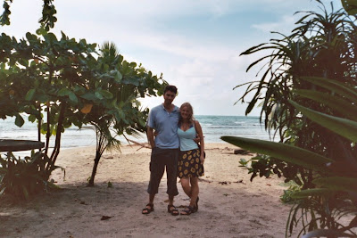

Because then I wouldn't feel so bad....

3 weeks in and we're feeling the pain of not being able to communicate. Last night we went to a Chinese restaurant for dinner (in Bocas del Toro - where we've been for 3 days now). I don't think anyone in the establishment actually was Chinese but that's still what it called itself.

The menu was presented and as with Chinese places the world over we were presented with a menu which was comparable in size to the complete works of Shakespeare. Not to be defeated we ordered some beers (we have at least learned the phrase "cevesa" during our travels). Further study of the menu didn't really render much hope apart from the fact that I identified "chow mein" which I thought might make a nice side dish to share. When the waitress came we decided to chance it and order with our fingers crossed....

This was a mistake.

When the meal finally came we discovered we had ordered the following:

- Strange crisps - sort of the Panamanian/Chinese answer to poppadoms I can only assume
- Spring rolls - traditionally these are filled with beansprouts and other things. In this part of the world bean-sprouts are hard to come by and so the Panamians are using a bean-sprout alternative: cabbage. I don't consider it an unqualified success
- Beef with rice noodles - a slightly bland main course for Lisette
- Chow mein to share - but after a mouthful I decided it was better to leave it
- A plate of fried rice. This was my main course. I distinctly heard the waitress cackling with laughter to herself as she strolled off. ("No tip for her", I thought at the time)

<!-- -->

Depression and determination arrived in equal measure as I determined to eat the plate of fried rice. However, after many a forkful I finally had to admit defeat ... It was that or be riced to death. What a way to go.

We're now off to stay in our "eco-lodge" for 2 nights - out in the middle of nowhere!

It'll definitely be a change from Bocas town which is essentially full to bursting with young Americans ever in search of an "alternative lifestyle" - mostly expressed in the form of beads, bongos and piercings in unusual places. They have managed to furnish me with a second wooden wedding ring though (to replace the one that went under the bus in David). It 's a little on the unusual side this new wedding ring - it's in the style traditionally worn by "Ming the Merciless" (all you Flash Gordon fans). Though the I should say that the outlandish style of my new ring does not appear to have intimidated Lisette in any way - as yet....

In fact it's quite a nice town - particularly if you like dogs. (I do!) There are many many dogs that leisurely stroll the streets here, occasionally pausing to beg for food, stretch or scratch for fleas... There's one in the hostel where we're staying that sleeps underneath the sofa. It's also a nice town if you like vultures. Huge ungainly birds that stroll the roads looking like huge threatening bald ravens. I haven't seen them picking at any carcasses as yet - perhaps they live off rejected chow mein from the Chinese restaurant...

Take care people!

John and Lisette

