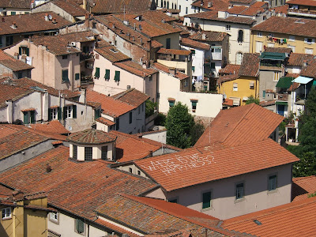
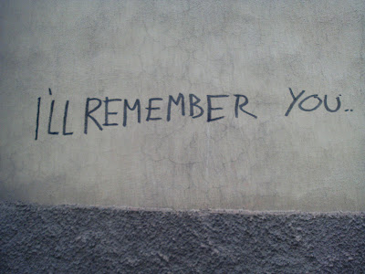

Dear all,

Lisette and I have finally made it to Bologna - and have officially left Tuscany behind. Now that we've got here I'm increasingly of the opinion that we never should have left. Bologna seems somewhat industrial, hostile and - dare I say it - mugging territory. (For the more nervous of you I haven't actually seen direct evidence of this - it's just a feeling)

We pulled into town latish last night having caught the Eurostar from Firenze/Florence to make our journey. That in itself was a bit of a surprise - I was only aware of the Eurostar chugging along between Waterloo and Paris. Quite unexpected. Having arrived and hauled our stuff to the hotel we went for an evening saunter during which I made the following observations:

1. There's a lot of cars
2. There's some dodgy looking blokes and a distinct absence of women travelling by themselves (in stark contrast to previous destinations)
3. The graffitti here is excessive and depressing.

<!-- -->

You might think that observation 3 is a bit odd. Surely all grafitti is depressing? However that's not my opinion; I'm highly in favour of the works of Banksy and the like. That said almost all grafitti is depressing. I don't wish to see another "Tox '04","Tox '05", "Tox '06" or "Tox '07" \*anywhere\*. "Tox", in case you are wondering, is the tag of some London sort who wanders around scribbling his chosen moniker and the year in which it was done pretty much anywhere he can in London. I'm not sure what he hopes to achieve by adding the year of defacement as a suffix to his tags. I can only assume that he genuinely believes he is an as yet unappreciated talent who's work will be toured by future art historians who will take great interest in the "progression" of his work. "Ah yes class, an '06' - truly the days when you can start to see Tox stretch himself. Note the positioning of this tag on a busy railway line. This would indeed have been quite a tricky spot to reach and great nerve would have been required in the execution of the 'tag' itself..."

I digress...

Anyway - Tuscany on the whole is not without grafitti. However there is a relatively small amount of it and if you would credit it, it is actually rather poignant. For a start, it's not "tag" orientated. That is to say, there are actually things written which you can read rather than simple "tags". Secondly, and for no obvious reason, the grafitti is in English. I don't why - it just is. Finally, that which is written is actually quite interesting... occasionally even moving! Here's some of the things we found written:

"Where is the happyness?" - written on the roof of a house in GIANT letters. We spied it from the top of a tower (we've climbed quite a few towers this holiday...) "I don't want to be alone - do you?" "I'll remember you" - written on a wall in Lucce.

Stirring sentiments don't you think? You could almost join together the different entries to form a story. Sad man is very lonely. Declaims "Where is the happiness?" to the empty world, emphasising further his solitary existence. Sad man meets someone passing through town and they get talking. After they've got to know each other a little, perhaps had a drink to reduce the inhibitions, the sad man opens up and says "I don't want to be alone - do you?". A friendship (maybe a romance?) begins between the two - the sad man is not sad anymore. Finally the other (whoever it may be) has to move on for whatever reason. The man (no longer sad) says to the other before they leave: "I'll remember you". A beautiful story... don't you think? I reckon there's a film in there somewhere...

slug: avoid-bologna-tuscany-is-better
---

Anyhow Lisette and I are doing our level best in the interim to avoid Bologna. Today we're visiting nearby Modena (home of Pavarotti and Balsamic vinegar) which is very charming. And tomorrow we move on to Lake Garda - about which we've heard very good things indeed.

See you all soon!

John

