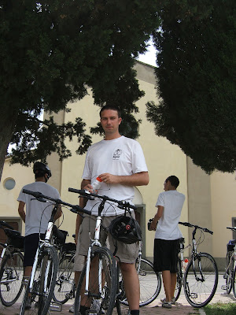

Hi All,

Am 30!

Currently sitting in internet cafe prior to catching the bus to Siena for a day out. So far have been to Pisa, Lucce and Florence (where we are currently holed up in a very nice place indeed!)

Yesterday was spent cycling round Chianti with Keith (Irish) and Andy (Scottish) - for some reason Italians dont feel up to running bike tours themselves... Was very pleasant - we got to taste award winning wine and olive oil along the way made by a Count and Countess no less! (Not of the vampiric variety we have been assured) A fair portion of the days entertainment was provided by Andy who is possibly the most blatant of chat-up merchants I have ever seen in operation.

Sample quotes:

- This way people this way - and American blondes can sit just here...
- Everybody in the van - girls you sit next to me
- So Keith, the story is they dont like me very much but they do care for you. You talk them round and we'll see what we can do next...

<!-- -->

Re-reading all of this makes his actions seem somewhat worrying. But the fact that each utterance was made in possibly the strongest Scottish accent known to mankind meant that the Americans (which was basically everyone apart from us) were putty in his hands... Very entertaining from a watchers point of view!

The leaning tower of Pisa still leans I can assure you. Lisette and I climbed it and surveyed the view (at an angle). Was great. Seems smaller than I remember it but the last time I visited it I was about 2 feet shorter I suppose.

See you all soon people!

love John and Lisette

