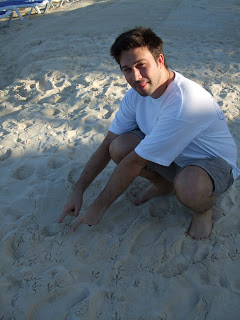

Dear All, We're in Mexico. And clothes-wise all that I have is all that I'm wearing. If I could offer you a few pieces of advice to guide your life they might go something like this... 1. Don't go to Miami - ever 2. Don't fly American Airlines (Mangesh I should have listened) 3. Pack everything useful to you in your carry-on luggage 4. Don't buy liquids in an airport Let me elaborate. Lisette and I arrived in Miami yesterday afternoon en-route to Cancun (Mexico). We thought it would be a simple matter of changing planes and off we go. No such luck. Instead we were stuck in the longest slowest moving queue we've ever experienced so we could go through "immigration". Why we had to do this since we had no interest in the USA apart from treating it as a glorified petrol station I don't know. Anyway you can't argue (well you can but people that do that are rarely seen again) and so we bided our time,buttoned our lips and finally got through. Lisette had been shopping for shampoo and suncream back at Heathrow. This standard activity made Lisette a clear threat to America and these items were thus confiscated by a venomous harridan in Miami airport. Somewhat unreasonable we felt given that the aforementioned items had been purchased air-side at \*Heathrow airport\*. For some inexplicable reason we had to pick up our bags and carry them 20 metres for them to be put onto the flight. So off to baggage reclaim we went, picked up Lisette's bag and then paused. No sign of my bag. Nothing. Nada. Nowt. In a mood borne of anger, frustration, tiredness and general fatigue I asked the nearest staff member - "Where's my bag?". "Que?" "Bag?" "Que?" "Bag?!" "No Ingelese" More conversations of this nature occurred, each with a different person. I soon came to the conclusions that - even though this was Miami NO-ONE SPOKE ENGLISH - no-one knew about my bag or was remotely interested in it. Having done all we could (and achieved nothing) we boarded the plane for Cancun where we hoped to miraculously see my bag appearing on the baggage carousel. We didn't. Not only that but we didn't see Lisette's either. At 4pm yesterday Lisette and I realised that we were done for. No clothes, no chargers, no summer dresses (Lisette not me). With heavy hearts we left the airport having left our details with the American Airlines staff. We headed for our destination - the Isla Mujeres (the Island of Women) - feeling pretty much pot-less. This story does not have an entirely sad ending as we are staying in a beautiful room that fronts onto a beach (Lisette very pleased). What's more in the morning we turned up for breakfast to discover that Lisette's bag had miraculously arrived! We have eaten gorgeous Mexican food (tortillas / yucatan eggs) and we're sleeping well. Spent the afternoon today by the pool in hammocks watching the local wildlife (birds and iguanas) flap and stroll around us. Alas though I still have no bag and I have yet to find a shop that extends it's range beyond ceramics, hats and beer-logo-ed t-shirts. Am fervently praying that I will either find more varied shops or my bag will turn up. If neither happens then I fear I will soon be feeling none-too-fresh... But it's a new feeling to be standing wearing pretty much all the possessions that I have to hand. Yours hopefully, John and Lisette PS "All property is theft man" 

