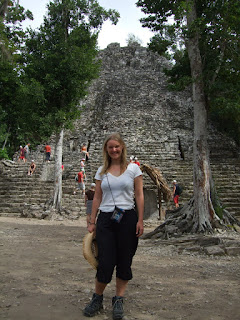

....Do you need more money? If so then I have the step-by-step plan for you: Step 1: Remove light fittings from rooms - no wasting money on expensive bulbs. Step 2: Remove plug sockets from rooms - let´s not have customers using that expensive electricity. Step 3: Stop changing the sheets and towels in the room - saves the environment and saves on the laundry Step 4: Treble your prices. Step 5: - And this is key - Change the name of your hotel. You are no longer the "**Hotel Filthy Lucre**" - you are the "**Righteous (\**not*\* miserly) Eco-Lodge**". Now sit back and watch the cash roll in! :-) I can write this with some authority as Lisette and I have been staying in an eco-lodge (and staring with shock at various bills in the interim). We moved on from Isla Mujures on Monday. At this point I was still bagless and getting a little weary of the "wash clothes in sink before going to sleep" routine I´d adopted for sanity´s sake (and for that of the local air quality). When it came to checking out we decided to try our luck by phoning American Airlines one last time. Good news. Apparently, having finished its world tour, my bag had headed for Cancun and was waiting for me in the airport. Delighted, we breathlessly told AA that we were leaving our current hotel now and so they should deliver the bag to our new hotel - the Luna Maya in Tulum. AA confirmed that was fine. We asked the hotel staff of the "Maria Del Mar" to refuse our bag if it should be delivered by accident and we headed South to Tulum (via a half-hour boat-ride, a 2 hour coach-ride, 2 taxis and a bit of walking). About 6pm we arrived at our new hotel - sorry - eco-lodge to meet probably the surliest man in the eco-lodge business. We asked him if we could use the phone to ring AA. We didn´t think this was too much of an imposition - it was a toll-free number after all. "No phone" he gruffly informed us. It seemed there were no lengths to which the penny-pinching of an eco-lodge would extend. After some unsuccessful attempts with our mobile phones we prevailed upon his good nature once more (clearly a desperate move). Glaring at us, he threw his mobile phone in our direction so we could make the call. AA told us that the bag was still "in-transit". The next morning my bag still hadn´t shown - something of a mystery. Coupled with this, Tulum was absorbing the kind of rain that is usually reserved for Biblical floods. Lisette and I sought protection in an internet shop until the worst was over. To kill time we phoned AA once more - the bag was \***still**\* in transit. Still! Apparently having circumnavigated the globe by air it was now attempting a tour of Mexico by land... We checked our email and found this waiting for us: *RE: Baggage it's in Cabanas Maria del Mar. From: CABANAS MARIA DEL MAR Sent:15 January 2008 16:45:14 To:mailto:xxxxxxxxxx@gmail.com Dear M. Jonh Reilly, Last night the company of American Airline brought the missing Bag at this hotel, the girl at the reception were thinking that still staying in the hotel and she received the bag, now you will have to come back at the Island for your bag. Kind Rgrds Clara. * Hmmmmmm........ I'll spare you grisly details of my reaction to this. Fate had made thrown us a curve ball and all we could do was biff it back to best of our ability. To that end: 2 boat-rides, 2 coach-rides, 4 taxis and about 8 hours later I had my bag by my (dishevelled) side once more. I have clothes!!!!!!!!! I have chargers!!!!! I have sandals!!!!! Since that time Lisette and I have investigated the Tulum Ruins (covered with iguanas and generally pretty), walked the beach, swam in an underwater cave with bats, climbed a Mayan pyramid, sacrificed a goat (well symbolically), abseiled (into the aforementioned cave), kayaked a river, eaten Mayan food, cycled the dodgiest bikes known to mankind and watched American tourists frolic next to a hungry looking crocodile (not nearly hungry enough as it turned out). We are now staying in Valladolid. I have no idea how to pronounce it. lots of love John and Lisette 

