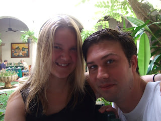

But fear not you "Wind in the Willows" fans out there - "mole" as far as the Mexican people are concerned has nothing to do with cute brown burrowing creatures... Rather it´s a thick sauce that is poured liberally over tortillas. For added differentiation it's also pronounced "molay". So we've had endless fun repeating "moly moly moly moly" whilst sporting makeshift beauty spots constructed of compressed bread. Keeps us entertained. Surprisingly it (mole) tastes like chocolate. This is because it´s made of chocolate (amongst other things) - unusual in a main meal but very nice indeed. We´ve never quite got to grips with our jet-lag on this trip - mainly as I´m firmly convinced that Mexicans have got it dead wrong time-wise. The sun rises at about 5am. Early. However it sets at 5pm... Too early to my mind. I think personally that they should take a "let´s maximise the sun" approach to their lives and switch the clocks accordingly. Given that I don´t speak Spanish and I don´t know who to ask I´m still none the wiser as to their reasoning. We've decided that we want to see as much sun as possible and so we're early to bed and early to rise as a consequence. (Am also vaguely mindful of Dad's saying that "early to bed and early to rise makes a man healthy, wealthy and wise" - not sure if there's anything in that or if he just liked the feel of the phrase on his tongue...) ---

 When I last put fingers to keyboard Lisette and I were in Valledolid which is sort of in the middle of the Yucatan Peninsular (the East-most part of Mexico). We were staying in a nice hotel (pictures of which you may have seen) which appeared to be populated mostly by retired Americans and student Americans (around the age of 18 and searching for countries with less stringent licensing laws). As mentioned previously, we've been crashing early of an evening and so headed up the wooden hills to bedfordshire at about 8pm. The next thing we knew the world was erupting. It was dark outside as far as I could ascertain and we were very much in the company (separated only by a wall) of the American students. After listening to their output for about 5 minutes it seemed likely that they were attempting to make some kind of sequel to the 70´s film "Animal House". Maybe "Animal House 2 - they´re back and yet somehow less charming". Reasoning that interrupting them in their inebriated state would likely only lead to a difference of opinion Lisette and I decided that discretion was the better part of valour and vouched to take a midnight walk instead. A couple of minutes later, Lisette and I were in the square. Contrary to our expectations of a quiet walk the square was in full fiesta flow. A stage had been erected on one corner of the square and on it was a full band, multiple singers / dancers / drummers / horns - the list goes on! In the square itself the people of the town (from young to very old indeed) were dancing away in the midnight air. The noise was incredible. I can´t really describe properly what it was like - loud, energetic, pulsing... Mexican?? We watched for some time and even ventured the odd move ourselves (well Lisette more than me in all honesty). There seemed no likelihood that they would ever stop playing and so after an hour or so we drifted back to our hotel. Felt like a very cultural evening though. 

 Mexico appears to have no cats. Whereas cats wander the streets as if they own them at home there appear to be none here. In their place are dogs. Not dogs on leads pulling owners along after them. Rather dogs running free and begging for scraps - think "Tramp" - as in "Lady and the ....". However, we´ve found an exception. We are now staying in Merida (not our favourite town - for reasons I won´t bore you with) in an amazing b & b called the Casa Mexilio. The only 3 cats in Mexico live here. And at night Casa Mexilio becomes Catfight Club. We wake up about 4 or 5 times a night to catch the most interesting bits. A "Wroooooooowwwwlllll" indicating that Ginger has Mr Tiddles in a headlock. A "Hisssssssssssssssssss!!!" indicating that Duster is defending his territory from Ginger. Off to Puerto Morelos for our last adventure now... love John and Lisette
