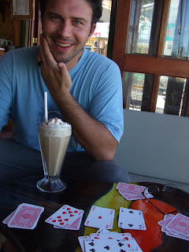
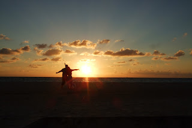

But not for much longer! Currently a major component of the day still involves the seeking out of good coffee wherever we might be. Much as Indiana Jones seeks out historical treasures, I seek quality beverages! Rather than the standard coffee that I go for at home I´ve been instead imbibing iced coffee by the bucketload - partly for the heat and partly for this is truly the elixir of the annointed! To give you some idea of the affection in which I hold this drink I should say that I type these words in a cafe in which I have so far consumed 4 Cappucino Frio\`s today. Ahhhh, life is good! 

 In general Merida was a dead loss on the coffee front, this may explain (at least partially) my lack of delight with the place. We actually spent most of our time in Merida going on trips to get out of Merida. And some of these trips were champion. I can now say that I\`ve seen 24,000 flamingos in the flesh! (well more the pink feathers) To my surprise not one was standing on one leg. Was tempted to ask for half a refund. All were very pink indeed - we were told this has something to do with eating shrimp. Lisette and I have now reached our final destination before heading home. After 6 hours on buses yesterday watching "Pirates of the Caribbean" in Spanish (crap, by the way) we are in Puerto Morelos (back on the east coast of Mexico again). We´re staying in the Amar Inn. Given our experience of the establishment I reckon that "Amar Inn" translates to English as something like "Home of the BIG BIG dogs". The place is a small B & B which is overrun with very large hounds - Great Danes a favourite. They\`re very friendly too - the most friendly is a golden retriever that appears to be part bear, such are her dimensions. Her name, ironically, is "Blondie"... The man who runs the place is also rather bear-like - it´s very possible that through his over-sized and over-muscled eyes she is but a cute yellow puppy - who can say? Lisette is very much in her element in Puerto Morelos as it contains the following: 1. Beach 2. Sun For me it´s good as it contains: 1. Hammocks 2. Shade So as I seek shelter from the sun Lisette comes to visit me every hour or so. Last time I saw her she had managed a new first - she has managed to tan 95% of her body - the only exception being the tops of her feet which are about the same colour as lobster that has failed to escape from the machinations of an enthusiastic chef... See you all soon - wonder if our luggage will make it back to Heathrow?? John and Lisette 

