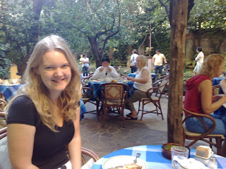

Dear all, I type this from the sunny town of Sorrento in Southern Italy where Lisette and I currently reside! We pulled into town late on Sunday night and since we are in the birthplace of pizza we have devoted much of yesterday and today to researching the topic in depth. The first part of our education took place last night when we went for dinner at midnight (the journey to Italy having taken somewhat longer than we anticipated). Unfortunately despite having that 'late Latin lunching' reputation almost all the restaurants were shut by the witching hour. In fact lots of places seemed to be open but all told us that they were shut and pointed us the to the main square. We had actually been deliberately avoiding the main square as each restaurant appeared to have extra zeros after the prices ( -Presumably this is for the pleasure of dining in the main square where all the Italians congregate with their motorbikes put-putting away in the background....) Anyway, since we had no option we attended one of the aforementioned restaurants in seach of sustenance. We both went for pizza and learned the first valuable lesson: 'Neopolitan' means that you get a pizza \***completely**\* devoid of cheese! Apparently this is traditional but I was frankly disappointed when Lisettes pizza arrived without what I had personally always considered to be the traditional topping... Fortunately my own pizza was not lacking on this front and so between mouthfuls I was able to offer up my sympathies to Lisette (who was essentially eating ketchup on toast as far as I could tell). Lesson two was not so much pizza related as 'main square' related and, as mentioned, we had a hunch on this one already. The bill arrived at the end of the meal and seemed somewhat larger than expected. Closer examination of the bill revealed the cause: Lisettes glass of 'house white' was clocking in at 12 Euro a glass! Lest I come over all grumpy - I can assure that I am not - just a bit stunned... and my credit card is still gushing blood from overuse... Today has proved very pleasant though. We have sat around in the sun and read books and papers, then made friends by donating said papers to English tourists gasping for an update on the sports news. We have looked over the bay at the pollution hovering above Naples and congratulated ourselves at not staying there ourselves ('There but for the grace of God go I...') We have wandered the streets of Sorrento... well not quite true. It was my brother David's wedding on Saturday (now happily married to Sarah) which involved a Kaili... Kailee? Not sure how you spell it - lets call it a barn dance instead. Anyway, Lisette was delighted by this and got thoroughly involved - so enthusiastic was she that took a tumble and damaged her foot. As a result the 'wandering the streets of Sorrento' has been more 'hobbling the streets of Sorrento' including pauses for Lisette to put her foot in the air to relieve ... something. Not sure what but apparently putting your foot in the air is a good thing. I am now cut short as someone else has been hovering near this computer meaningfully... We are off to Pompei tomorrow to gaze in awe at the subject of so many history lessons. Will look learned and serious, nodding occasionally with true understanding of all things volcanic! John and Lisette (currently resting leg again) 

