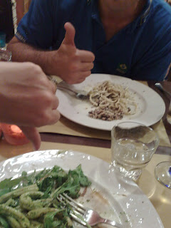
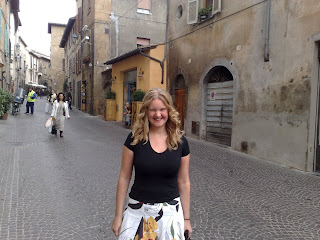

Each one the same face swathed in 90% black plastic, shielding the wearer from having to interface with the world. Oddly it appears that at roughly the age of 50 they all abandon their U2 ambitions and start to interact with people once again - reasons for this are not yet fully understood. Lisette is learning quickly that the term "local speciality" is not necessarily a recommendation. For lunch she had what is best described as "pig fat... on toast" and yesterday evening was a strange pasta dish that was so intensely green in colour that we have dubbed it "Kermit Pasta". Most of these strange menu choices have been down the fact that none of the restaurants have even a hint of an English translation and so we have been thrusting into the great unknown. Happily my choices have been much more pleasant - no fat on toast for me! However, Lisette has made me promise that we track down an English menu before we make a food choices for the next meal. 

 We took a trip on Tuesday to the town of Positano. We were assured by the book that it was an amazingly scenic and picturesque place. So it was. The slight (and unmentioned) quirk of Positano is that to get there one catches a bus. The buses weave a beautiful journey around some lovely coastline before finally dropping you at the side of the road. Once dropped off there appears to be nothing there at all - Positano doesn't appear to exist (Italys Brigadoon?). It is not until you look down that you identify the reason for this. Positano basically lives at the bottom of a sheer cliff face - it looks to the casual eye as though visiting is only possible for committed abseilers or parachutists.... After some rooting around we discovered that there was an alternative method of entry and that it was basically descending 9,999 steps. Maybe more. Naturally I had no fear of attempting this myself but I was worried for "Hopalong Reilly" (otherwise known as Lisette). Hopalong was still suffering from the foot injury obtained from dancing vigorously at David and Sarahs wedding. There was no real alternative though so over the period of about 2 hours Lisette and I descended (with many a yelp) into town. The happy discovery upon reaching town was that we could escape by boat rather than put my heart and Lisettes foot at risk on the re-ascent. Our journey home was consequently very scenic and was doubly improved by the fact that Lisette and I had managed to smuggle 2 restorative seafood pizzas onto the boat to sustain us. Think this irritated our fellow travellers though - jealousy is a terribly thing. By the way, for those wondering I havent forgotten how to use an apostrophe - I simply cant locate it on the Italian keyboard. Did devote some time to looking but at the end of the day it costs 6 euro an hour for the internet and so I have decided to put grammar (and no doubt spelling too) by the wayside. See you soon! John and Lisette 

