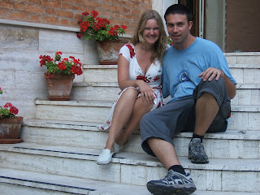
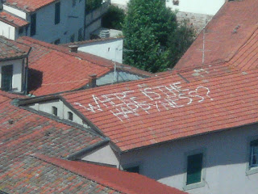

I have little, in fact no, tolerance left for young women who sit with their legs crossed on public transport. Why they do it is beyond me - surely they know they are taking up more than their allotted space when they do so? I mean, i'd be bound to notice if i spent 50 minutes kneeing the person in front of me in the back and non-stop kicking the person next to me with every vibration of the bus - wouldn't you? It's as if they are completely unaware of their own bodies from the ankles down. Give me strength. (By the way apologies if you believe I am unfairly maligning the good name of "young women" - it is just that I havent yet encountered any men / older women / boys / girls / dogs / cats that exhibit the same objectionable behaviour) 

 Enough with the moaning. As you can probably gather Lisette and i have been spending a lot of time on buses of late - we have been a little over ambitious with this holiday in that we are travelling pretty much from the bottom of Italy to the bottom of France. Unfortunately bad planning (on my behalf), strikes and changes in ideas have meant that we have found ourselves travelling all day for the last couple of days, finding somewhere to sleep at night and then repeating the pattern. Its a bit like one of those Jason Bourne films - just with less killing and only minor occasional identity changes. That said Lisette had a haircut in the hill town of Orvieto that she was very pleased with at the time - hair very curly and buoyant by the end. (Now alas flattened somewhat by the absence of good curling tongs and a freak rain shower) I have decided that the localising of place names is a mistake. London to an Italian is Londres. Firenze to an English speaker is Florence. Naples to an Italian is Napoli. The list continues... In my opinion all these extra alternatives are confusing and a waste of good words that could otherwise be put to good purpose. And we've encountered at least one American that spent a full week circling central Italy in search of Florence... Speaking of other nationalities, we met our first ever Romanian one on the train (when the strike was over): Marion the Romanian Nurse - in fact we shared a rail carriage with Marion and an Italian family on the way up from Pisa. The name might mislead you into thinking that Marion is female - he is not. In fact Marion is an ex-construction worker with much the same build as a professional wrestler. Conversation with him was eye opening. Ever wondered why there are so many people from Eastern Europe (ie ex-Soviet Union countries) keen to get into England / Italy etc? Marions take on it was this: "So it (the USSR) finished and suddenly there are all these products in the shops from all over world instead of just all of the USSR. And the non-USSR products were much cheaper. So no-one buys the USSR products and all the USSR companies went bankrupt." Consequently, Marion and his family at least had went looking for work where there were jobs - and in their case that meant Italy not Romania. We gave Marion the rundown on where we had been so far. Sorreto, sunny. Orvieto, medieval in a good way. Napoli horrible (we were only there for 2 hours but long enough to form an opinion). The Italian woman next to us (who was studiously not paying attention to us) notably snorted to herself at this point - presumably she agreed with us that Napoli was grim. Marion then decided to give us a bit of tourist advice and told us that in Sicily (where we were originally going) they were thieves and muggers. The Italian woman did not snort at this - not sure if Marion had just offended a Sicilian (for which he would no doubt pay if he was right) or if she simply agreed... See you soon! John and Lisette 

