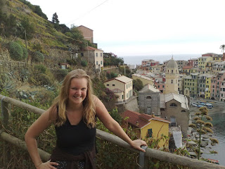
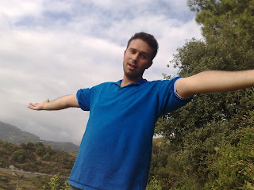

We have arrived in the Cinque Terre which is on the North West coast of Italy. The direct translation is "Five Towns" and the idea is that you stroll / hike from one town to the next marvelling in the sights of the sea and the beauty of the towns. And the towns are lovely - it is as if Walt Disney came here 80 years ago to get his ideas of what fairy castles etc should look like. 

 We are staying in the most Southerly town inside the Cinque Terre - Riomaggiore. There are no real hotels inside the Cinque Terre and the books (Lonely Planet and the "<s>Rough</s>

 Rubbish Guide to Italy") advise staying with locals. Accordingly we found ourselves following a burly, and I thought rather scary, Italian man home from the station after we arrived. Despite initial trepidation we ended up at a lovely apartment with a view of the sea at a fair price and with a gushing landlady who is wont to say things like "you should-a make-a the hay while the sun-a.... shines!". I think that at other times of the year we would be sharing this accommodation with every man and his dog but this being the off season we've fallen on our feet. Our attempts at making hay are mixed. The best idea is to rise early and be on the walking trails by 9am. Lisette and I have not quite managed that being somewhat on the tired side as well as being foxed by the unusual behaviour of the sun in this neck of the woods. Bizarrely it is pitch black until about 7.30 here when it suddenly becomes all brightness in a matter of seconds. This generally leaves us a little stunned and it isn't until I have had a few restorative coffees (and Lisette, teas) that life seems normal again - around about 10. So we hit the trails at about 11-12 (incidentally "Hopalong Reilly" really is on the mend and could now more aptly be dubbed "Mountain-Goat Reilly"). At this point the sun starts its full beam effects which tends to leave us panting at the side of the path wondering why we appear to be walking on our own. The reason is simple - everyone has finished walking at this point and is enjoying a leisurely lunch. We tend to hove into town around about 3-4ish absolutely drenched in sweat and waving empty water bottles in the hope of serious refreshment. And here is the miscalculation. One tradition that continues unabated in this part of the world is "siesta". Just as we arrive in town looking for sustenance all the shops close their doors, the restaurants stop serving and Lisette and I stagger round much in the manner of people who have just gone 10 rounds in a boxing ring and lost on points. 

 The restaurants all open again at approximately 7pm by which point we have often found our way home and promptly collapsed. No more do we venture out as we simply do not have the energy. Consequently it seems that an easy way to lose weight is to go on a "John and Lisette-style" walking holiday. Exhaustion guaranteed. Your only meal is breakfast. Onwards and upwards!
