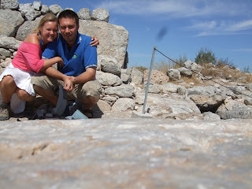
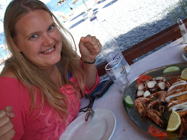

Dear all, Never ones to sit back and relax, Lisette and I have been busily exerting ourselves in Santorini. It's a good way to break up the mealtimes. The most ambitious activity so far has been a hike from our digs, halfway up the island on the West side, to "Oia" - a town at the North-West tip of Santorini. Looking at the map on the morning before the hike we scoffed at what a short distance it was and made plans to complete said journey in under 2 hours. This was not to be. 

 "As the crow flies" is a fatal way of looking at the world in these parts. It fails to take on board the matter of scrabbling up hills, down mountainsides and also the furnace-like heat - none of which does the humble crow have to contend with. Shortly after departing Firostefani ("our digs") these points came sailing right home to us. Regular examination of the GPS map on my phone made us realise just how far we actually hadn't travelled. Nevertheless, we pressed on, and were indeed rewarded by many a fine view. About halfway through our hike we came upon a very beautiful chapel sitting on top of a peak. Looked straight out of Mammi Mia. (Which was I think filmed on a Greek island?) Lisette took time to take scenic photo's of the church. I sought shade and took time to empty the the last of the water bottle (gentleman that I am). It was at this point I became aware of dog scampering around the church in a jolly fashion. The breed of the fellow was unclear - "blonde mongrel" is probably the most apt description I can come up with. For some reason (and with no objection from me since I am a general fan of dogs) the dog decided that he was going to stick with us for a while. So we descended from the chapeled-hill, Lassie in tow - occasionally running ahead, occasionally drifting behind. The path which we had followed so far had basically been a footpath which wound through the hills of Santorini and passed through the occasional town. However, the path now came to an end and forced us to walk on the main road until a new path started later on. The dog was still with us at this point and was taking a turn at leading. Given the dog seemed to be several years old and still alive, we had every expectation that it had mastered road safety as a young pup. - Consequently, his actions when the first car rounded the corner were not less than staggering in our view. Traffic (the name we subsequently attached to the dog) reacted to the presence of a distant car in a rather different fashion to myself and Lisette. We, having observed the way the Santorinis drive, pretty much attached ourselves to the cliffside as we waited for the car to make it's way past. Traffic, on the other hand, made his way into the centre of the road. Hackles up and snarling he crouched, facing down the approaching car. Daring it to look him in the eyes, he pounced, leapt up, and raced, barking madly, directly at the car. Lisette and I were at this point screaming, watching in slow motion, imagining the only possible future that could present itself. And then with seconds to spare, the car swerved, narrowly avoided hitting Traffic, further narrowly avoided going off a mountainside and then slowly swerved left and right up the road until it returned to normality. Traffic, meanwhile, stared proudly at his bested conquest. That's right Ladies and Gents - we have found a dog that plays "chicken" with cars! I would like to say that this happened only once and that Traffic learned his lesson. He did not. With every car that came round the corner the same scenario was repeated. The only difference was that Lisette and my screams got louder each time. -Convinced with each iteration that this would be the one. This would be it. But no, Traffic lived to fight another day each time and for all we know may still be there doing the same. Lisette and I will never know though because as soon as we came upon the new path up from the road we legged it and didn't look back. For my part I am choosing to believe that Traffic has special powers and will live forever. John and Lisette 

