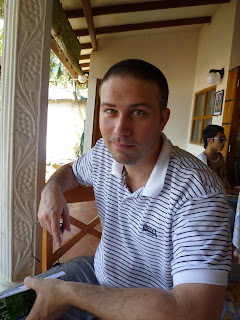
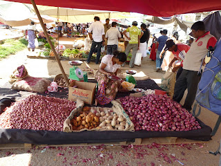

...and this is The Great Escape - I'll come back to that.... Hello Folks, Lisette and I have headed off for one of our adventures - this time to Sri Lanka. Unlike our usual approach to holidaying (buy tickets, catch plane and pray) we have decided to deviate. We are "on a tour". The tour started somewhat inauspiciously. We arrived after a 12 hour flight at 3 am on Valentines Day in Colombo. We were met by a man bearing an "Adventure Company" sign who bundled us into a van together with our fellow tour-ees/tour-ettes. All were pretty shattered at this point and pretty much hoping for instant bed. Not to be. Our tour guide (Asangha) drove us for quite some time and we were in some pretty ropey neighbourhoods by the time he confessed that he may have taken a wrong turn at some point. However, by 4am we were delivered to a hotel. The good. The bad: hotel was pitch black and it soon became apparent that we did not have reservations. The group mood did darken somewhat at this point, particularly as by now the flies (which dont need sight to detect human flesh it seems) were by now crawling upon us fairly profusely. Not much happened for quite a long time as I recall. Asangha made a lot of phone calls, essentially begging the hotel to open up and show us the love. Am delighted to say that, in the end, they turned on the lights and in due course delivered us to rooms where we collapsed. It was later revealed by Asangha that he had made reservations for us... but not at that hotel. Hey ho. Expectations suitably lowered.

---

In the time since our arrival I am proud to say that Lisette has been performing a valient service. She has selflessly allowed herself to be attacked by swarms of mosquitos thus sparing her loving husband from suffering the same fate. Given the choice between tough-skinned John and fair-of-leg Lisette the mozzies are in \*no\* doubt. They'll take Geordie meat any day. At last count Lisette had about 20 bites. I have a small one on the knuckle of my right hand. Lisette is truly my sacrificial anode.
 
---

The tour has properly kicked off now and we have been busy. So far we have: - Eaten some very hot food - proper "crikey-get me water" curries. Experienced some very hot and humid weather. - Been out on a boat at dawn watching a variety of dolphins hurl themselves out of the water like so many grey-skinned teenagers doing skateboard tricks - Travelled round several of the "most important archeological monuments in the world" (Asangha's words) - Inspected a number of "eighth wonders of the world" (also Asangha's words... hmmm) - Travelled from the coast of Sri Lanka to Habarana in the steep hill country. And it's in this last point that lies the rub. It has occurred to me that I have become a prisoner of circumstance. Lisette, I, (and the tour-ees / tour-ettes) are holed up in a hotel in Habarana. There is nothing in Habarana - it's a one-elephant town. Normally, Lisette and I like to get out and explore. See what the town has to offer. Go for a meal etc. Can't do any of that. So we're kind of stuck either doing stuff on the tour or stuck on hotel grounds. Not that it's an unpleasant hotel. It's kind of like a "nice" version of a World War II Prisoner-of-War camp. (Hence my allusions to the Great Escape - not too sure who Lisette would be in that scenario so lets skate over my inaccurate analogies). As well as this, we are caused to rise very early every morning to "get the best of the day". Tomorrow we're up at 5:30am. Today we were up at 6:30am. The day before yesterday we were up at 4am. Not quite my bag baby. So not sure yet if tours are "us". We shall have to see if this pans out...

---

 That's me for now. I'm off to read my book as unfortunately (definitely from Lisette's point of view) the weather has turned. We have gone from a combination of body-melting mid-thirties sunshine and humidity to the monsoon season. (which I didn't think Sri Lanka had - but you learn something new every day) Toodle-pip. John and Lisette 
