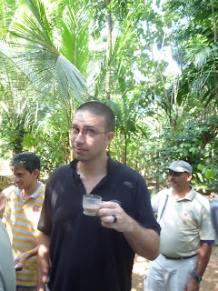
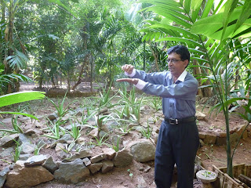

...no - as it turns out I'm \*all\* woman... (thanks to the good Professor) Hi all, First up, thanks for your emails - apologies for not responding in kind but I've just recently (within the last half hour) been re-introduced to the world of "pre-broadband". Internet connection in Kandy is pretty much approximate to to internet connection in England in the early 90's. Maybe slower. And so each keystroke has alas become rationed for today. ---

 Following about 12 hours of monsoon rain Sri Lanka has returned to levels of frankly dangerous heat and humidity. Even Lisette (bearing in mind her boundless enthusiasm for heat) has declared that it's "a bit much". If you'd like to paint a mental picture of me at present you should imagine a man in a sauna, fully clothed and eating curry. I'm hot. ---

 I've been to Happyland. Happyland, it turns out, is a spice garden on the way to Kandy. We visited it yesterday and were greeted by quite a short man (even by Sri Lanka's somewhat petite standards). In the full heat of the day he dressed in manner of a character straight out of "Wall Street": full suit, a coloured shirt with white collar and cuffs, designer glasses, teeth whiter than the sun - and maybe even braces (but that might be my imagination running away with me). I never learned the mans name, but as he led us around his garden (lair?) and showed off various plants / seeds etc I mentally came to categorise him as one of the Bond-villains that has yet to be. For the sake of reference I shall refer to him as Professor Magic Plant (PMP). Apparently PMP has cured \*everything\*. His tour went something like this: "and here we have plant X, it cures the common cold. And here is fruit Y - it prevents cancer and makes you thin..." The tour concluded in a open air tent where we all perched upon benches in front of him, the great showman. We were told that we were to see some "great Asian magic" and that a lady was required. Ever shy and retiring it turned out that all the Tour-ettes were for some reason otherwise engaged. Possibly having made the same mental assessments that I had. PMP cast the net wider: "Perhaps a gentlemen would be obliging?" The Tour-ettes felt this was very good idea and my very own Tour-ette Lisette went so far as to nominate me saying "John will do it. Won't you John?" 

 I was then brought to the front of the tent and one of PMP's unlovely assistents smeared an unknown pink cream on the back of my right hand. I then returned to my seat. At this point Big George (one of the Tour-ees) decided he'd definitely got the measure of PMP and exited stage left (pursued by a bear?). Last seen heading in the direction of the tourbus. Whilst Lisette and I continued to stare at my hand a number of demonstrations took place. Some foul smelling liquid was passed round for tasting. Made from pineapples I think. Then a forced massage was given to all the remaining audience members save me and Lisette (who resisted the greased up assistants of PMP quite forcefully). Once the fellow audience members had been fleeced of their roupees PMP addressed us. "And now is time to see the great Asian magic... Come forward" (pointing at me). I went forward feeling no little trepidation. It's not every day that Paul Daniels evil Sri Lankan cousin experiments on me. From his pocket PMP dramatically pulled some Kleenex. He then rubbed the Kleenex on the back of my hand to reveal..... no hair. "Is all natural!" beamed PMP whilst I, somewhat forlornly, compared the hairiness of my left hand to the hairlessness of my right hand. 

 I've never felt so underwhelmed and yet relieved at the same time. Waving to you with a hairless hand from high in the hills of Kandy. John and Lisette
