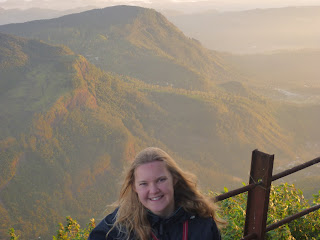
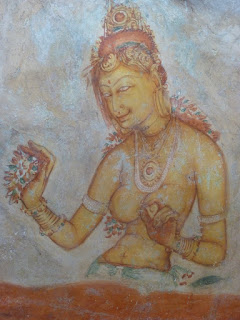

... Dalek. Hi all, Many things I am capable of but, as I discover, many things are unwise. Lisette and I were woken at the princely time of 1:50 am and tumbled out of bed, into clothes and into the blackness outside. The plan, such as it was, was to climb Adam's Peak which is either the fourth or fifth highest mountain in Sri Lanka (Asanga and the Lonely Planet are still arguing the toss on this point). The plan was to reach the summit and watch dawn break from the top. Also, Adam's Peak famously casts a shadow the shape of a roughly equilateral triangle just after dawn breaks which we were also hoping to see. Climbing a mountain in the dark is less fun than you might imagine. There's a lot of stumbling, wheezing and general bitter self-recrimination as to why you ever agreed to doing this in the first place. There's also a fairly worrying amount of losing the people you're travelling with as well. In the event we did finally make the ascent, reaching the Summit at roughly 6 am. It was a pretty impressive sight. However, for some reason I appear to be wired to be underwhelmed though. As Lisette bounced around like Tigger, delighted in the vistas abounding my own eyes were cast down gazing at the vast tract of pathway we had traversed and pondering the joys of doing the self-same trip in reverse. Oh exquisite agony here I come. 

 To complete the full round trip (bed to summit to bed) took about 7.5 hours - we hobbled back into our quarters around 9:30ish. And felt pretty bad. (Physically - obviously we were mentally quite impressed with our own derring do and what not) This pain was a mere taster though of what was to come; the next day came the real kicks. Lisette and I woke with legs which appeared unwilling to bend more than a fraction at the knee. And that with muscles protesting like Greeks. After no small amount of yelping we fashioned a way of transporting ourselves, shuffling much in the manner of penguins. So: Breakfast. Out the door, turn right, shuffle 10 paces, turn right, shuffle 10 paces, turn left. Stairs. Oh. It was then that Lisette and I realised that we had been transformed effectively into an early iteration of Doctor Who's finest adversary: Daleks. That's right, we can do \*anything\* - but we can't do stairs.... ---

 In the words of Vincent Vega: "it's the little differences". Lisette and I were strolling round Kandy the other day and amongst all the completely foreign (well it is Sri Lanka) architecture we spotted a remarkably English looking church. In fact it looked very much like our own St Stephens - reason enough for us to poke our heads round the door. When we did we were presented with a church that looked indistinguishable from a church at home. We discovered the caretaker who was busy clearing up masses of broken glass on the floor. It turned out that this was the result of a tree hitting the building in the night. Thrown by the elephant that lived next door. You dont get that in Twickenham. Speaking of elephants, I have made an important discovery: not all elephants have tusks. I am relieved. Growing up I had always believed that elephants always had tusks. And if they didn't have tusks that meant only one thing: the evil ivory hunters had been plying their trade by plucking the teeth of the poor pachyderms. Since arriving in Sri Lanka I have been presented with a large number of tuskless elephants and had been busy mentally berating large swathes of the Sri Lankan population whom I believed to be responsible for elephant abuse. All without cause I am happy to say: only something like 3% of Sri Lankan elephants grow tusks. Shouldn't be so quick to judge. 

---

 Now staying in a hotel on the South coast of Sri Lanka. Quirky. The lock on the door is upside down. So to lock the door, you have to unlock the door - and vica versa. Other unique features: - a phone attached too the sink. Perhaps so you can talk while you brush your teeth. - a toilet roll holder fitted 10 centimetres from ground level. Possibly installed for Lilliputian customers? - a television set on which no channels work. For those that love the soothing sound of white noise. Oh dear, internet connection is going a little haywire here. Signing off while I still can. John and Lisette
