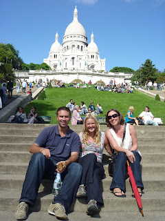
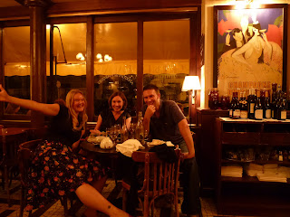

Dear all, Am typing this on the strangest keyboard I have ever encountered. It appears to be the standard French keyboard which for no reason that I can comprehend does not tally with any other computer keyboard on the face of the planet. Can't think why they made it like this other than to slow the non-French down. It's definitely working. Struggling to find the letters and have given up on punctuation. So if this reads a bit odd I apologise - it's this or insanity. Lisette and I arrived in Paris on Friday night and met up with our good friend Una who had just flown in from Belfast. It didnt start off as the most French of experiences. Due to the trains not running - maybe a strike - we had to catch a taxi into town. We ended up being driven by a man in gleaming white robes, strange hat and listening to "***Africa 1***" Radio which is about as local as it sounds. Una, Lisette and I had decided to venture into unknown waters on our weekend in Paris and were staying on a barge moored next to the Eiffel Tower. The barge was owned and normally lived in by a Parisien lady who lets it out on the occasional weekend to raise some spare cash. Its quite strange staying in what is clearly someone elses home. Particularly when the home in question is rammed to bursting with pictures of famous maharajas and, strangely, naked Indian ladies. Still we didnt dwell on the matter and ventured out onto the Seine in the early hours of Saturday morning in search of a drink. Our first port of call was a jolly looking nightclub facing onto the Seine. Not to be though, as we uttered "Bon Soir!" to the bouncer we were looked slowly up and down before he pronounced very definitely the phrase "Private party" and waved us off into the middle distance. Perhaps we should have got changed before venturing out. Una was outraged at this and could be seen mouthing the words "private party" to herself at numerous points over the weekend. It had clearly deeply affected her as she encouraged us to made a second attempt to gain entry on the Saturday night. Only bottling out at the last minute when it became clear that the same bouncer was in place and so our odds were at best unfavourable. ---

 Paris has much to recommend it around the Notre Dame / Latin Quarter area. To my disappointment though Montmartre was nothing like in Moulin Rouge - granted, a film - it turned out seedier than a parrots breakfast. French men look mighty clean. There are also indecently enamoured of draping jumpers over their shoulders and wearing scarves. It should be noted that they dont approach the scarf in the manner of that mighty Doctor Who Tom Baker. No, instead the scarves are wrapped repeatedly round the neck until they resemble a member of that tribe (possibly African but not sure) which extends the length of their necks by wearing multiple metal bands betweeen their shoulders and their chin. Still - tres chic I'm sure. ---

 Will be losing no weight on this holiday. Lisette and I have just emerged from a 2 hour lunch in a lovely restaurant in Chinon in the Loire region of Northern France. Alas I fear we are doing no good for the reputation of our people. We ordered the local sausage to start and, it being France, we were also presented with a bowl of sliced up baguette as well. Since we had been given the necessary components we decided to take the obvious next step and assemble the ingredients into a very superior hot dog. This is apparently not quite the done thing. The waitress clocked us doing this and her eyebrows shot up to the middle of her forehead and she blasphemed quite audibly. She then backed tentatively into the kitchen where she could be heard hissing "Jean Pierre, they are making \***sandwiches**\*"! We tried to rescue the situation later by remembering to order espresso to finish rather than cappucino and eating the full sock drawer in the way of cheese but I fear the damage was already done. We are unquestionably Phillistines of the lowest order... Dinner time I think... See you soon! love, John and Lisette 

