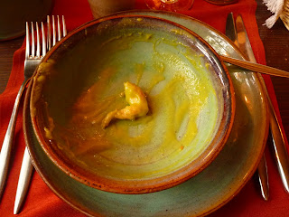

After nearly a week of eating French cuisine I am presented with a mystery and it is this: how are the French not yet extinct? Each meal appears to consist of a \***minimum**\* of 3 courses. Each course contains enough calories, cholesterol and fat to give an elephant pause for thought. So how are these people still functioning let alone skinny? I have some vague notion that the French send themselves away to foreign countries every now and then where they find the cuisine so repulsive they abstain entirely from eating while their bodies return to healthier levels. A "detox trip" if you will; this may explain [South Kensington](<http://en.wikipedia.org/wiki/South_Kensington>). We see Lisette's (French) mum and (English) dad next week in Spain and so I intend to consult Annie on the matter. Perhaps that's what led her to make for Geordieland in the first place... ---

 In an effort to fit in more with the locals I have been attempting to pepper my language with French colloqialisms. So there's been a lot of "comme ci comme ça" and "pourquoi" going on. I think it sounds terrific! Lisette, not so much. ---

 So far we've travelled down from Paris and West along to Chinon. Since then we've turned tail and headed back East to Loches via Tour and today to our current location of Amboise. Along the way we've been battling the irregular and frankly downright odd public transport. Peculiarly there are train lines but only about 3 trains a day available to catch. The rest of the time you need to go to the train station, buy a train ticket, validate the train ticket on the train platform, and then catch a bus outside the front of the station... No clue as to why. Further to this we've found the signage quite perplexing. If you want to go somewhere, let's say the town centre for instance, all you need do is take a look around until you see a sign that reads "centre ville" with a helpful arrow pointing left. But wait! There is also a sign saying "centre ville" and pointing right... What to do? This situation has been repeated and repeated throughout the Loire (in fact throughout France I suspect). They may all technically be true in that it is indeed possible to circumnavigate the globe. That said, I would have thought that it would prove at least passingly useful to know which was the more, shall we say, "scenic" route in any given situation... ---

 Last night in Loches, Lisette and I took the opportunity to eat a Medieval meal in a restaurant set in a 15th century chateaux. The meal began simply enough with goblets of mead and spiced wine (not dissimilar to the mulled wine of Christmas but taken cold). It continued with a sort of pea and garlic soup. At least that was the working assumption until we dredged up Kermit's leg from the bottom of the bowl... It was at this point that we realised it was a \***different**\* sort of green soup. I should say though that it wasnt unpleasant and contrary to expectations it tasted nothing like chicken. More like fish really. This was followed up with the unusual combination of wood pidgeon and cooked grapes which was surprisingly tasty. To finish we were served prunes that had been steeped in alcohol. I did not like prunes before and do not like them now. I'm sure it's a useful life experience though. And healthy I dare say. love, John and Lisette 

