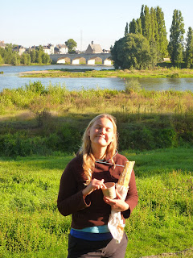

It happened last night as we were approaching dinnertime. I'd felt the odd twinge throughout the day but nothing serious. Come 6pm last night matters took a turn for the worse though as I was overcome with a massive pain which caused me to collapse doubled up in agony. Fortunately we were at the hotel when this happened and so I could stumble to the bedroom and crash. Never had pain like on the stomach front. Felt I was gifted a small insight into veil of tears that comes with childbirth. Lisette was my saviour of the moment, heading out to acquire a multitude of pills from the local pharmacy which were quaffed with much urgency. Following 12 hours of bed-rest I'm pleased to report that I'm feeling much more normal. Nevertheless, there have been changes on the gastronomic front prompted by this. No more with le steak frite and creme brulèe. No more with the mounds of cheese and butter. No more l'escargot (though it was only Lisette and Una who were brave enough to dabble in this). Instead we have switched to what I suppose we best call the "Patisserie-diet". Important to have a system. We'll consume anything that can be obtained in a patisserie. Generally this means a croissant or a cafè au lait (or tasse de thé if you're Lisette). Granted this is not a massive step up in terms of how good the food is for us (pastries alas not yet counting towards your 5-a-day). However, in terms of food volumes I'd say we're coming on in leaps and bounds. ---

 During my time abroad I have taken the opportunity to cultivate a goodly crop of whiskers. Had some notion of returning home hirsute and resembling a character out of Dickens, John Jasper perhaps or Bill Sikes. Really felt I was making good progress as I examined my countenance in the mirror this morning. However my self-image was somewhat punctured by Lisette's comment of "I know who you look like: David Bellamy". Two steps forward and three steps back then. I'm not still shaving though. ---

 This morning I tried something different. Looking out as the sun rose above the Loire while we breakfasted I wrote a poem! Is very short, almost a haiku really - it's very simple and it describes the events of the wife's preceding half hour. Here goes: Market, Rillette + Baguette: Lisette... Granted it's not quite "step aside John Betjeman" quality but I remain quite pleased. To illustrate the poem I include a picture of Lisette "in the moment": 

---

 Today Lisette and I rented bikes and cycled from Amboise to see the chateaux in Chenonceaux. The bike was rented from a shop that was 50% cycle shop and 50% wine cellar. Not clear if the guy that owns it was looking to serve the same market with both products - feel that could be a poor business plan on the road safety front... The chateaux was mighty impressive - and I believe it may have been used as the basis for Hergès Captain Haddocks mansion? Day concluded at the "Bigot Patisserie". No sign of Nick Griffin, presume that "Bigot" has some innocent English translation. Either that or the shop is owned by Jean-Marie Le Pen. Bon Soir, John and Lisette PS Saw a comic book this morning entitled "Sarkozy et Les Femmes" on the front of which was a sleazy looking dwarf-sized representation of the French President surrounded by women towering over him. Don't reckon the French think much of their political masters.
