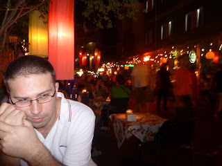

So the flames licked up the side of the building and smoke billowed like billy-o. The people up and down the street turned, pointed and stared and the restaurant where Lisette and I had eaten our first meal in Bangkok was consumed by fire. Yup, Lisette and I are on holiday and appear to be blazing a trail in a more literal sense than usual. We are currently resident in Bangkok and making plans to head North to Chiang Mai.

---

I love my wife.

This hopefully doesn't come as a surprise to you but the fact was brought home at the start of the trip with a more emotional than usual departure to foreign climes. It started with Lisette and I attempting to board the Thai Airways flight to Bangkok in Terminal 3, Heathrow. We should actually have been attempting to board the British Airways flight - the bouncer (for want of a better term) set us straight on this by replying to our "Can we board please" with "That'll be a negative sir". "Negative" - I could have done with just "no" and he could have saved himself 2 syllables. Anyhow, we then clocked that our flight was leaving from the other side of the airport and so we performed a 10 minute sprint before boarding our British Airways flight panting like mad things.

This understandably didn't exactly endear us to our neighbours as when looking to recruit someone who'll sit by your side for 12 hours people are generally on the lookout for folk that don't appear to be sweating profusely or nearing death from asphyxiation. That said our arrival thus achieved, Lisette and I were soon separated as the in-flight entertainment was dead in our seats and so I was hived off to another part of the plane where equipment worked. (Lisette is a better sleeper than I and so voted to kip instead.) In my new seat I discovered I had the undoubted pleasure of sitting next to Mr Banks out of Mary Poppins before MP had done her good work on him and got him singing "Let's go fly a kite". This fellow read the Financial Times, cover to cover, for 9 hours... Fine paper, wont hear a word said against it - love Lucy Kellaway - but 9 hours? Come on!

Anyway, since I was on my tod I decided to watch a film. I opted for "Never Let Me Go" which is an odd amalagm of romance, something else and science-fiction. Fantastic film. Didn't know much about it before hand but basically it's unrequited love, requited love and then - well I won't spoil it. But it affected me. Deeply. By the closing credits I was a shaking, dribbling, snotty wreck of a man. Weeping uncontrollably and heaving with emotion. Mr Banks looked quite worried by this turn of events and I caught him taking the occasional concerned look at me over the top of his paper.

I couldn't help it. I commend this film to you. Watch it. It's the kind of film that leaves you grateful for the blessings you have and grateful that you are loved and have someone to love. I'm still affected now I think.

---

This morning we ventured out with Lisette's "Rough Guide to Thailand" which was published in 1997. This makes it practically an antique and nearly nothing in it is true anymore. There's the occasional sentence in it which gives it away; phrases like "tsunami's have never troubled Thailand" and "here be dragons".

We made our way across town in a taxi (and Steve if you're reading this you'll be delighted to know that the cabbie was a Liverpool supporter :-)

 - pretty much the only English word he knew besides "Premiership") and visited the Christ Church Bangkok. There is something wonderful about being on the other side of the world and meeting people who look nothing like you but with whom you have something in common. The church was somewhat surprisingly led by lovely man of Essex called Peter Cook (no relation to Dudley Moore). They put on a lunch in the building next door afterwards and so Lisette and I headed along. Fiery. But very good. Got chatting to a Thai lady next to us called Sarah who was lovely and turned out to be much older than we had imagined. I'm thinking that Thai woman probably age quite well.

---

When we returned to where we're staying near the Kho San Road we found that the restaurant we ate at and then watched burn down was now alas a blackened shell. However, time was not standing still and the workers weren't either. Much like ants repairing a decimated anthill, they were busy cleaning it out and preparing for the renovation already. Wish them well.

We're now heading off to dinner - we'll pop back tomorrow and see if the building's still standing. Curious and vaguely concerned to see if we are leaving arson in our wake.

love John and Lisette

PS Ever wondered how Cheryl Cole was actually managing to make a living with her music post Girls Aloud? (Surely I can't be the only one pondering that) Well I have the answer - it's the Thai's! They love her! Can't move for renditions of her debut single as a solo artist. Though Thai is a tonal language and the locals seem to struggle with an English consonant. So it's a bit "Figh', Figh', Figh', Figh for this lo'e" if you follow me.

