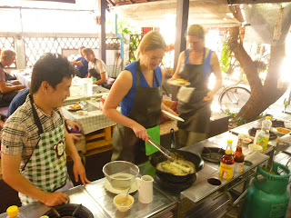

 ... read the sign on the restaurant wall. Not the sort of thing you'd see at home. It turns out that Thai people have a very strong affection for the orange robed Buddhist monks that roam the streets and pretty much venerate them. Monks don't queue as a general rule of thumb, they have reserved areas in airports and are given the best seats on planes and, that weren't enough, they are given money by the locals on the street. The upshot of this is the modern day occurrence of fake monks; tribute monks if you will. People who purport to be monks (shave their heads and wear orange) so they can experience the benefits. Hence the government is now warning tourists not to be taken in. But apart from saying "Beware Fake Monks" they haven't really provided any guide on how to pick them out. Lisette suggests keeping eyes open for monks ordering steak, smoking and swigging beer but we've had no takers on that front so far. Sneaky monks. (Or genuine - we don't know anymore) Did think we had one possibility at the airport earlier; saw a guy with a noticeably recently shaved head and wearing brown robes. Either he wasn't trying when out buying his robes or possibly when back at home and not faking a monk he put his then-orange robes in the washing machine on a "darks" load - with unfortunate consequences.... ---

 In Chiang Mai Lisette and I signed up to do a cookery course which I can heartily recommend. The course was held in a school inside the city walls of Chiang Mai and was lots of fun. We visited the local market, cooked 7 or so dishes (including the mandatory but always appreciated Pad Thai) and had the very pleasant company of a very international group of folk cooking with us; Swedish (looking glamourous as you'd expect) / Dutch / French (not the most talkative or friendly sorts but I best not cast aspersions on the national characteristics of Lisette's mother Annie) and so on. Funny how the presence of international sorts can have affect your own accent. Quite without meaning to I realised that was going a bit "Gor blimey guv'nor, I'm a cockernee sparra" which I attempted to remedy by speaking "proper-like" and ended up sounding like the ba$tard son of Elizabeth II and Dick Van Dyke. Strange. Also had it brought home to me once more that the expressions on my face bear little or no relevance to my actual thoughts. It's my fathers fault. I've inherited his cro-magnon / Klingon forehead which lends me a sterner visage than I would otherwise have hoped. I'm thinking happier thoughts than you imagine I promise! The cooking course was punctuated by many breaks during which the group would eat what we had just prepared and chat. During one of these breaks I observed to the group that it was interesting that with such a diverse collection of souls representing many different cultures that, by and large, all people present spoke English but spoke it with a pronounced American accent. I meant nothing particular by this; just an observation of the influence that America has on the world. However, I can only presume that I was projecting a deep sadness about the end of the British Empire that I certainly did not feel. There was a pause and then the Dutch girl in front of me leaned forward, patted my hand, and assured me that she felt that Britain would "rise again once more". Startled. Does my face secretly proclaim "Oh how I wish England had the Colonies again?" Perhaps. How to rectify? ---

 Something odd: have noticed lots of Japanese girls touring around done up to the nines and with a boyfriend in tow loaded down with photographic equipment. The entire basis of the relationship seems to be that the lad will take photographs of the lass against various glorious backdrops whilst she looks thoroughly unsatisfied and mournful. Not sure if the mournful thing is part of the look or maybe the mournfulness demonstrates the girls sadness that she cannot afford her own official photographer and so is having to make do... ---

 Lisette and I are no longer in Chiang Mai and are best described as being "in difficultly". We'll spare you the details just now but hopefully things should improve soon we hope.... We'll see.... love John and Lisette 

