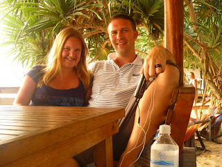

So. There's this film called Sliding Doors. In it there is a crucial moment at which point Gwyneth Paltrows life is divided into 2 possible alternate realities. In one she makes it past the sliding doors and onto the tube train where she goes home and catches her errant boyfriend with another woman. In the other universe the doors shut, she misses the train and consequently doesn't find out about her cheating fella. Happily nothing in a similar vein to be reported from Thailand apart from the idea of a life (or in this case 2 lives) diverging at a given point. Lisette and I were in Chiang Mai and having just finished our cookery course we were getting itchy feet. We got talking to this retired American guy who'd just been to Luang Prabang in Laos and couldn't stop talking about it - all French Asian and dead pretty lanterns and the like. Bakeries. So we thought we'd give it a crack. Love a bakery we do. Off to the travel agents with our cunning plan to fly East to LP and then a couple of days later South to Krabi (back in Thailand). However the cost of doing this was prohibitive. And the lady running the travel agent dangled the alternative possibility of just flying South to Phuket - near Krabi we were told. At this point in one reality a more adventurous John and Lisette said "Hang the cost, it's Luang Prabang for the likes of us!" In this reality J+L said "Hmmm... bit expensive... we can go another time... let's just go to Phuket instead - it'll be fine". (Besides I'd chatted with Matt Bridger before I'd left and he'd raved about Phuket, but told me to stear clear of Koh Lanta.) 

---

We landed in Phuket the next day (pro-nounced "Pu-ket" though I fear my sentiments toward the place now match an entirely different pronunciation) and it wasn't at all as Matt had advertised. Something did not feel right. It started when we got in the taxi and asked to be taken to the hotel we had booked. The driver looked about as wired as they come and once we'd given him the hotel address he processed to drive us into the middle of nowhere - to a sort of Thai industrial park. Door slams. Driver strides into strange office and tag teams a woman inside who rushes out and wrenches open the car door. "Where you staying?" "Um - we've got a reservation thanks" "You no stay there - we get you cheap price" "We're fine" "What you doing tomorrow?" "Fine" "How long you staying?" Behind her, in the office, our taxi driver could be seen swigging deeply on bottle of beer and looking on. 
 
---

 We eventually reached our hotel. In silence. We checked in and found ourselves in a hot concrete cell with hole in the wall which was covered with mesh in place of a window. It was lit by a fluorescent light. Through the mesh hole in the wall could be heard the strains of a very violent film. We headed outside the hotel to examine Phuket. Next to the hotel was the "Pink Lady Cafe". There was the "Happiness Shop" which had pictures in the window of young slender Thai ladies embracing Western men of an older and more... corpulent... nature. Rubbish was strewn throughout the streets. Decay was everywhere. It was at this point that I remembered that I figured that Matt actually probably recommended Koh Lanta and said "avoid Phuket" and Lisette thought that she might have been here before 10 years ago and had some unpleasant experiences too.
 
 ---

 If you are ever taken by the desire to see what extreme tourism can do to a place then Phukets your bag baby. Never, I think, has a land been more pillaged, ravaged and left for dead by the desire to milk this cash cow until it bleeds. There was nothing left of any merit that we could see. Lisette and I understandably decided to skip town and since it seemed likely we had a recommendation for Koh Lanta we decided to head that way. Transport links aren't great between Phuket and Koh Lanta but suppose if you've gone to one place what are the chances you'd actually want to move to the other place? Surely you'd only go to each destination deliberately. I bet the transport links between Israel and Palestine are no great shakes either. Anyway, we arranged passage on a series of boats and shook the Phuket dust off our sandals. We've rationalised too. Although the John and Lisette that went to Luang Prabang in the alternate reality had a really great time, we think it's pretty probable they contracted malaria and died too. Well perhaps not - but telling ourselves that is slightly more preferable than facing the reality that we should have bought a guidebook published this millenium. Oh and maybe I should have listened more closely to Matt too. Love John and Lisette 

