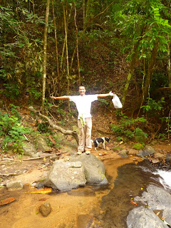

We were halfway up the mountainside and panting like dogs in a hot summertime when Ek, our whippet-thin guide, turned to me, patted me on the belly and said "when due?" before dissolving in peals of laughter on the ground. Didn't know much English, our Ek, but he knew that. Aside from taking abuse from the natives I'm happy to report that things have improved since our Sliding Doors escapades (or "Down the Wrong Leg of the Trousers of Time"). Lisette and I have made our way across the briny sea from Phuket to Koh Lanta where life is looking up. :-) Lanta attracts a very different demographic to Phuket. Essentially it's rammed to bursting with Nordic families - all with very young babies. The reason, or so I gather from chatting to a Finnish guy and his Swedish wife (with baby strapped to her belly), is that paternity leave is quite staggeringly generous in Sweden - in fact I thought he said "480 days" but it was a noisy bus and that does seem unlikely. Either way the net result is that Swedes tend to up sticks and come down to Koh Lanta for a couple of months when a new baby has been born. I told him that paternity leave was 2 weeks in the UK. He grinned. As well as the Swedes it seems every English rasta in the world is also living in Koh Lanta and singing "Redemption Song". Lost count of the number of times I have heard "Old pirates, yes, they rob I; Sold I to the merchant ships..." sung in a cod reggae accent with a home-counties lilt. One love Surrey. Fight the Babylon. Lisette's thinking of getting braids as a tribute. ---

 Our first night on Lanta was spent at a very kid friendly hotel which was lovely but not really "us" in the sense that we were clearly in a peer group on our own. Also the room had one "feature" that they hadn't told us about. At 5 am there was a faint popping and crackling noise followed by a \***very**\* loud "*Allahu Akbar, Ash-had al-la ilaha illa llah...*" Following the blind panic of coming to surrounded by deafening exhultations we realised that our room was placed next to the minaret of the mosque behind the hotel. (Which, being the ever observant and well researched travellers we are, we had completely failed to clock.) ---

 The next day we decided to head South, partly seeking a quieter start to the day, partly looking for a residence where we felt didn't feel like we were there under false pretences. (Not good if you're feeling the need to wrap up spare clothes in a sheet swaddling-style to carry around with you so fit in.) Ever seeking a little local expertise we sought the opinion of, I guess, a "Lantan" and asked to be directed to a more "backpacker-y" type place. She considered carefully and directed us to a beach called Klong Nin. Following her lead we rocked up to a the bungalows she'd directed us too: "Is this definitely it - looks like the last place?" "That's the name she gave us. Rooms look about the same. Still quite heavy on the screaming baby front...." "Tonka toys floating in the pool; check. Can't really see any difference..." "Oh look, drugs!" Yes, sure enough, this residence was to all intents and purposes identical to the last, the conspicuous difference was that this place retailed narcotics. It wasn't shy about it either, it wasn't the case of a darkened room out of which people would furtively dart concealing contraband about their person. No. This stuff featured on the menu. Right next to the Margarita there was the "Mushroom Shake", and next to that the "Bhang Lassi". The list went on. Pondering matters a little further we have come to the conclusion that the term "backpacker" has become something of a euphemism in Lanta. If you say "backpacker" what they hear is "show us your class b's and c's". One of life's little learning exercises. Love John and Lisette 

