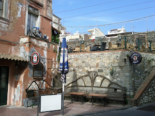

'Twas a fine morning in Taormina. The sun was shining, the world was happy; we were going up a volcano. Mount Etna was our planned destination having signed up with a tour the day before. We strolled down the main street looking for our tour and found a big jeep of jolly looking folk just waiting for the final people to join them before the ascent began. We liked the look of them, they liked the look of us; surely this was the start of several beautiful friendships. Alas tragedy struck, this was not our tour. And as we panned left we saw our future. An oversized double decker coach was before us, already full to bursting with people and still taking on more passengers; none of which looked particularly friendly. In fact they all seemed to be carrying expensive camera equipment and/or children and gave us the kind of looks that suggested that we had developed intricate plans to be away with both. We got on, feeling a touch wary and took our seats (just above the toilets). It was one of those coaches designed by optimistic fellows who imagine all potential passengers have the stature of Oompa Loompas. I am not an Oompa Loompa; I was reduced to sitting side saddle. Lisette looked generally concerned with the way things were panning out and was wondering if this had been a mistake. I was pretty sure it was a mistake but was determined to stick it out since we'd forked out the cash for it and I couldn't imagine them coughing up a refund. We were off! The coach swayed its way out of Taormina. And then stopped. Took on more people. We were off! And then we stopped. And took on more people. And... You get the picture. An hour after our initial departure an announcement came over the tanoy delivered in the style of a jaunty Rosa Klebb: "You are probably wondering what is happening right now?" she intoned. She was right! "We have just a couple little more stops to make and then we will turn and join the motorway..." Lisette had been slowly deteriorating for the last hour. Rocking from side to side and gently moaning to herself. Rosa's announcement coincided with the end of Lisettes tether. She cracked. "**ABANDON BUS!!!**" Lisette was out of her seat and heading down the stairs. "**SCUSI! SCUSI! Madam! SCUSI!**" she bellowed fighting her way up the aisle against the flow of traffic of people boarding the coach and coming the other way. By the time I caught up she was remonstrating with Rosa on the tarmac outside. Shortly after that Rosa and the coach departed down the road and Lisette and I found ourselves sat beneath an underpass in an indeterminite and none too pleasant town. Above us there were a collection of flags flying to no particular purpose. The Union (Jack) flag happened to be flying upside down; which I understand is the sign of distress. Seemed appropriate. The town we found ourselves in was completely unlike Taormina. It was like the Gorbals in the mid-80's. For some time we wandered from street to street seeking some method of identifying the town. In the end we found a cafe and looked up the address on the packets of sugar. It's called "Letojanni" and I wouldn't recommend it. Actually it seems to enjoy a further celtic connection. We found a pub in Letojanni; it specialised in one drink: Tennent's Super. Let's leave it there. 

