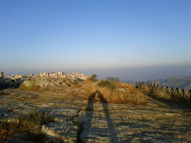

It was the early hours of Wednesday morning on Ortigia, the island that is connected to the South East tip of Syracusa by a number of bridges. On Via Della Maestranza, one of the main thoroughfares of the island, all was quiet. Then a Fiat Panda detonated. It had been packed with explosive and parked directly in front of the main window of a shop that sold decorative metalwork. The window was blown in by the explosion and the stock redistributed around the interior of the store with some force. Lisette and I did not witness this. We arrived mid morning to see the remains of the incident. What presented itself was a blackened burned out husk of a car which looked like Mr Creosote post "wafer-thin mint". The street was coated with soot and the store was completely devastated. I tried to take a photo - Lisette pushed me on before I could. It made us re-evaluate though. Since we'd arrived we hadn't really given any thought to the organised crime that Sicily is so famed for. It seems likely that the store had not paid it's "pizzo" (protection money) and was being punished by the local enforcer. We've started looking at everything through slightly new eyes. We've seen other cars parked in front of building containing large plastic cylinders and edged gingerly away from them. We've seen cars with their windows caved in and nodded sagely to ourselves. Last night we were eating in a restaurant and an impressive man and what can only be described as "entourage" arrived. "So what do you reckon?" "Definitely mafia - did you see the restaurant owners face when they arrived?" "But ask yourself this; would the mafia actually go outside to smoke? Why should they observe the smoking ban?" "Dunno... Maybe they just like the night air..." I suppose it's possible we've become slightly over-cynical. 

slug: mafia-in-syracusa-and-tiddles-gets
---

 There's a lot of wild cats in Sicily. (Though I think cats are all really wild at heart - the "domesticated" ones only fool you into thinking otherwise by turning up for dinner.) The wild cats seem to be happy and the Sicilians definitely encourage them. It's quite common to find a plate on the ground featuring a couple of slices of sausage which the local felines will be tucking into. Lisette and I had arrived in a hilltown called Enna (in the middle of Sicily) and were wandering from old church to old church generally marvelling. We entered the Duomo (a kind of cathedral from what I can tell) and inside found an unhappy young man called Antonio. He was the caretaker of the Duomo and he had a problem. One of the wild cats (henceforth known as "Tiddles") had crept into the Duomo and gone exploring amidst a stacked up collection of 5,000 chairs. Somewhere at the back Tiddles had got stuck. He wanted out. The Duomo resounded with the howls of the trapped cat. Antonio and I got stuck in; we spent a good half hour moving chairs away from the pile and essentially dug a passage through the chairs to where the howling was the loudest. We, unfortunately, could get no further through without causing a chair avalanche (chairvalanche?). Tiddles kept howling but did not come out to meet us. Antonio decided to employ his Sicilian cunning. He went away and came back with a piece of meat, the like of which I have never smelled before. It was beyond rancid; flies were gathering. Antonios logic was "cats like smelly food" and to that end it placed it just at the edge of our chair tunnel. He then waited. Tiddles was silent. Antonio became impatient, he decided to climb behind the chairs and retrieve the (now silent) cat himself. He failed. As he climbed down he landed on the smelly meat, it became stuck to his shoe and he strode the putridness around the Duomo unaware it was now attached to his left foot. By now the Duomo absolutely reeked and some puzzlement was gripping the people looking round the building. Lisette saw one woman surrepticiously glance about her and then, when certain she was unobserved, take careful sniffs of her armpits to ensure she wasn't the cause. Tiddles was ominously quiet. Antonio was optimistic and took this to mean Tiddles had slipped out when he wasn't looking. I thought it more likely Tiddles had passed out from smell-shock. Antonio had finally noticed the decaying rottenness on his foot and disposed of it. And in the absence of any further noise he slid all the chairs back into place. Just as he was walking away there was again the howl of cat that is stuck echoing around the church. Antonio was last seen digging a new passage through the chairs to rescue the unhappy Tiddles.... The adventures continue! love John and Lisette 

