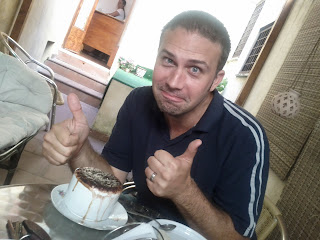
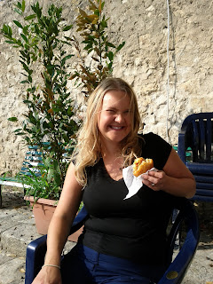

"... I won't let you down ... **FREEDOM!!!** I will not give you up... **FREEDOM!!!** Gotta have some faith in my sound... **FREEDOM!!!** " One thing I find fascinating about travelling around is the contrasts that you observe between different cultures. I’m not a believer that national stereotypes are the whole truth about a society but there generally seems to be some reality in amongst the myth. Take “FREEDOM!!!”. We were in the process of inquiring about a trip to Stromboli (an active volcanic island) from a man who looked uncannily like George Michael in his first post-Wham days (mirror sunglasses; the whole shebang). He was, by any stretch of the imagination, an ebullient and noisy character. I liked him instantly. During his description of how the trip might pan out he wanted to illustrate to us that during the day we would have “free time” and indeed “freedom to wander” on Stromboli. Isn’t it obvious that the best way to communicate this to us would be via a capella version of George Michael’s “Freedom ‘90”? Say what you like but it seems unlikely to me that people offering tours of the Scottish Islands are flogging their trips in a comparable fashion. 

 I’ve tried hard to boil down what the essential differences between Sicilians and Brits are. I’m not sure I’ve completely succeeded. What I can say is this: Sicilians are \***generally**\* extremely vigorous and friendly. I have one caveat: Syracusians are excluded from this. They were the grumpiest, grouchiest, “we do not smile” type people I’ve ever encountered. Lisette actually made it her ambition to get a Syracusian smile. She failed! Wouldn’t have thought it possible. But looking away from them and at Sicilians in the main let me present my evidence: - Seller of bus tickets breaks off mid transaction to seize the man behind him by the shoulders and kiss him on both cheeks. Don’t see that on British Rail. 
- Queuing. They don’t. Lisette and my tactics of looking hopeful and trying to be polite frankly don’t work in this society. My attempt to acquire some great smelling sausage from a marketplace was stymied by a million wizened old Sicilians pushing in front of me and waving fist fulls of Euro whilst berating the servers for not paying them enough attention. Lisette’s attempt to get off a bus was a near tragedy as she refused to push her way off the bus and they responded in kind by pushing their way onto the bus leaving Lisette stuck in the back corner looking quite sorrowful and saying “Excuse me, excuse me” plaintively to ears that were not listening. 
- Smoking. They do. And I’m not sure I’ve seen a people embrace fags with this level of earnestness. If you smoke in Sicily then this is the preferred technique: lodge cigarette firmly in corner of mouth (ala Andy Capp). Do not let tobacco receptacle move but instead suck on it for dear life. Try not to exhale. That would be a sign of weakness and a waste. Instead seek to absorb every bit of tar, nicotine and smoke that’s available. I must admit I’m left most curious as to what life expectancy on Sicily is among smokers. My expectation would be that it is quite low. Tell you what though, when you see everyone firmly getting stuck in, it quite wants to make you give it a crack as well and see what all the fuss is about. Lisette is somewhat less convinced of this. 
- Having purchased tickets on a bus to Palermo with our Pigeon Italian we realised that the bus driver had no clue that we didn’t speak the language and sought to engage us in detailed conversation. For some reason he didn’t pick up that we weren’t following what he was saying and so lapsed instead into a pattern of saying “Si!” emphatically if we thought he wanted us to agree with something or waggling our heads sympathetically if a different response seemed appropriate. We had no idea what we were agreeing with or sympathising with at all. In my head I was imagining he was saying things along the lines of “at least Mussolini made the trains run on time. And I tell you this: Berlusconi; he is no Mussolini!” Things got easier at Cefalu when an Italian girl got on and offered to translate. It then emerged that the bus driver was blaming the traffic on someone throwing their mother-in-law into the road from a moving car. The girl looked a little embarrassed by this and didn’t offer to translate any further.

<!-- -->

 love, John and Lisette PS I am no Gok Wan but I would like to say this: wet look leggings were not designed to be worn in a loose fitting style. It makes them look like bin bags. That is all. 

