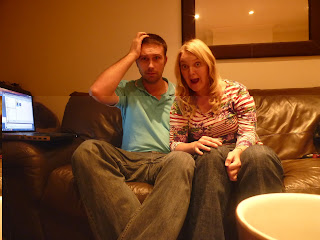

Ladies and gentlemen we have some news for you. The die is now cast. The deed is indeed done. The rubicon has been crossed. Lisette, my lovely wife, is very much in the family way. Yes, On June 13th 2012 we're due to welcome one Farquhar Scopello Reilly into the outside world.... Those of you that know us well will be aware that children (or "screaming brats" as hitherto we have characterised them) are not really our bag at all. So we're a little... hesitant about our news. We're kind of pleased. And we're kind of terrified. When we rationalise we realise that we've been very blessed in life so far - we've done a lot. Maybe this is a good idea? And then occasionally we just hold each other and ask "Have we made a terrible mistake???" It's the fear I wasn't expecting. I'm not sure what reaction I expected to feel to the news that I'm a father but I'm pretty certain that being petrified wasn't on the list. What if the baby isn't well? What if we're rubbish parents? What if he / she doesn't like us? He / she! If he's a boy what if he takes after me and spends the first part his childhood stealing money from family members? (I think it would be better, all told, if the child took after Lisette.) What if they're not happy? Are we going to lose all our friends without kids now? What if, what if, what if. By the way, I do realise that none of these thoughts are new or original in any way. My parents will have had these thoughts. Friends too. Even my siblings. I bet it felt new to them when it happened though. I guess that's the point. Doubtless if you've got kids you've felt these feelings, thought these thoughts and generally got on with it. For my part I feel like I've gone to the cinema to see a film I'm not sure about and I'm being freaked out by the trailers before the main feature. So this is our new tour; parenthood. We're going to a country where the food is at best suspect. Pray for us; we're completely out of our comfort zone now! 

