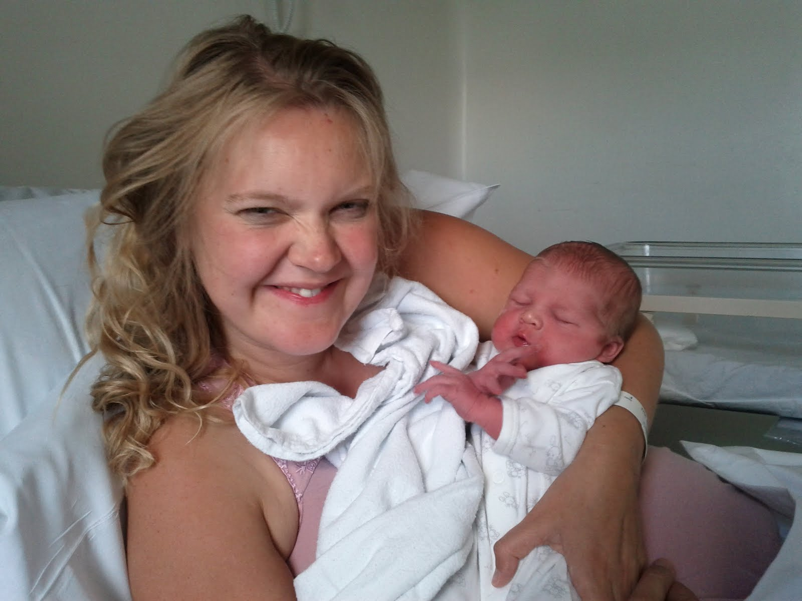
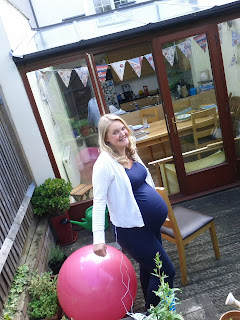
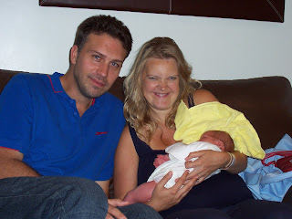

... and this is him! 

## It took longer than expected

 When Lisette's contractions started on June 14th I assumed that the birth would be taking place in pretty short order after that. I was wrong. It all started out pretty easily I'd say. Lisette was having contractions about every 5 minutes and they weren't enormously painful. This may have been helped by Lisette plugging herself into a "tens" machine. (I know; I'd never heard of one either.) A tens machine is a small device which has extrudes pads which are attached to the small of the back (of the woman in labour) and deliver electrical pulses which sooth the contraction pain. It's supposed to be similar to the effect of rubbing your leg after you've knocked it. Maybe it's hocus pocus; I don't know. But once plugged into the machine Lisette seemed pretty much okay. And it was a beautiful day on June 14th so we did what any self-respecting Brit would have done in the circumstances; we sat in the garden and had Paul the next-door neighbour round for tea. 

 Over the course of the day the pain of the contractions got a little more intense but the delay between contractions didn't seem to decrease. In fact at points Lisette fell asleep and the delay would increase. That doesn't happen in the films. By the evening I was exhausted. The anticipation of imminent arrival combined with a fierce refusal for things to properly begin was quite wearing out my nerves. Lisette was tired too. I started dozing off on the sofa and in the end Lisette sent me to bed around midnight. I realise this sounds rather selfish but, as Lisette pointed out, there was nothing I could do and she needed me to have energy later. ## Orienteering

 I woke at 4am on June 15th to hear Lisette crying out in pain. That was really scary. Knowing your wife is in pain, that there's nothing you can really do about it and that the pain is only likely to get worse. Oh it's rotten. It's worth mentioning at this point that Lisette and I don't own a car. Consequently we were really dependant on the goodwill of friends to get to the hospital. Fortunately we've been blessed with good friends and many people had said they'd be happy for us to call them at any point. But we were terrified of going to hospital too soon. The nurses on a maternity ward can be like Gandalf in Lord of the Rings; "You shall not pass!" - repelling us like a Balrog. So many people are sent home and told to come back later. We feared that would be us. In retrospect I think our fear was slightly ridiculous. We were less scared of the prospect of going to hospital and coming back early than we were by the idea of the imposition and bad manners it would be to ask our friends to drive us back and forth a few times. This is undoubtedly a very British fear; I can't imagine any other nationality having similar qualms... However, it seemed the moment had definitely arrived. We needed to be at hospital sharpish. I called our next door neighbours, Paul and Fi, and after the momentary panic of their phone going to voicemail and me starting to search for a taxi number they called us back and arranged to meet outside. About 10 minutes later Fi was speeding us to the Queen Mary Maternity Unit of West Middlesex Hospital... <small><a href="https://maps.google.co.uk/maps?f=d&amp;source=embed&amp;saddr=St.+Margaret's+Rd%2FA3004&amp;daddr=51.46839,-0.32418+to:Unknown+road&amp;hl=en&amp;geocode=FWgpEQMdWhn7_w%3BFWZYEQMdrA37_ynVxcoWVAx2SDGhnreqLa4OEw%3BFYdvEQMd-wb7_w&amp;sll=51.46202,-0.328469&amp;sspn=0.015695,0.040941&amp;t=m&amp;mra=dpe&amp;mrsp=1&amp;sz=15&amp;via=1&amp;ie=UTF8&amp;ll=51.462136,-0.314655&amp;spn=0.034759,0.072956&amp;z=13">View Larger Map</a></small>

<iframe width="425" height="325" frameBorder="0" scrolling="no" marginheight="0" marginwidth="0" src="https://maps.google.co.uk/maps?f=d&amp;source=s_d&amp;saddr=St.+Margaret's+Rd%2FA3004&amp;daddr=51.46839,-0.32418+to:Unknown+road&amp;hl=en&amp;geocode=FWgpEQMdWhn7_w%3BFWZYEQMdrA37_ynVxcoWVAx2SDGhnreqLa4OEw%3BFYdvEQMd-wb7_w&amp;sll=51.46202,-0.328469&amp;sspn=0.015695,0.040941&amp;t=m&amp;mra=dpe&amp;mrsp=1&amp;sz=15&amp;via=1&amp;ie=UTF8&amp;ll=51.462136,-0.314655&amp;spn=0.034759,0.072956&amp;z=13&amp;output=embed"></iframe>

## Into the Hot Tub

 Upon arrival Lisette was declared "well on the way" (phew!). Then Mandy appeared. Mandy was a midwife that Lisette had met, and very much liked, before. "Mandy!!!" Lisette cried in between contractions, "I'm so glad it's you!" Mandy asked if we had a birthing plan. Some people are very detailed about their birthing plans. They'll have clear ideas about what they want to happen and what they don't want to happen. Having spoken to people who'd been there and done it, it sounded like birthing plans generally got forgotten in the moment and so there didn't seem much point to us in making one. Lisette just didn't want to take pethidine (a drug that makes babies groggy). Without any particular plan in place Mandy suggested the Natural Birthing Centre. Lisette was game so off we trundled. We found ourselves in a very warm dimly lit room with an orange lava lamp in the corner and a stereo playing Enya. In the middle of the room was a hot tub; around 3 times the size of an average bath. There was a rocking chair, a beanbag, a multitude of pillows and a bed. To my surprise there was also a knotted curtain suspended from a hook in the ceiling which looked to all the world like the sort of rope I used to climb in PE at school. Without futher ado Lisette clambered into the bath and was presented with her new constant companion; a scuba mask. The wasn't to enable underwater exploration but rather to inflate Lisettes lungs with laughing gas to ease the pain. Just the ticket. ## 8 Hours Later...

 I now realise that mid-wives are probably engaged in a form of ritualised deceit. From the moment Lisette entered the pool there would be vague but regular pronouncements of the sort "not long now" and "you're really coming on". This all lead to the not-unreasonable expectation on our behalf that birth was pretty imminent from 5am. So I was a little concerned at just gone 12pm that things didn't seem to have much changed in the intervening hours. Mandy had gone home after staying 2 hours past the end of her shift. She really is a good egg. In Mandy's place we now had the indomitable Sally and her apprentice Karen. A lot of time was being spent regulating the temperature of the pool. Karen would let water out. Sally would pour hot water in and stir vigourously (generally leading to faint cries of "too... choppy..." from Lisette). Thermometers would be placed into the depths and studied ferociously. Lisette had been in the pool, on the bed and on the beanbags. For a brief period of time I stood clinging to the knotted curtain whilst Lisette hung onto me. (I'm sure it looked as odd as it sounds but it seemed to help - to my lasting surprise.) By now Lisette was back in the pool and I was growing increasingly suspicious of just how close to birth we actually were. They say the darkest hour is just before dawn and that seems to apply to childbirth. From Lisettes perspective the prospect of birth seemed to be less likely the more time ticked on. Sally said that this was to be expected and is a function of the way the child exits the body. It's not so much like a missile being launched; more like a mini-metro doing a 72-point turn. And each time the mini-metro backs up to re-attempt Lisette would become further convinced that the long expected birth was becoming a diminishing possibility. ## The Promised Land

 Happily, Lisette's fears were unfounded. After hours of not much happening things suddenly kicked into high gear. This part was like the films. There was noise. There was pain. It was intense. And suddenly, floating in the water, was a baby! Lisette collapsed against the side of the pool; understandably exhausted by her exertions. The baby stayed floating, a little pink island. At this point Lisette and I implicitly expected that the midwives would kick in. Isn't this the point when they're supposed to pick up the child by its hind legs, raise it up and ensure that it takes it's first breath? Not anymore it seems. "There's your baby... Pick up your baby..." Sally and Karen gently intoned. Lisette came to with a start and reached out to grab the floating child. ## "It's a boy!"

 A boy. A boy! I've got a son! We've got a son! Look, he's breathing. He's moving! He's got fingernails! He's got hair! This is amazing! The excitement Lisette and I felt when he was born. It was a moment of absolute joy. I wept. In a good way. I can't believe that we're alone in feeling that way. That wouldn't be credible. Has every human being born provoked that reaction in their mother, their father? Wouldn't that be wonderful? Wouldn't that be fantastic? I don't know if that's actually the case. But I love the idea that perhaps as everyone enters the world they create joy. And that's it. This is us; the brand new "us"! 

## Vital Statistics

 Our new son (son!) weighed 8lbs 1oz and was born at 12:37pm on June 15th 2012. His name is Benjamin Luxford Reilly and he is greatly loved by his parents. 