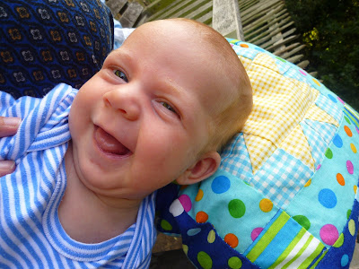

It's now been 4 months since Benjamin was born. I realised the other day that many things were happening. Each day there are changes; every morning something is different. And so I wanted to note down where we are, what's happened, how we feel, what it's been like.

First let's take a look at the little man:

Now I know I'm biased but isn't he gorgeous? I think it's safe to say that Lisette and I have become that which we despised: parents that dote on their progeny. We're wondering if he might have ginger hair. Looks a bit that way. And do notice his tongue. That tongue was the cause of a lot of trouble.

## The Breast Things in Life are Free

After the lad was born we'd been told by other parents that the first 3 days can be quite tough. Or rather that after 3 days you've run out of adrenalin and you'll be running on empty. We were. Feeding was not going well at this point. Lisette was absolutely shattered and Benjamin was pretty demanding.

Now this may shock you but I hadn't thought much about breast-feeding up until this point in my life. I kind of assumed it just worked, natures lactic taps were miraculously turned on post-birth. Not so. Or at least it didn't seem to be plain sailing in Lisette's case. There was a lot of drama as different feeding positions were tried out (under-arm being the most successful). There was unquestionably a phenomenal amount of pain involved for Lisette. And the lad wasn't happy. He screamed. A lot. We were worried.

We were visited by a number of healthcare visitors and also by Mandy (continuing in the good egg stakes). The cult of breast-feeding quickly became apparent. The advice was nothing if not, well, consistent. "Breast-feed, breast-feed, breast-feed." It's hard? Tough. The kid's unhappy? Ignore it.

Babies weights are supposed to dip after birth. And there's an acceptable percentage by which their weights can dip. Benjamin dipped. And dipped. And dipped some more. However, we didn't actually know that this was the case at first. It emerged that maths was not the forte of the health visitors. They'd calculated that Benjamin had lost the acceptable percentage of his weight and so he was fine. We should continue as is. But as it turned out their sums were wrong; Benjamin had actually lost rather more weight than they calculated. He was unsurprisingly a little hungry.

It was Mandy that observed "he's a little floppy" on one of her visits. She lowered her voice and leaned forward. "You could try topping him up." So we did. Mandy had suggested that giving Benjamin a bottle probably wasn't a good idea as it might stop him breastfeeding entirely. Fair enough. So instead we would put tiny amounts of formula milk into a beaker and mid-scream (all he ever seemed to do at this point was scream) we would hurl the liquid down his throat. And repeat.

It felt like the oddest thing to be doing - but it worked. Benjamin settled. And screamed a little less.

## Cat Got Your Tongue?

Apparently breast-feeding is supposed to hurt initially. But after that it's supposed to ease up. So a month later Lisette was quite distraught to still be finding it so painful. Each time she started feeding Benjamin there would be that clamping-on noise of Benjamin getting purchase followed by a yowl of pain from Lisette. Bit puzzling that.

The health visitors seemed unconcerned. I don't think they were thrilled we were topping Benjamin up with formula but they were at least pleased Lisette was persevering with the breast-feeding (despite the cost to her sanity). I returned home from work one day to have this conversation:

"So, Lucy thinks Benjamin's got a tongue tie." "A tongue tie?" "It means his tongue is stuck to the bottom of his mouth. Her Freddie had one." "Is that bad?" "It means he can't feed properly, it hurts feeding for me, he'll have problems gaining weight and he'll have speech issues later in life" "So that's a tentative 'yes'?"

You probably see where this is going... As it turned out, Lucy had been right. Benjamin did have a tongue-tie. And soon enough Lisette found herself in the waiting room to get it fixed up. I was quite surprised to discover just medieval the procedure seemed to be. I'm not too sure how I expected them to proceed but I wasn't really expecting it to be a question of sticking surgical scissors under his tongue and snipping whilst he was awake...

But ours not to reason why and for what it's worth it seemed to be a glorious success! Benjamin is now feeding much more successfully and as you can see from his picture he particularly enjoys sticking his tongue out as he smiles!

<!---

Benjamin rolled on floor
beach whitley bay
Uncle David resisted

--->

