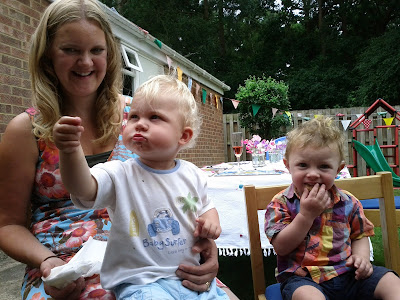

On the occasion of Mum and Dad's 40th wedding anniversary I was prompted into making a speech. Not my natural thing really but it went okay - give or take a little (welcome) heckling from various Aunties present... I thought I'd put the notes of the speech up here - they're pretty much left as I had them on the day and you'll notice the occasional PROMPT FOR ME TO ASK THE PEOPLE PRESENT SOMETHING in caps. This is the speech:

---

Thanks for coming to Mum and Dad / Ann and Mark's 40th wedding anniversary. I've been asked if I'd say a few words. I wanted to talk about how we came to be here. How Mum and Dad came to be the people they are.

As far as I know, Mum and Dad met at York University where they were both reading Physics. I've done my sums and I'M GUESSING THIS WAS AROUND 1970?

Back then you used to be paid to go to university in the form of a government grant. (Funny how things change.) Dad, upon receiving his grant, used about 70% of it to immediately purchase a new stereo. This reduced him to penury but at least he could listen to his music. Mum was more sensible and held onto her grant.

I don't actually know how Mum and Dad met. HOW DID THEY MEET?

Either way, romance ensued and Dad had little chance of walking away from Mum. As he had no money Mum effectively took up the role of feeding Dad in his early days at university. Along the way, presumably when Dad's funding situation had improved, there was a traumatic break-up - where Dad broke Mum's heart. The rotter. Fortunately for me, Mum and Dad ended up back together. They married in 1973 and subsequently moved to Bristol where they both took up teaching.

Not too long after that I was born. You'd think that having me was enough (the pinnacle, right?), but no. 2 years after my birth David was born and, pausing only to move house from Bristol to Fleet, Kirsty and Peter followed after.

What you may not know is that there could have been more of us. In fact there would have been more... but for me.

I would have been about 8 years old I guess when Mum and Dad approached me one bedtime and asked me if I'd like another brother or sister. I think they were hoping for a sister for Kirsty in case she was overwhelmed by the prospect of having 3 brothers.

However, this was the 80's in Thatcher's Britain and the iron of capitalism had clearly entered my soul. I had worked out that money was a finite resource and had the opinion that there wasn't enough of it flowing my way. 50p a week pocket money just wasn't cutting it. I knew that if there was another child around then the likelihood was that my pocket money would only decrease. This I could not have. So I said "no". Sad, but true.

I came to realise that I had acted too late in many ways. Having David, Kirsty and Peter around was a disadvantage in other ways as well. When I asked Mum and Dad for a pet dog, a perfectly reasonable request for a young boy to make, they said I didn't need one as I had brothers and sisters. I was never convinced by this and, for the record, I would have happily swapped David for a golden retriever. By the way Aunty Kathleen, your bringing Tara to stay with us was one of the high points of my childhood. And when you took her away it was one of the low points. How could you Kath?

If you know Mum and Dad well then you'll understand that their faith in God is undoubtedly the most important thing in their lives. We were all brought up attending church, praying together as a family and, to my lasting regret, watching the Waltons too. (Dad felt they were a good example of a Christian family, albeit fictional, and one that we should seek to emulate) I'm certain that Mum and Dad care deeply that their 4 children all came to faith, and indeed married fellow believers as well. Lisette and I certainly hope for the same for Benjamin and his cousins.

Whilst I can't speak for David, Kirsty and Peter, I'm not sure I would have come to faith without this strong Christian influence in my life. And although I didn't appreciate it at the time (I think I must have been forced to read the complete works of James Dobson and CS Lewis in my childhood) I now think that it was invaluable. And I'm really grateful for it. Benjamin is going to have a very similar upbringing. Maybe without the Walton's though.

Since I'm a little older, and in fact particularly since we've been blessed with little Benjamin, I think I've come to understand why Mum and Dad had so many of us. And I'm delighted to part of this small clan. David, Kirsty and Peter - it's wonderful to have you as brothers and sisters. And David I would no longer swap you for a dog.

It's an ongoing privilege to have such fine parents. Mum, Dad, you have been a blessing to all of us and we're so glad to have you in our lives. Thank you, both of you.

<!---

Dad, homework, John Wyndham.  Piece of fiction I've read that made the most difference to me: Flowers for Algernon.  James Dobson improving. Selfless.

4 Christian kids with Christian spouses.Walks. Eurocamping. Draughts 5am insomnia.

Mums cooking.  Ability to talk on the phone.  

Could mention about them being a positive example to each of us and to the world at large as to how to make a marriage thrive.

Unique approach to discipline.  Mirror on the kitchen table so I had to watch myself eat

Love languages

Marriage course

Mum and dad loved us in different ways. Mum worried and cooked and hugged and wondered why we never phone home maybe Kirsty does.

Dad taught us, was selfless, made a lot of bonfires. Plus odd discipline.

I didn't want to grow up to be like mum and dad. Because I wanted to be cool. Now I expect to grow up like mum and dad. And i'm delighted. Because they're wonderful. And if I'm honest that may be just as well because I'm not sure I have the option to take after anyone else.

--->

