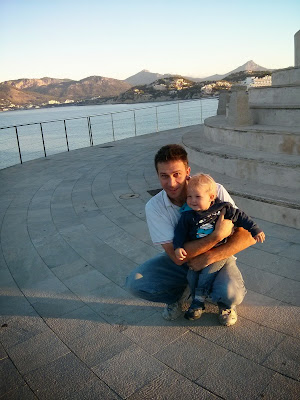
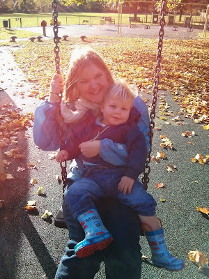

It's just over 500 days since Benjamin, my son, was born. He's no longer the fragile newborn. He eats normal food, he walks, he sleeps through the night. He's a very healthy little fellow. He doesn't talk yet but I've no doubt it's in the post.

Lately I've been considering - how has becoming a father changed me? Because I know it has.

To a greater extent than I'd like, the answer is fear. Put simply, I'm terrified. I'm terrified of something happening to Benjamin. I'm terrified of him hurting himself, someone else hurting him or worse still, me hurting him. And lest I sound too narcissistic - it's not restricted to him.

Fact of the matter is I find much of the world more painful than I can bear anymore. I've found I can't read newspapers these days. They are filled with tragic events. People wounding each other, people killing each other. And I can't take it. Not that it didn't used to bother me, it did, but my reaction now is far greater. For every person I read about suffering I know that that person was some mother's son, or some father's daughter and for reasons that I cannot satisfactorily explain that makes it painful for me to even consider. I realise this sounds incredibly self-indulgent. Believe me I don't mean it to be - but I've got to be honest.

The flip side of this coin is the feeling of absolute joy that Benjamin brings to Lisette and I. Each morning we wake at about 6am. Lisette jumps in the shower, I go to the kitchen and make her tea (builders, milk, 1 sugar), me coffee (a large strong latte) and Benjamin gets 8 fluid ounces of full fat milk given 3 rotations in the microwave on full power. We assemble the drinks upstairs and then enter Benjamin's room to wake up the young master with a rousing chorus of Lisette's creation:

*"Goooooooooooooooood morning, good morning! We love you very much, good morning, good morning to you! Goooooooooooooooood morning, good morning! You slept the whole night through, good morning to you!"*

He'll beam up at us and, after a little coaxing, present Lisette with his dummies (he sleeps with 3 in the bed just to be on the safe side). And then it's back to our bedroom where Benjamin will glug his way through about 80% of the milk before breaking off to play with various toys that we have scattered on the bed.

Each day we're filled with enormous gratitude that God has blessed us \***so**\* richly. What a magnificent little man he is. How privileged we are to get to raise this jolly little boy. To have each other. It's wonderful and we are so grateful. I've found I'm coming to forget what life was like before we had Benjamin. That's one reason why I'm writing this - I want to remind myself in the future how it felt in the past. In my head, it feels like we were just wasting time before Benjamin. I don't think that we were actually - what I'm trying to say is that I'd much rather be living the life I'm living right now than go back to my life before parenthood.

I guess that's it. Life is as it was before, but the emotional intensity is greatly increased. The joy has increased exponentially. And so has the fear. But it's worth it for the joy. Yes, it's definitely worth it.

