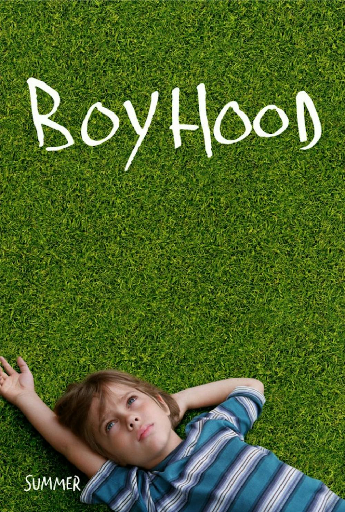
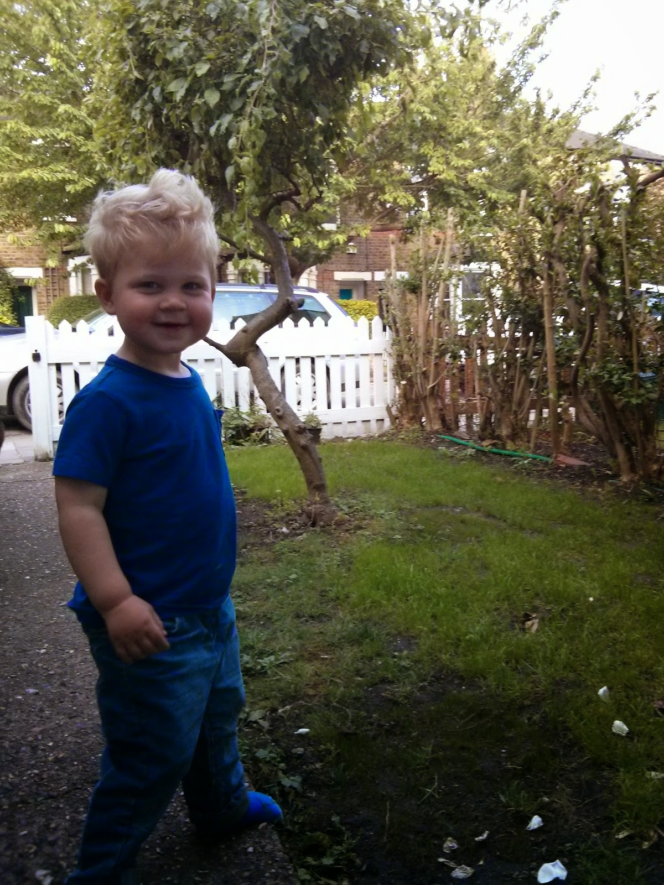

I just cried. I'm not an especially tearful person for the most part so that was kind of odd.

Lisette and I went to the cinema last night. It's our wedding anniversary on Monday and Lisette is due to give birth in a months time. So we felt an outing was in order - probably our last outing for quite some time.

We saw a film called "[Boyhood](<http://en.wikipedia.org/wiki/Boyhood_(film)>)". It moved me. It's a film pretty much like no other. You see a boy, Mason, age from about 7 to 19. It's amazing. It's not full of big drama - but it is full of the kind of things that happen when you grow up. It made me remember the things that happened to me when I was younger. I should say that my own life was easier than Mason's - there were far less genuinely scary adults in my own upbringing.

But so many of the things that happen reminded me of things I'd forgotten. At one point Mason goes "camping" with friends in a semi-built house and they smash up bits of wood and throw circular saw blades at a wall for fun. I was similarly stupid and dangerous. Where I lived there were many new houses being built. When the builders would go home for the night onto the building sites my friends and I would romp. I remember throwing myself happily off the roofs of new houses onto piles of sand below. It didn't seem dangerous. It seemed fun!

When Mason sets off for university he's excited. His mother is distraught. I remember my own parents driving me to university and mum being in floods of tears as they dropped me off. I don't think I appreciated that at the time - I was just delighted to be away on an adventure! Funny how human beings seem incapable of understanding someone else's perspective until they've lived it themselves.

So why did I cry? Well, I'm not sure. It was a mixture of emotions I think. Partly I'm so glad I ended up where I did, with who I did, that I made it at all. It seems so clear from watching the film that life is incredibly tenuous. It's remarkable that any of us make it as far as we do. There's so many opportunities for something to go wrong.

Partly I think I cried out of fear. I know my son Benjamin is going to face all this himself - or something like it; his own particular recipe of life. Bad things happen and I can't always be there to protect. I won't have the first clue half the time Benjamin's in danger. I've got to let go - not yet I know (he's only 2) but it'll happen. I know deep down it wouldn't be good even if I could protect him anyway. If I don't let him live his life then he isn't really living life in a meaningful way. But I want to save him from harm - and certainly take the rough edges off life if I can. Like most parents (I expect) I'm winging it, praying and hoping for the best.

I think that watching the film at this time in my own life probably contributed to the reaction. So much is change. One son growing up quickly. Another son or daughter due to arrive in the outside world within the month. I'm a bit overwhelmed. Excited - yes. Terrified - some. Alive - definitely.

