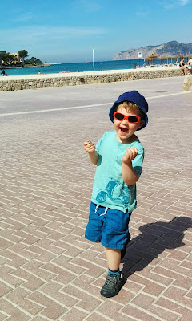
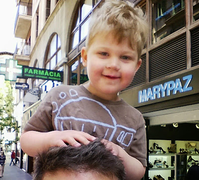
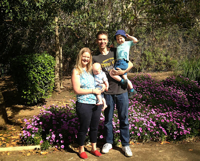

Fun fact, the word "typical" enjoys a vastly different meaning when used by Brits as opposed to when used by the Spanish. The English usage of typical is effectively: "It's rubbish and I knew it would be". Example: the word uttered upon learning there is no car parking space when you need one. The Spanish definition is simpler; it means "traditional". Consequently the examples are jollier: olive oil, tapas and maracas.

---

The flaxen haired youth's name was Benjamin Luxford Reilly and, as he was fond of telling people, "I \*not\* a baby, I a big boy".

It was another sunny day in Mallorca and it had been decided that a trip to the market was in order. Benjamin wasn't too clear what a market was exactly. He had supposed that it would be much like a supermarket, but apparently not. Benjamin's father delighted in telling him that whilst supermarkets were a relatively recent innovation, markets went all the way back to Roman and Greek times. Perhaps even further still, but the prohibitive expense of using his mobile phone whilst abroad meant Mr Reilly wouldn't stretch to checking Wikipedia, preferring relative ignorance to massive bills. It emerged that it was Benjamin's father's view that markets were far more exciting than their "super" equivalent because they were

1. Outdoors and
2. Far less likely to sell washing powder and far more likely to sell tasty snacks.

<!-- -->

The family proceeded together on foot in the direction of the marketplace; Granny Annie, Benjamin, Baby James and Mr and Mrs Reilly. Well "on foot" perhaps does not describe James and Benjamin's modes of transport. James was snoring in the buggy with a sunhat on, being pushed by Mrs Reilly. Benjamin had opted to sit upon upon Mr Reilly's shoulders. Mr Reilly enjoyed his equine duties but, given Benjamin's not insubstantial weight, would have welcomed the occasional break. Benjamin disagreed, feeling it was better that he remained in the saddle, so to speak. It toughened Daddy up. He saw himself as much in the tradition of Yoda training Luke in "The Empire Strikes Back". Though perhaps without recourse to the levitation of rocks and X-Wings accompanied by troubling hallucinations of Darth Vader.

As they entered the market, the first stall they came to was offering all manner of bread and baked goods. Alongside these were sold a Mallorcan variety of pizza which seemed to have replaced the traditional tomato base with a mixture of caramelised onions and peppers. Benjamin eyed the local speciality with some concern but finally agreed that they could procure a slice. "Uno, por favor" stumbled Mr Reilly in his pidgin Spanish, gesturing hopefully in the direction of the bready goodness.

The family took a seat on a wooden bench in a park that was located just to the side of the marketplace. Sat upon the bench Benjamin had decided that he definitely didn't like the pizza. Without first trying it he opined "don't like it" quite forcefully, fearing that, perhaps, it may even be poisonous. After about 10 minutes of special pleading by Mr and Mrs Reilly, Benjamin was persuaded to give a tiny corner of the pizza a try. "Mmmmm!!!" He intoned, delighted, and indicated that contrary to prior sentiments expressed he would actually be open to having some more.

It was obvious to Benjamin that by waiting 10 minutes before putting incisors to peppery bread, the flavour had been quite transformed and the poison dissipated. Mr Reilly was not so convinced; Benjamin's change of heart had rather put him in mind of that quotation attributed to Mark Twain:

> "When I was a boy of fourteen, my father was so ignorant I could hardly stand to have the old man around. But when I got to be twenty-one, I was astonished at how much he had learned in seven years."

The park was of the sort that didn't allow dogs and, to inform patrons of this, large signs were hung here and there which featured the profile of a dog with a thick red line running through its head. As the family sat there, they watched a variety of dogs and their owners ambling slowly past the signs in and around the park. Granny Annie observed that rules and laws are generally regarded as symbolic in Spain. Few Spaniards feel particularly bound by them. In fact, in all likelihood the signs were only erected to put the Germans at ease. In some ways this could be seen as a charmingly relaxed Mediterranean attitude towards needlessly strict rules. After all who would honestly say they don't enjoy the spectacle of a golden retriever romping through grass of an afternoon? Not Benjamin, who basically considered himself quite pro-dog (provided the dogs weren't too large). However Mr Reilly had observed other side effects of the laissez faire attitude to the law, in the form of smoking in restaurants and pavements liberally splattered with dog waste. (Which had not been pooped, scooped and binned by their rebellious owners.) As such he felt that perhaps the Germans had something to offer on this occasion.

It was at this point the Reillys decided to try and pose for a family photograph. Baby James was, perhaps understandably, a little less than thrilled to be woken from his slumber, picked up and turned to face the noonday sun in all her beaming glory. Reviewing the photographs afterwards it was agreed that three out of four people facing the camera was not bad at all. Benjamin, seeing Mrs Reilly's phone, took the opportunity to grab it and bring music to the park. Earlier in the day, Benjamin had discovered a small pile of coins on a cupboard. They were the loose change that had been in Mr Reilly's pocket when they arrived from England. Given that the coins were of currency Pound Sterling and effectively useless in Mallorcan shops, Mr Reilly had discarded them until the return journey. Benjamin, feeling that big boys needed money, decided to take it himself and had placed the coins in the breast pocket of his T-shirt. As Benjamin jigged up and down to the tinny beats of mid-90s Erasure, a fountain of coins leapt from Benjamin's pocket filling the sand with shiny metal. "Oh no!" lamented Benjamin, looking entirely crestfallen. Fortunately for Benjamin the Aged P's were on hand and Mr and Mrs Reilly busied themselves on their knees excavating pound coins and fifty pence pieces from the earth whilst delicately trying to avoid some of nature's surprises, tucked away alongside. "Living the dream!" murmered Mrs Reilly, hands deep in the ground.

A little later on Benjamin was presented with the gift of a lolly by a kindly, well meaning man. "Ank-u!" Benjamin said. Mrs Reilly felt similarly about the notion of Benjamin eating a lolly as she did of the prospect of poverty, famine, war and death. "Think of the effect it will have on his teeth" she seethed inwardly. Benjamin didn't improve matters by then proceeding to suck the lolly hard and then exhale in an ostentatious fashion. Mrs Reilly realised, in a moment of absolute horror, that Benjamin was using his lolly to emulate a man smoking nearby. She is probably still twitching in a state of trauma at this very moment...

