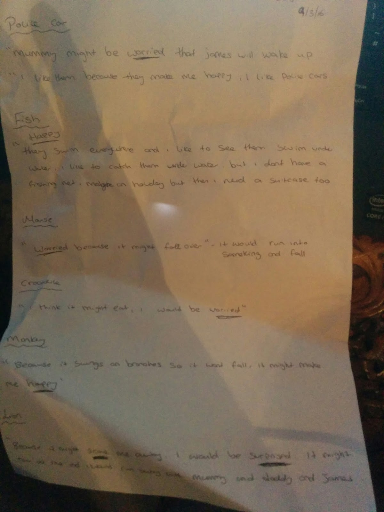
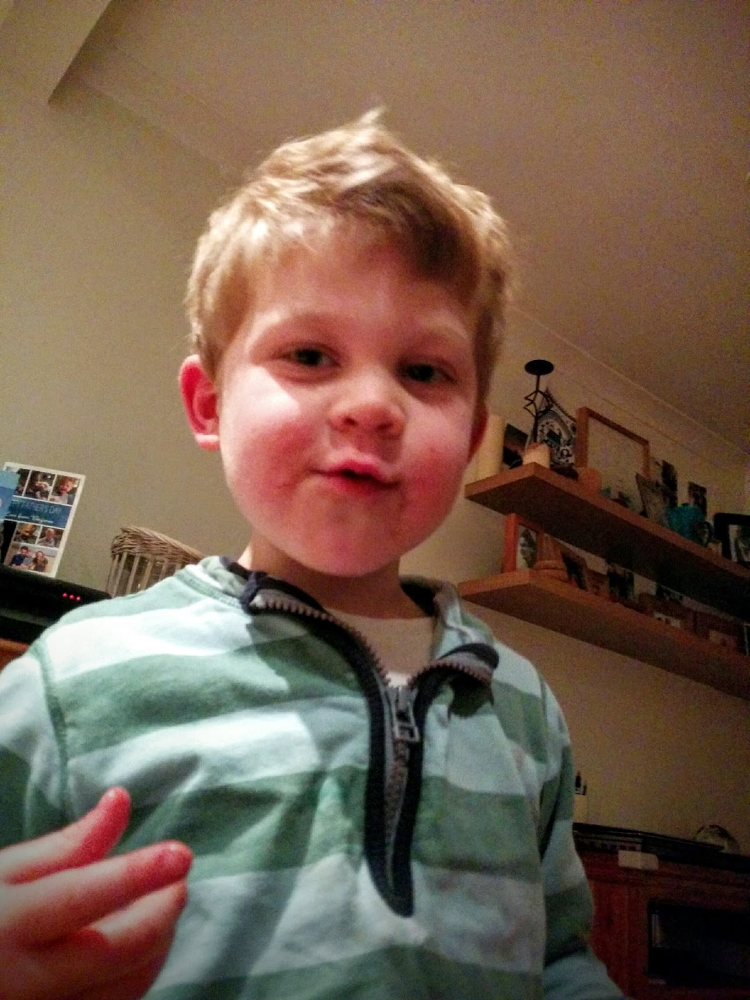

Miss Rachel at Nursery had a grand idea. She would give Benjamin a number of words and ask him how he felt about them. So she did. As Benjamin responded she diligently scribed away the results and presented Lisette with this at the end of the day:

It's not the best photo I've ever taken but the contents are gold and I didn't want to forget them. So here they are; Rachel's words and Benjamin's musings:

## Police Car

"Mummy might be worried that James will wake up."

"I like them because they make me happy; I like police cars."

## Fish

"Happy. They swim everywhere and I like to see them swim under water, I like to catch them under water, but I don't have a fishing net, maybe on holiday but then I need a suitcase too."

## Mouse

"Worried because it might fall over - it would run into something and fall."

## Crocodile

"I think it might eat. I would be worried."

## Monkey

"Because it swings on branches so it won't fall... It might make me happy."

## Lion

"Because it might scare me away I would be surprised. It might roar at me and I would run away with mummy and daddy and James."

Thank you Miss Rachel; you quite made our day!

