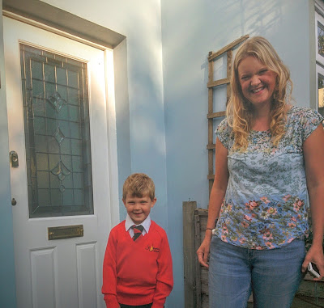
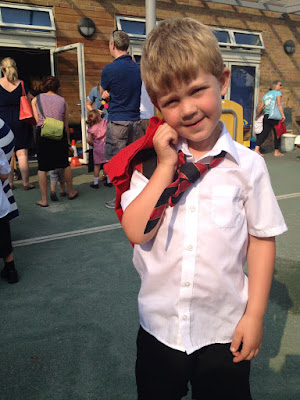

It was a warm Thursday morning. Despite it being mid-September and the beginning of autumn it still felt summery. Just another day of sunshine.

But that wasn't quite true, for today was Benjamin's first day of school. He was going to get up, eat breakfast, put on a shirt, shorts and a tie and walk the 6 doors down the road to St Stephen's Primary. Lisette had reservations about the tie; the shirt too for that matter. It seemed excessive for a child as young as 4. But they were the rules. She had other things to worry about; John was faintly baffled by the level of stress accorded to the difficulty in acquiring shorts. But there you go.

The morning began as most mornings did. Lisette drank a mug of tea upstairs. The boys drank milk, played and sat around her. Downstairs, Radio 4 could be heard in the background as John flicked various knobs and twisted dials on his coffee machine until something was produced that sat somewhere on the scale between "cappuccino" and "latte". There was something deeply satisfying to him about the level of effort required to produce coffee. The idea that the varying levels of attention to detail meant you could either produce a gloriously flavoured treacle or, alas more likely, a mug of brown slop.

This was a milestone morning. Everybody knew it was a milestone morning. Something big was going to happen come 8:40. The odd thing about the imminent approach of significant moments is not knowing how you're supposed to feel or behave. There's a notion that there is a certain path you should be treading but no idea of what that might actually be. So instead, for want of anything else, the morning continued as it might normally. James still wandered off mid-cereal to find his scuttlebug, only tempted back when he heard the "pop" of the toaster. Benjamin still insisted on 2 bowls for different types of cereal; the majority of which remain uneaten. He also decided that he needed to have porridge to which he gave a similar level of inattention.

But imperceptibly a point was reached. The countdown clock had started ticking. Benjamin needed to be togged up in his uniform, pictures needed to be taken. It was time; the boy needed to go to school.

The bell was rung. John watched Benjamin walk into his classroom and take his seat on the floor. His back was to his father and Benjamin formed part of a haphazard circle of 4 year olds. In a difficult to describe way, it felt to John as though Benjamin had just left his family. Left his pack, to be part of another pack. Of course he would see him again that evening. But in a way he wouldn't. He'd see a subtly different Benjamin, with the beginnings of new experiences and loyalties and friends. John's eyes grew hot and he forced himself to stare at the wall for a minute or two until he felt more in control of his emotions. Behind him he could hear Hazel exclaiming to Lisette "you're tearing up!" At least we're in the same boat.

Meanwhile, James had decided that by not going into the class he was clearly missing out. He lay face down on the playground. Lisette felt rather the same way although for different reasons. Normally on a Thursday it would have been her day to spend time with Benjamin and James. Her little gang. They would have gone to Little Acorns to see friends, then to Marble Hill Park to run around and eat lunch in the enclosure. Then maybe to the 1 o'clock club. But that wouldn't happen anymore. Her little buddy was gone. He had moved on and she wasn't ready to. Being a mother was, to quote Gilly Charkham, "a wrench". That night it rained heavily and thundered. It seemed somewhat appropriate.

