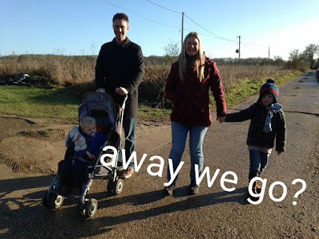

There's this film called [Away We Go](<https://en.wikipedia.org/wiki/Away_We_Go>). It's about a couple expecting their first baby and wondering where they should live. Over the course of the movie, they travel to different places in North America, spend time with different groups of friends and family. In the end, (spoiler alert) they work out where they think they should be.

When Lisette and I first saw it we thought it was fantastic. It's got a great soundtrack. It's got John Krasinski, making me question my own sexuality and reinforcing Lisette's. It has beautiful locations. It has great characters. What's not to love?

When we first watched it, the main theme of the film was just incidental to us. "Where should we live?" That's the question. Where should we be now? Where should we raise our children? Where do we belong? Over recent years this theme has become something Lisette and I actively think about.

## Never Let Me Go

We live in leafy Twickenham on the outskirts of London. We have done for more than a decade. As we've lived here we made many good friends and we've had wonderful times. There was a beautiful period when our first son was born where it felt that every person we'd see on the street would be someone we knew well and loved.

But a serpent entered our garden idyll: people started to leave. One by one we started to notice friends and family upping sticks and moving away. Some would like a bigger house. Alas, unless you're an oligarch, that's a somewhat difficult proposition in London. Some want to be nearer family. Some don't like the city. Some have dreams of living abroad. Or perhaps their work sends them away. They all had and have *REASONS*.

The leavers (let's call them that) are \**still*\* your family, \**still*\* your friends. But they're not part of your life in the same way anymore. You have different lives, different reference points, different experiences. Those differences make a... well like it or not (and naturally I do not), they do make a difference. So the realisation has started to sink in that a period of life I'd naively thought would last forever is ending. Has it already ended? Who knows; it's all a bit nebulous.

## How Did We Get Here?

I was born in the maritime city of Bristol, as was my brother. At the grand old age of 3, our family left the Southwest. We moved East to Fleet; a commuter town an hour away from London on the train.

Most people I've met look back with unalloyed fondness on the area they grew up. Lisette, a Geordie to her fingertips, is no exception. "Wey aye, man, Newcassel's purely belta like!" she says. Or some such incomprehensible positivity like that.

[Fleet regularly tops polls of the best place to live in England](<http://www.bbc.co.uk/news/uk-england-30560011>). I ought to love it. I had friends. I had a decent education. It was a green and pleasant land and there was plenty of space. But alas, I'm a contrararian.

As I grew up I found Fleet to be tremendously boring. The number of times Public Enemy toured Fleet? 0. This is a place that struggled to pick up Channel 4; never mind Channel 5. In fact, the cultural highlight of my youth was one of the world's strongest men coming to pull a coach the length of Fleet High Street to celebrate the opening of a pizza shop. So you can see why I left.

Oddly I never felt like I belonged there. I grew up with a personal Jiminy Cricket sat on my shoulder telling me "you're not supposed to be here..."

After university I decided to head to London to seek my fortune. The streets are paved with gold, right? Lacking any real knowledge of the capital I aimed my vessel to the home of David Bowie, Mike Skinner and Delbert Wilkins. Brixton. Being one of the rare white faces in the many splendid diaspora of Lambeth I naturally felt completely at home. My flat was in stabbing distance of Brixton Academy as well as the glory of Electric Avenue, Coldharbour Lane (where actual stabbings took place) and the Ritzy Cinema. Each night the town's character changed; morphing based on the fan demographics of whoever was performing at the Academy that night.

In a way that defies easy explanation I felt like I belonged. My now wife, Lisette, felt otherwise. Having been raised in Whitley Bay, a seaside town near Newcastle she didn't warm to London. But we loved each other, so the deal was we'd find somewhere that was London but didn't feel like it. That was Twickenham. And it was great. It \**is*\* great.

## What's Next?

Do a thought experiment with me: close your eyes and imagine all the people you know in your community. They matter to you. You love them, don't you? Now imagine they're all gone. One way or another, they have left. Do you still want to live there? Is "home" still your home?

I ask as it seems the inevitable conclusion of this drip-drip exodus.

London feels like home. In London the air is electric. To me these are both truths. But the other thing to bear in mind is that London is a very transitional place. People come and people go. Often. That's one of the things that makes it so exciting. So dynamic. And that's why, in the words of Johnny Cash channeling Trent Reznor, [everyone I know goes away in the end](<https://youtu.be/vt1Pwfnh5pc>).

That's not true of the suburbs. People settle there. They stay. I have friends living in and around Fleet that have been there since I was a boy. My parents are still there. There's something in that stability. Whilst I didn't appreciate it at the time, perhaps I benefited from that as I was growing up. It's worth considering.

## Should I Stay Or Should I Go Now?

I feel like I'm approaching a fork in the road. And on present evidence I'm liable to go straight.

I just don't know what to do with myself. With my family. Do we double down and stay where we are? Knowing that the majority of the relationships we form will have something of a time limit associated with them. Knowing that we'll regularly need to recommit to making new friends as old ones move on. Who's worth investing in? It seems terribly transactional.

Or maybe we should be thinking about moving out of the city. Back to where I was raised? Close to family. Nearer to old friends. Longer lasting relationships but less excitement. More space for the children but less vibrancy. Less difference.

Or something else entirely. Maybe abroad. Brexit is likely to restrict Brits' ability to work in the EU. But I've got an ace up my sleeve. Despite being born and raised in England, I find I'm eligible for an Irish passport purely by dint of my family. My wife is eligible for a French passport in the same way. What glorious mongrels we are. Maybe if we went abroad for work things would become a little clearer in my mind. It helps that I'm a software developer. You can do that anywhere. And, in fact, even working remotely is a pretty common way of working in my industry. So there's options.

What I lack is clarity. I pray I would know what to do. And when. And why. It comes down to this: I don't want to go. Or do I? And if I do, well where?

