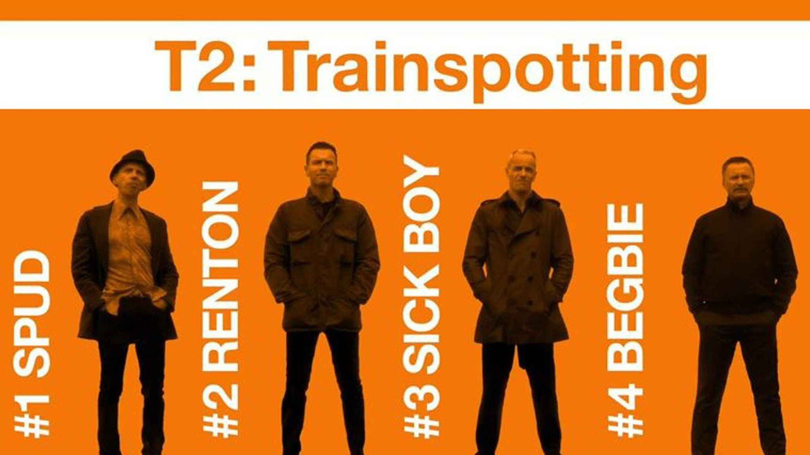

On Friday night I went to the cinema and saw T2: Trainspotting with a mate. I loved it; for my money it's a wonderful film. Albeit one with a terrible name. I put it to you my alternative title is better... Ish.

I went to see the original in the cinema. Like pretty much anyone of my generation I had the mandatory orange posters plastered on my walls. I read the book multiple times. I had the video, the VHS cassette (I'm that old). Hell, I had the green special edition VHS with the deleted scenes. (Which was probably only released because at that time the marketing men realised they could slap Trainspotting on \**anything*\* and make some money.) If I was going out for a night I watched Trainspotting with a drink in my hand before I headed out. It was part of the vague rituals of my life.

The film meant a lot to me. It's hard to express just why; excessive exposure has tattooed it into my mind. Part of it may be that the characters feel real. I have the same reaction to the Before Sunrise / Before Sunset characters Jesse and Celine and they're quite different but equally distinct.

I had some trepidation knowing that they were making a sequel to Trainspotting. Sequels usually fail to honour the original. But I've got a lot of time for Danny Boyle and I thought it could work out. In Danny We Trust. Rightly so.

It's not the same sort of film as the original. The nominal plot is not what the film is about (which is as well as the plot is fairly unedifying). The film is about getting older. Aging. How do you feel about how your life has turned out? How do you feel about the relationships in your life? Your family? Your friends. How are you doing?

It got me at a gut level. I have a feeling I responded to it so much because I'm not the same age as the me that originally imbibed this. Time has passed. I see these faces up on the screen and in the same way they've got creases in their faces and lines around their eyes, so do I. George Orwell said: "at 50, everyone has the face he deserves". The idea being that by the time you reach that age the movements of your face, the smiles and the frowns will have become etched in stone. Recorded in your skin as the permanent expression of the memory of a million emotions. So get smiling or I'll know you haven't been.

The characters, those that survived the original, are all back and you believe it's them. It's not some actors turning up for a paycheck; it's totally them. It's Mark Renton, Sick Boy, Spud and the supremely terrifying Begbie. The latter member is, somehow, one of the most fear inducing characters committed to celluloid. At any given moment he could do \**anything*\*. You have absolutely no idea what he will do. Then he does it.

If you had any time for the original I think you should take a look at this. It's wonderful. It's hideous and filthy in large part and yet it is fulfilling and somehow... Elegiac. The best part for me is what happens to Spud. I won't spoil it - but there's a great idea that is used for his character. It's beautiful; it's *right*.

Oh and lest I forget; the soundtrack \***rocks**\*. Just who are Wolf Alice? Never heard of them before but I think I've listened to [Silk](<https://youtu.be/mEASmSwndnw?t=1m2s>) a thousand times now. So good. So good.

PS I'm a member of the Church of Wittertainment (Hello to Jason Isaacs) and [I'm with Mark Kermode on this](<https://youtu.be/oi8a3c1a6gc>)

