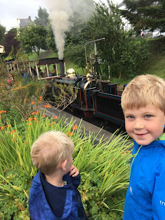
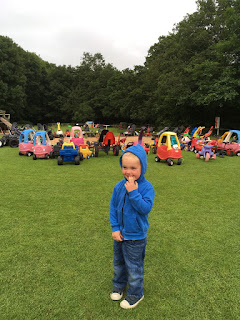
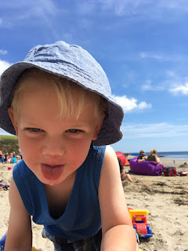
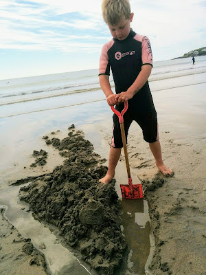
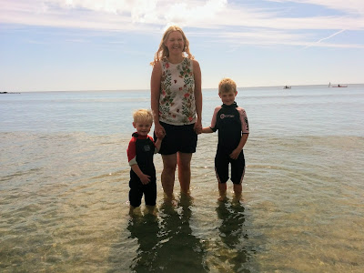

Lisette and I have proven ourselves incapable in the "booking holidays" category of competence. After months of attempting to find something we realised we'd fallen at the first hurdle by failing to do the requisite planning-one-year-in-advance. This is alas mandatory now Benjamin is in school and restricting our holiday times to select high priced periods. Why did he have to grow up?

So it was, that around 3 weeks prior to us having to explain the meaning of the word "staycation" to Benjamin and James, we received an offer. A couple we knew from church, Peter and Sarah, were going to be in Portscatho, a village in Cornwall and would we like to stay with them? Would we? Popes / Catholics / bears / woods - you get my drift.

<!---

It was, to be honest, a slightly more considered decision than that. Lisette was concerned for Peter and Sarah's sleep; Benjamin and James being the very definition of early risers. Knowing that our potential hosts / housemates (... hostmates? yes!) had raised boys, my view was: they've been there; they'll understand. Lisette was more: they've been there - perhaps they don't want a reminder? Reader: self-interest will out.

--->

We set our sights for the Southwest. And so, the four of us came to find ourselves winding our way down a single-lane road with the rain lashing the windscreen of our rented car. Always say yes to a memory.

In a gesture towards being actual grown up adults we had opted to break up the long journey into manageable chunks. We did this by Air B&B-ing our way to Cornwall. On the first night we stayed with a retired hot air ballonist in Somerset, who was convinced 9/11 was in reality a conspiracy courtesy of the Illuminati. We followed that with a night at the most lovely of farmhouses just inside in the border of Cornwall. It had what few other B&Bs have: a functioning steam railway. James was beside himself with joy; muttering "train.... Me... Me! Train! Me! Train. Train!"

We had something of a baptism of fire concerning the single lane roads for which Cornwall is famed. I must be ruthlessly honest: unlike Rain Man I am not an excellent driver. So much so that each journey tends to begin like this:

<dl><dt>Me:</dt><dd>Dear God, please don't let me kill these lovely people and if you could get us where we're hoping to go safely that would be oh so greatly appreciated. Thanks. </dd><dt>James (from the back, in a muffled but distinct voice):</dt><dd>Not God! Oh my gosh! Oh gosh!</dd></dl>

James is very hot on outlawing perceived blasphemy these days.

So finding myself front bumper to front bumper with a Land Rover, on a road without passing space, jolted me somewhat from my happy place. During the tense standoff with the other car, I pondered whether car technology had moved on significantly since I'd last checked. There's an awful lot talked about driverless cars and drones these days. Perhaps there was a "flight mode" for our Vauxhall Insignia that I had hitherto not noticed? I inspected the dashboard optimistically, searching for a button I hadn't yet pushed. The other vehicle eventually tired of my misguided wonderings. It reversed to a passing point. We edged past it and onwards to glory. And Portscatho.

---

Portscatho is a beautiful village on the the East coast of the Roseland Peninsula. It slants down a hill which means at almost any position you can look out to sea. And being East facing, the sun rises above the bay each morning, looking for all the world like a megawatt-bulb Zeppelin. The village contains a pub, a butcher, a couple of shops and the harbour club which doubles as the local cinema on Monday nights. The small harbour is populated with motorboats sat just inside a stone quay which juts out into the sea. Children can occasionally be found hurling themselves off the end of the quay, enacting a worrying local tradition. Apparently it's safe as long as there's no more than 4 flagstones depth to jump. More than that and legs might be broken. Ah tradition!

The water is crystal clear and you're likely to find people crabbing. 🦀 Crabbing involves using some bait, typically bacon, to tempt in shrimp and crabs to nets. On the first night Sarah took us on a tour and we met some boys doing just that. No friends of caution, they'd opted for a full rasher of bacon in their net. They no doubt figured that if you scaled up the bait, you scaled up the prize. They were hoping to land Godzilla. Alas life doesn't work like that and they had thus far acquired a single (rather puny) shrimp. But we admired their intentions.

The third personality we were living with was Peter and Sarah's dog: Jess. Jess is a giant black walking carpet of friendliness. An enthusiastic and affectionate labradoodle with breath that, post-breakfast, could stun an ox. She's awesome and, with a little coaxing, enabled the boys to get past their fear of dogs.

One evening Peter and Sarah were out for dinner. I volunteered to take Jess for her pre-bed constitutional so their evening could go with more of a swing. I should say now that whilst I'm a dog lover, I'm not a dog owner. We headed down to the Lugger (your guess is as good as mine - it's a road that overlooks the quay). There Jess wandered from bench to telephone box to grassy area, sniffing, panting and occasionally urinating. What felt like the appropriate period of time passed, and I reattached the lead and pointed her homewards. We mooched past our car, which I had parked in a temporary waiting spot. By Portscatho standards, where every second car is double parked or sat on double yellows this seemed small beer. But still I thought I should do something about it. It was then I realised that Jess was busy voiding her bowels on the driveway next to the car. It was dark. And I had no bags. After a moment's guilty squinting at the dark (and now smelly) driveway, I affected nonchalance and, with lead in hand, strode purposefully upwards to where we were staying. I awoke the next morning with this mantra running through my head:

Move the car, move the dog poo, move the car, move the dog poo. Almost meditative. I might have it engraved on a plaque. Once I'd summoned energy for the day, I did, and I did. Anyone who was near the harbour at 6am that morning, may have witnessed a man furtively foraging in a driveway; attempting to retrieve something whilst desperately trying not to wake the occupants of the house. Such witnesses would have quickly realised that the driveway being made of super-audible gravel really worked against his noble aims.

Walking distance from Portscatho is Porthcurnick Beach. It's a glorious stretch of sand to which we dragged 2 bags, buckets and spades, and a buggy. We arranged ourselves on Lisette's picnic rug, pretty much immediately resigning ourselves to it being persistently covered in sand. Different people have varying expectations of a beach trip. Just along from our modest pitch a family had erected a tent. The entrance of the tent was expanded out on each side by windbreakers taking the form of walls leading out from the tent to the sea. At the end of the windbreakers a tennis court had been etched into the sand where 2 of the party were gently thwacking a ball to each other. Applying for planning permission was undoubtedly their next logical step.

The beach is well known for a beach side café called "The Hidden Hut". There's been articles in magazines and papers about it. And once someone off of the telly ate there. Or something. Either way, it's popular. Having eaten there a couple of times, we can say it deserves its reputation. The prices are very "London" though. Also, when rain kicks in (as alas it was wont to do on a regular basis) you can really find yourself wishing for a roof to shelter under.

In that wonderful way that children have, Benjamin and James almost instantly made friends with an assortment of other like-minded spade wavers down by the seafront. Negotiating amongst each other what should be constructed next and how. Much digging was done and many moats and castles were made. If I close my eyes I can still see Benjamin standing facing the shore, laughing as the waves hit his back. Magical.

