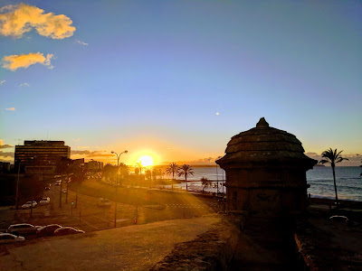
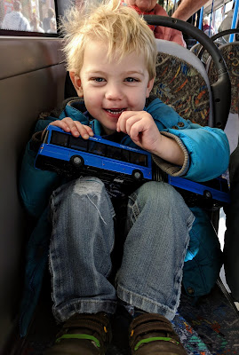
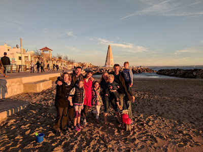

The difference between Spanish winter and British is not really temperature. A mild British winter day isn't significantly colder than Spain. The difference is light. Winter or summer, there is a lot more light to go around in Mallorca than in London. Lisette, Benjamin, James and I are staying in Palma visiting family. The day we arrived was not auspicious; it was overcast and stormy. The next day however, well... As I looked around I realised I was squinting. The light was too strong. I haven't squinted in London since October.

So it's a shame I distrust sunglasses. For some reason I always have. If the eyes are the windows of the soul then it follows that I regard sunglasses as harbingers of suspicion. If you won't let me look into your eyes then part of my brain is convinced you must be up to no good. Probably only a hop, skip and a jump away from pretensiousness too; that most tragic of attributes.

Quite apart from the not-so-nice-judge-y aspect, this is a lamentable attitude for another reason. The thing is, I look quite fabulous in sunglasses. Really I do; Ray-Bans were born to be on my face. Aviators; sitting atop my nose have reached their pinnacle in existence; they can do no better. I base this on memories of me wearing sunglasses when I would have last countenanced it; when I was 20. It might not hold true now I'm 40. But then, ha! Move over Beverly Hill 90210's Luke Perry, there's a challenger for the throne.

I'm both a man of integrity and a man with silly ideas. That's why I'm stuck doing my best Mr Magoo. But if there was ever a locale where compromise for eye's sake would seem reasonable, it's Spain. Each morning I've watched the sun rise over Mallorca; soaring into the sky above Palma old town. Watching the glowing red orb climb until the light is too much. It's beautiful.

Benjamin and James are enamoured of their Christmas presents: toy bendy buses. Plastic and metal approximations of the the sort that used to rumble through London's streets, occasionally catching fire. Ah, those bus shaped phoenixes, how we miss them. Galaxy S8's are but a lowly tribute act. In one of those peculiar ironies it turns out that all buses in Palma are bendy buses. Consequently the bus drivers of Mallorca are presently being greeted by 2 small blonde haired boys, who enter their vehicles waving petite bendy buses at them as they proceed past in search of window seats.

Travel generally (not just bus journeys) is much easier now than it ever was. It's all down to the internet. o2 have dropped roaming charges in Europe; you can use data in Mallorca just like you're in Margate. (I've never been to Margate but I have to believe it would make me want to use the web.)

Having the internet opens up a lot. We can Google bus routes on our phones and know just when the bendy buses will round the corner. When we're on the bus we can see ourselves slowly shuffling along the roads on Google Maps. Oh and my Google phone has this thing where you take a photo, it detects any text in the photo and then translates it (with Google Translate) into English. It's incredible! Minority Report has arrived.

With all this in hand, the world is less scary. (Or considerably more so if you're into George Orwell.) Travel is so much easier! But we've lost something too. Lisette and I used to get around, get shelter and get fed in foreign lands with no knowledge of language, customs or infrastructure. It felt like such an achievement. Such a noble mountain we had ascended each day. Though if I'm entirely straight, I'd say that particular challenge is not one I'd be up for with 2 children in tow.

So on balance, I'm really pleased that Google got good at running my life in the last couple of years. I'd be lost without them. Quite literally. Let's hope they don't turn evil.

---

I have this Dickensian ideal of Christmas. I know that the first Christmas happened in a hot country (and more likely in September than December). But I don't care. Actual facts be damned. To me, the person who really "got" Christmas was Charles Dickens. Christmas is supposed to happen in a snow covered London. Where there are snug pubs, mulled wine, minced pies, roasted big birds, carol singing, big Christmas trees, churches, Victorian waifs and strays - this chap called it right! (OK - the child poverty I can live without.)

All this goes to say that the idea of being away from London at Christmas time filled me with deep suspicion. Even dread. Everywhere else is a pale imitation of how Christmas is supposed to be. Christmas happens in London.

That's how I felt. I was wrong.

Christmas in Palma is different. They celebrate more on Christmas Eve than Christmas Day and if anything the real action is 12th night; January 5th. Epiphany is known as "The Arrival of the 3 Kings" or just "Kings". It's a tradition that has evolved from the idea of the Magi turning up with gold, frankincense and myrrh for Jesus. (Just what every 2 year old needs, right?) For 200 years, the "kings" have been arriving annually in Mallorca. In the modern day retelling the kings arrive in Palma by boat (obvs!) They then proceed around the city for 3 km as part of a kind of carnival with music and sweets, passing by palm trees wrapped in fairy lights.

Christmas here has Mallorcan ways, food and traditions. It's not London but that's not a bad thing. Palma has a glory of it's own. And no Victorian waifs either... So props!

