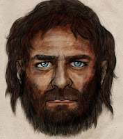

As I have grown older, I've become aware of a characteristic of mine, which I don't much like. It's not casual racism or a prediliction for keeping a lap dog in a handbag about my person. It's more complicated than that.

It's my face. Or at least: that's where it starts. I have a resting facial expression that gives off a vibe. A hostile one. Not intentionally; it's just well... It's a thing. My face at rest looks like Vinnie Jones thinking "you don't get to talk about my mum".

I get it from my father, who got it from his father, who in turn... All the way back to Cro-Magnon man. Somehow my family line has managed to maintain the same physical characteristics as the European early modern humans of 15,000 years ago, almost without compromise.

I used to joke about this with people. Then one afternoon, in a moment of boredom, I decided to google what Cro-Magnon man looked like. You know you get those artists impressions of long dead species? Well the same exists for CMM. Lo and behold, atop the list of my image search results was a gentle portrait of... Well, not to put too fine a point on it, me. I'm handsome enough, but to all intents and purposes I am also pre-historic man.

Daily people say to me "are you okay?", seeing the foaming torrent of fury upon my brow. What they don't realise is, they're almost certainly seeing me imagining "what will I eat for lunch today?" The person asking the question doubtless thinks I'm giving genuine consideration to eating them. Alas.

This isn't helped by a number of other qualities of mine. I have a deepish and booming voice, excellent for terrifying small children... And adults too as it turns out. It all goes together to form the impression of an altogether terrifying man. C'est moi.

Tragically for all concerned, the inquiry "are you okay?" now triggers a Pavlovian reaction. Immediately I'm thinking "oh no's! I'm giving off that vibe again!"

Even my own wife, who at this point I've known for half my life, asks this question. It's as if I have a broken sensor which feeds people the wrong data. My face is the human equivalent of a smoke alarm cited too near a toaster. Daily triggering panic in those around me when really everything is fine. It's fresh toast, not the end of the world.

Whilst this may seem immediately comic, it is not. Not really. I spend more of my life than I would like attempting to compensate. Trying to make people feel everything's okay, when actually everything is okay, it's just my face that suggests otherwise. This is tiring. Adjusting the person that you appear to be, to be closer to the person that you actually are. It really is exhausting. It merits a chorus of "I am what I am, and what I am, needs no excuses". And then some.

The question is: what to do? I need a lifehack to help me. I've had a small bunch of ideas so far:

Idea #1. Literally look through rose tinted spectacles if you're giving off that vibe. What I mean is: get some sunglasses of a cheery disposition and wear them when you fear you're giving off negative vibes. If they look somewhat ridiculous, so much the better. That can only serve your purpose. Aim for Elton John's heyday and you can't go far wrong.

Idea #2: always be looking in mirrors. This has the disadvantage of coming across vain but might help as you'd be aware of your appearance. It's also impractical; mirrors aren't everywhere. Mind you, Arthur Fonzarelli managed to swing this.

Idea #3: Eye contact; make more of it. This helps people know that you're not a serial killer; I'm certain of that.

If anyone else has any suggestions I would warmly welcome them. Debug me; you have my blessing.

