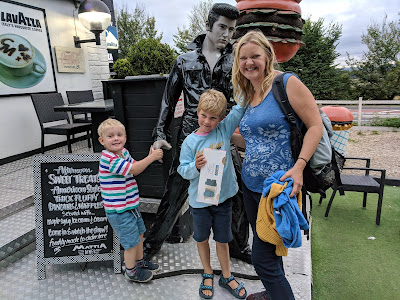
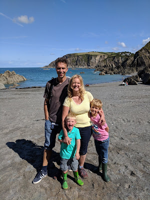

The Reillys had set out on their summer holidays. Benjamin, James and the Reilly parents were going to stay with some friends on a working farm in rural Devon. The farm was proudly carbon-neutral; it generated electricity and had its own water supply. This was a holiday that could only be more middle class if they breastfed the livestock hummus.

Rather than travel directly from Twickenham to Devon, the family had opted to break up the journey. So it was that on a Wednesday evening the Reillys found themselves outside their Somerset Airbnb and in need of food. Having wheelspun into the driveway, Mr Reilly was driving no further. Instead, the four of them set out on foot to search for dinner.

After an initial disappointment, involving a delapidated pub with ashtray and bleach issues, technology was consulted. According to Mrs Reilly's phone, a 50's America style diner could be found just fifteen minutes walk away. Whilst Mrs Reilly had misgivings about the health qualities of burgers, fries and milkshakes, she felt it still represented the best available option.

Having studied the map, the route seemed straightforward. Across a picturesque bridge and then up a long thin farm lane. This ran for a mile or so through fields, finally connecting to the road upon which the diner would be found.

The Reillys turned in a Northerly direction, heading single file across the bridge and onto the lane. It was very basic; just a single track with the occasional passing point. Unsurprisingly there was no pavement, and the lane was gifted a natural ceiling by hedges and trees that had grown out from the sides to meet in the middle. There didn't seem to be an intentional trimming policy in place. Rather, the vegetation was only restrained by the occasional tractor punching through and knocking limbs off trees.

Mr and Mrs Reilly were mindful that it was perfectly possible for a tractor to do the same thing to people. So, when a stile was spotted at the side of the road, they decided to hop it and orienteer across the fields.

It started out very promisingly; Benjamin pointed out delicate white flowers growing in the hedgerows. Sheep were spied gamboling and munching grass nearby. The family continued clambering through woods until the pathway began to descend quite steeply, towards a gap in the bushes. They crept through, expecting to be presented with the promise of food.

Whoooosh!!! An articulated lorry thundered past the collective Reilly noses. Thwip! Thwip! Two cars followed in quick succession. Through some error of geography, the family was standing not outside a US period themed eatery but at the side of a very busy multi-laned road. Traffic continued to rumble past at an alarming speed. Benjamin and James stared awestruck as heavy vehicles of all shapes and sizes whizzed past their nostrils.

Having briskly consulted the map, Mr and Mrs Reilly realised they were very close to their destination. Just four hundred metres separated them and sustenance. The family edged up the minimal verge in the direction of the diner. After three hundred and fifty metres everyone came to a halt, confronted with a thick bush that spilled out to the edge of the road blocking their path.

"What do we do?" yelled Mrs Reilly above the noise of a passing juggernaut. Mr Reilly spied that on the other side of the road the verge was clear and unencumbered by greenery.

"Everybody join hands" he bellowed over the continual drone of traffic. "We are going to cross the road together.... When I say..." Mr Reilly paused for a long time. "Ummmm... It is quite a busy road" he observed, in case anyone hadn't noticed. "... Quite soon... Okay. After the white truck.... Go!!!" The family, hand in hand ran across the lanes, very aware of vehicles fizzing towards them from 2 directions. "Ruuuuuuunnnnnnnn!!!!!!!"

It is commonly observed that time can slow in moments of danger and high tension. If the Reillys had last had foot on verge on a Wednesday evening, as far as Mr Reilly was concerned, they arrived at the other side a week Thursday.

Panting, the family turned themselves back to face the road once more. In the distance could be seen a building surrounded by 50s memorabilia, Chevrolet cars, neon signs and the unmistakable profile of Elvis Presley adorning the front door.

Everyone linked hands again and waited for a gap in the onrushing traffic. Again they had to wait some time. "Go, go, go!!!!" bellowed Mr Reilly when the time finally came. Eight legs of varying lengths raced across the road, heading directly for the bequiffed blue suede shoes loving icon. "Go, go, goooooooo.............!"

Heaving and shaking, the four figures arrived at the other side of the road and edged up the verge. James could be heard muttering "me no like motorway, no like motorway". Benjamin was white faced and Mrs Reilly was in the early stages of shock. Meanwhile, Mr Reilly was really questioning the wisdom of whichever authority that had allowed him to parent children. Enacting a human version of the classic computer game Frogger was just further evidence to add to the already teetering pile. Mr Reilly imagined some cosmic authority looking on and shaking it's head whilst marking a cross on a clipboard next to his name.

Once they'd caught their breath, the family made their way into the diner. It was a mighty pleasant meal; albeit just as unhealthy as Mrs Reilly had feared. Throughout dinner there were regularly mutterings from small voices of "no like motorway" and "might have got bashed".

The family took a different route back.

