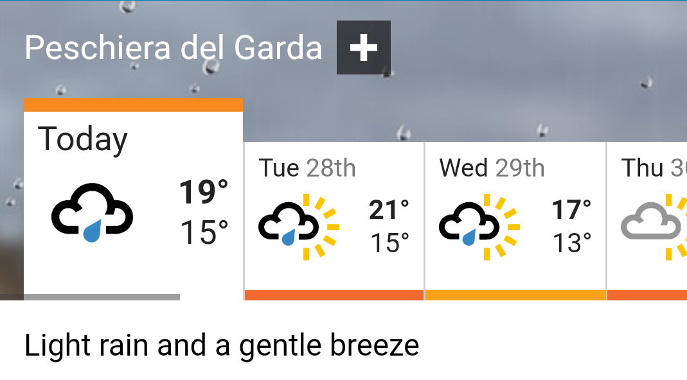
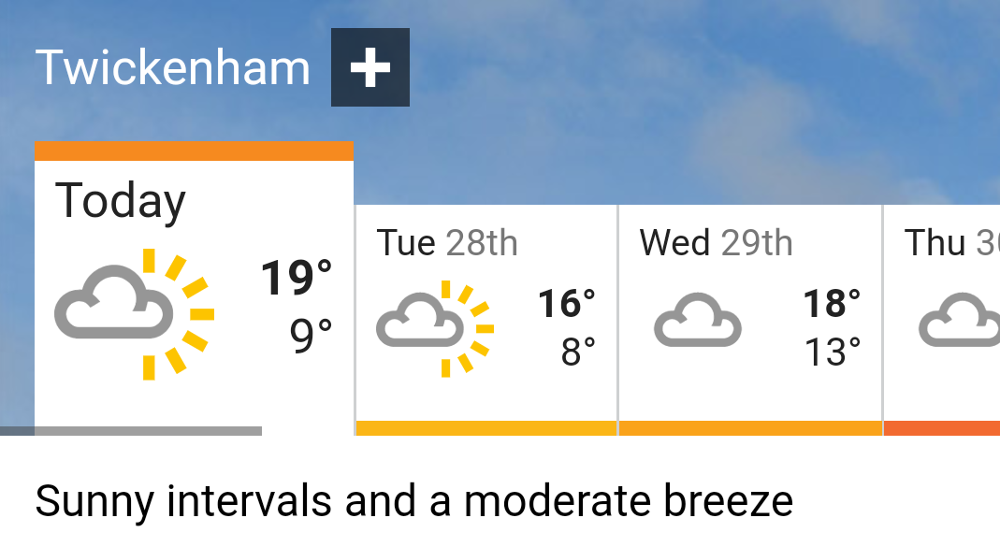
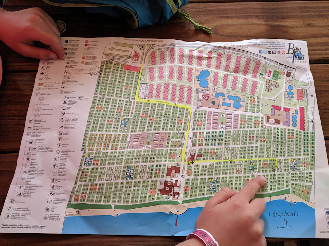
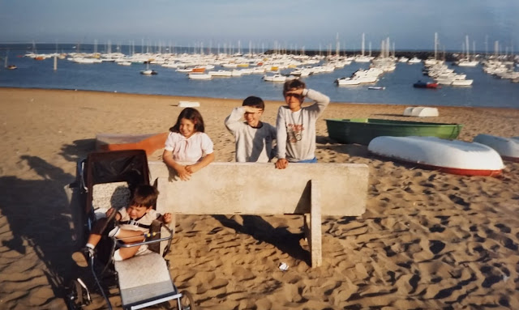
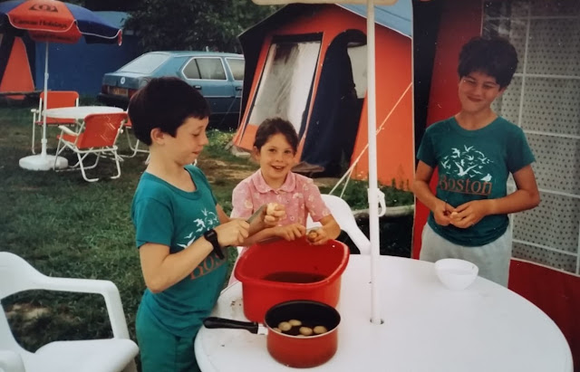
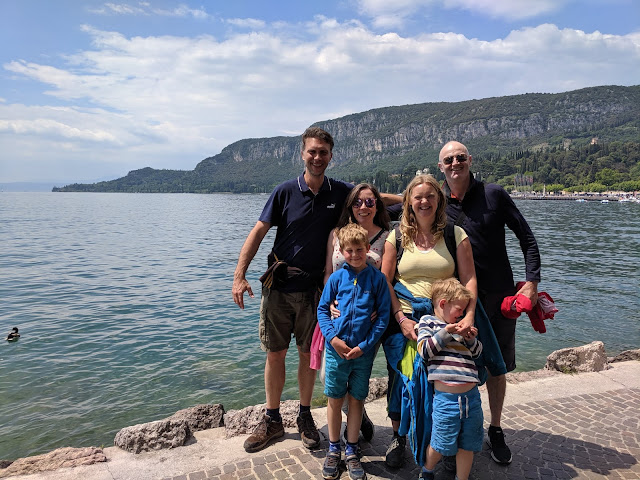
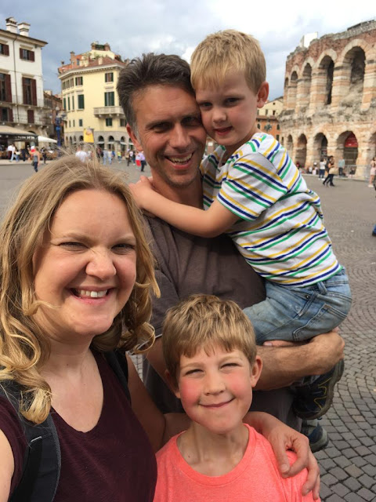

On May 27th 2019 the weather in Peschiera del Garda looked like this:

Whilst in Twickenham it was more like this:

Since myself, my good lady Lisette and the marvellous, "extreme" (that's right! - Ben) Benjamin and James were camping in the former location, we collectively agreed it was a bummer.

To be more accurate, we were not so much camping as glamping (correct! - Ben). Whilst we were living under canvas, we had not erected that canvas with the honest sweat of our mutual brows. Rather, we had opted to show up and occupy a tent which had already been pre-assembled for our living pleasure. Even calling it a tent seems a stretch, given that it featured a 4-ring gas stove, a fridge, a microwave, beds, lights, electricity and was sited upon a raised wooden deck rather than muddy earth.

But it didn't have a toilet or running water, so we could still argue that on some level we were still "getting back to basics". This kind of camping also fulfils a basic life-need of mine, that is to say: access to cooking facilities. The absence of stoves means I've always viewed hotels as disempowering experiences. To me at least, not being able to cook is in the same ballpark as being denied the right to vote. Hotels are essentially prisons with a more lenient gate policy.

In many ways, this kind of trip harks back to the holidays of my childhood. Apart from the first seven summer breaks of my life, family holidays were spent on a campsite somewhere in Europe. Before that, each August we'd gone to stay in a chalet in the Gower in South Wales. This particular family ritual was brought to a brutal close due to a tragic brewing accident which I will attribute to my father. As it was his fault.

Back then, Dad was a keen brewer of ginger beer. Ginger beer unlike the bottles of Idris you might see in Waitrose. Different. This was potent stuff. Filled with yeast and sugar and (in the end) alcohol. The recipe resulted in a fiery liquid which, as it fermented, pumped out prodigious quantities of gas courtesy of the yeast. Now, this was in the days before plastic bottles. Imagine. A time before David Attenborough documentaries of ecological tragedy. Instead, my father used glass bottles.

The ginger beer-in-waiting was treated much like the Incredible Hulk. Tentatively. Cautiously. Carefully. Each day, past a certain point in the brewing process, someone would be called upon to perform the great gas releasing. What this meant, was taking each bottle in turn and opening it a touch to allow some of the excess gas to escape. Then reclosing each bottle once normal atmospheric pressure had been achieved. It was a delicate task and not unterrifying. The rich reward was the amazing liquid left at the end of the brewing process. A fiery brew which I have not subsequently tasted the like of in my life. It truly was that good.

Upon this occasion, in our holiday chalet in the Gower, we were all milling around the lounge. Reading, playing boardgames and suchlike. Suddenly there was an explosion. A fully fledged boom. For a moment there was a fear it could be a minor terrorist incident. It's hard to believe now, but it was genuinely a concern at that point in time. Busily active then were Meibion Glyndŵr; a Welsh nationalist movement violently opposed to the loss of Welsh culture and language. They were responsible for setting fire to English-owned holiday homes in Wales from 1979 to the mid-1990s. We were staying in one such home.

Once the shock of the moment passed, we went to investigate. It turned out that one of Dad's bottles of ginger beer had achieved critical mass and exploded. In fact it had gone off like a rocket, launching from the carpet, climbing, climbing until it reached escape velocity. Punching a jagged hole in the ceiling as it left the chalets atmosphere. Scattered around the room were smashed bottles, shards of glass with droplets of the sticky, fizzing liquid rolling down the walls. Whilst it's good no-one was present to witness the event, one can only imagine it was quite a sight. You can see why we weren't invited back.

I digress. Family holidays after that were, invariably, camping trips to somewhere in Europe. I seem to recall that the first trip split our time between Jard-sur-Mer and Biarritz. Over time we established a pattern of driving, catching a ferry and travelling to either France, Italy or Switzerland. Always camping in pre-erected tents. Generally with Eurocamp. (Still, I understand, a going concern.)

Looking back upon those holidays, some questions come to mind. As I recall, at least in the beginning of those trips, we would take all the food we were going to eat with us. I'll say that again as it bears repeating: we transported, from England, all the food we intended to eat in France. All the food.

I can't think quite why. I think of my parents as game to eat most anything. Perhaps that was not always the case. Or they feared shops didn't exist; too much reading of Asterix the Gaul leading to the mistaken belief that the French hunted wild boar for each meal. Who can say?

Either way, the first Reilly trip to France was like Matt Damon travelling to Mars. Carefully bringing with us all the supplies necessary to support life. Not knowing quite what might present itself in reality. I'm certainly aware of a tendency in myself to over prepare and leave nothing to chance. Lisette will occasionally remind me of the time in the Galapagos where I proposed catching a bus to see the bus stop where we would catch a bus in a weeks time. We Reillys can be like that.

I think this is probably something my parents got over. Perhaps they weren't willing to initially accept that French people probably did have shops which sold food, but came round to the view after sufficient evidence had been gathered. I picture them upon that first trip after I and my brothers and sister had been dispatched to bed. My father, looking for all the world like Mr Spock with an afro, thoughtfully writing in a journal one evening in Jard:

> Day 4: Again today we saw people who are demonstrably not starving. Some perhaps even could be described as... overweight. Fascinating...

My father pauses to consider, sucking his biro. In the meantime, my mother turns to him and says "Mark, we keep seeing this sign; 'boulangerie'. I've been paying careful attention and I think this may be a food shop..."

Whatever the mechanism, clearly they came around. Certainly I can remember on later trips attending that most excitingly named place: a hypermarket. (Very similar to a supermarket it turned out.)

It is striking to me that the holidays I'm having now are not that different to the ones I had thirty years ago. Just that now I'm playing a different role in the family en semble; I'm the father now. I've been mulling over why we have chosen to have such similar holidays as my parents. In the end I suspect it's simple: they were good times and I remember them with happiness. I will certainly do the same when I recall these new holidays in future. We enjoy each other; family, friends and the world around us. We laugh. We eat ice cream. We are together. Content. I feel very fortunate indeed sometimes.

Whilst we seem be retreading an existing path in some senses, Lisette and I have opted not to emulate my childhood in regards food transportation. We have instead been standing in awe inside the various food temples on offer to us. There's so much potential for culinary happiness when you're surrounded by ingredients. So very many possibilities. You can see why communism didn't work out; insufficient varieties of cheese and olive oil.

