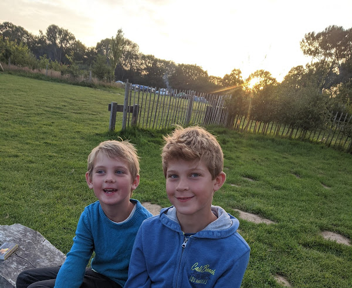
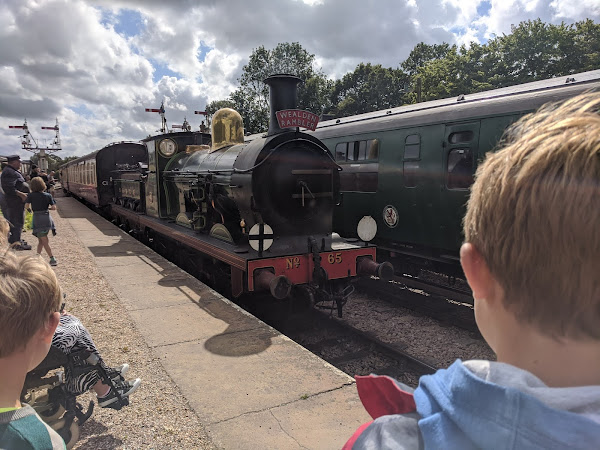
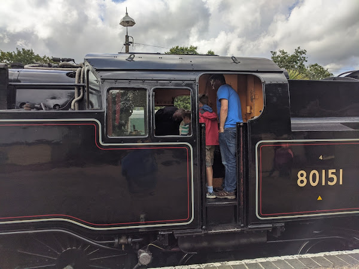

The bodies lay upon the ground in the field. They were dressed colourfully, each kitted out in varieties of neon outfits that shone in the sunshine. "They're very still" I said, by way of summing up the situation. "They all died" said Lisette, who was also taking in the view.

Because I'm a slightly gullible fellow (and, well, you just never know) I watched keenly half wondering if it might be true. They were very still. After a surprisingly long period of time, the figures started to move slowly. It turns out that yoga in a field can, temporarily, be indistinguishable from death.

## Camp Wowo

We were staying at a campsite named Camp Wowo in East Sussex, England. It's a campsite I have stayed at many times over the years. Initially just myself and Lisette. More lately, having got past the initial intensity that results from the arrival of children, we've come to taking our boys to camp together as a family.

It's never been without incident. The first time, one of my brothers melted the trainers I'd come wearing next to the bonfire. This left me hobbling around the campsite in shrunken shoes with brittle laces.

The last time we stayed, a friend was in a car crash which they fortunately walked away from. This time our visit coincided with such strong winds that a gazebo lent to us by some friends was lifted, tent pegs and all, out of the ground and into some nearby woods.

So I've come to the conclusion that there is something implicitly risky about Camp Wowo. Perhaps it's the yurts.

The boys loved camping. And, as a dad, I loved them, loving camping. My eldest boy is highly influenced by the works of Bear Grylls, and would explain at great length the best way to construct a bonfire. To give him his credit, his bonfires were very good. In the evening, after dark, the boys liked to go for "nightwalks" which amounted to rambling in the woods without being able to see, occasionally falling in streams. I couldn't quite see the joy in it myself, but I was clearly the exception.

Myself I found something magical about us waking up in the tent together. Blonde boys with tufty hair, squinting and yawning like baby bears as they opened their eyes for another day of fun. Coming over for cuddles before the day fully kicked into gear.

## A trip to the past

One of the attractions of Wowo is the Bluebell Railway. The Bluebell Railway is what's known as a "heritage line", the trains that run are all historic, and mostly steam engine powered. The boys like trains generally. Steam trains are, naturally, even more exciting. The combination of them being from times gone past, incredibly powerful and noisy, as well as being dangerous, makes them thrilling. They're like dinosaurs that aren’t quite extinct. The Bluebell Railway is Jurassic Park.

So a trip to Camp Wowo would be incomplete without a trip on the Bluebell Railway. Sadly the last time we were here, it was fairly early into the COVID 19 pandemic and the Bluebell Railway was closed. The line is mostly staffed by retired volunteers. Given that this demographic was considered high risk, it was unsurprising to discover that the line was out of action for a while.

But this year it was back up and running and we found ourselves at the ticket office happily purchasing a family return to East Grinstead. It seems to be a general trend that prices have risen now that places are starting to reopen, and the BR was no exception as we parted with £60 for our tickets. Probably lots of places are trying to make back the money they lost whilst they were closed. It's hard to begrudge but also hard on the wallet.

One of the things that is so delightful about heritage lines is that it's not just old trains running. All the stations and staff are decorated and dressed as though it was 1933 or thereabouts. The waiting rooms feature adverts from years ago. For day-trips to Brighton, and for ice creams and cigarettes that no longer exist.

Curiously a number of cigarettes used to rejoice in variations on the name "flake". "Gold Flake" and "Dark Flake" and similar. I grew up in the UK of the 80s and 90s, where every third advert on television was [a woman in a bath eating a chocolate bar named "Cadbury Flake" to the strains of "only the crumbliest, flakiest chocolate, tastes like chocolate never tasted before"](<https://youtu.be/9AATTN5p30A>).

So the idea of a flake being smoked seemed deeply puzzling. I had to keep reminding myself that people would not be eating the cigarettes being advertised. Incidentally, I have vague memories of being able to purchase chocolate cigarettes in the sweet shop when I was very young, which can only have contributed to my confusion. I assume that chocolate cigarettes are no longer being sold. It feels likely that someone at some point will have asked the question "are we sending helpful messages to the children of society by making these?"

We had wondered if the trains would have been forced to make adjustments to cater for the pandemic as many establishments have been. But as we looked around we realised that very little tweaking was probably required. Steam trains and their rolling stock are either entirely open air, or enclosed carriages. "Open-plan" was not a strong design influence in the 30s and 40s. As such, each party could generally find themselves an individual compartment where they were safely isolated from the rest of the passengers.

The Reilly family steamed out of Sheffield Park on the first train of the day. We chugged slowly up to East Grinstead, travelling through Horsted Keynes and Kingscote along the way.

Whilst it's notionally fun to realise you're being conveyed by a steam engine, this high passes quite quickly. A compartment is just a moving box; the steam engine is where the action is. Happily, getting to the action is totally achievable. The engineers that run the train are essentially excited seven year olds in seventy year old bodies. They happily showed off the engine to the awe inspired children gathered around, once we'd pulled into a station. I got to glimpse into the firebox and I have to say it was terrifying. I found myself looking at a large bath of shimmering fiery coal, pushing out a fierce wall of heat. I didn't realise I was scared of baths of fire, but it turns out I really am.

## Mr Ow Much and the steam engine

On that particular day I was wearing my "Mr Ow Much" sweater. It's quite a striking outfit as it features an image of a made-up "Mr Man" character invented for a [song by Ben “ExP” Goodwin](<https://youtu.be/aZuiWGC6Pto?t=12>); a hip-hop artist from West Yorkshire. The Mr Man in question is a character who is the very definition of judicious in his expenditure. Or as he says: "It’s Yorkshire, I'm tight".

As we wandered up the platform at East Grinstead, the stationmaster stopped me and asked me about my sweater. I explained it wasn't a real "Mr Man" and it was from a song. And that I'd got the sweater for being one of the people to crowdfund the album that featured it. The stationmaster nodded and looked slightly thoughtful.

In the pause, we asked him how much it was to get into the steam train museum. Without missing a beat, he said "£30 a head". He then grinned and waited for me to retort "'Ow Much?!"

Tragically it turns out that I'm slow on the uptake and in the awkward silence that ensued he had to explain that this was actually a joke and entrance was included with our train ticket.

I profoundly wish this story had a better ending.

