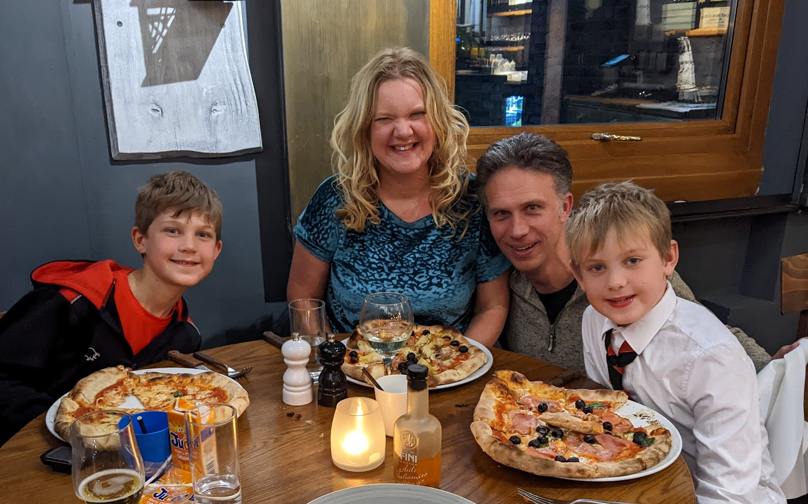

My dear Lisette,

You are an amazing mother to the boys. You might doubt that yourself on occasion, but you most certainly are. Let's take a moment and think about how this is true.

## Providing

Each day you provide food, clothing and bedding for the boys. They don't worry about where their next meal is coming from, they don't worry about whether they'll have clothes. Children shouldn't have to worry about such things, and ours don't. They are relaxed and know these will be taken care of, because of you.

## The Rolling Stones

"You can't always get what you want But if you try sometimes, well, you might find You get what you need"

If you listened to what the boys wanted, they would live very different lives. They don't have phones, they don't watch everything on TV that they'd like, they don't go to bed at 10pm. You're careful to have children that have what they need, but not what they want. If they had what they wanted, they'd be less content than they are.

You've created healthy boundaries which make for happier children. The boys wouldn't thank you for this now, but I will. Thank you.

## Their biggest fan

The boys know that you really dig them. Even if they don't always respond in kind, they know that you think they are *amazing*. This builds quiet confidence in them. It means they don't have doubt about their tremendousness as human beings. They know they are brilliant as they have a cheering section in you. You want to spend time with them, you enjoy their company and believe that the best possible time you could be having is with them.

## Rituals

In your days you've built rituals for them. You start the day with cuddles and stories. We pray as a family before we leave the house and at bedtime. There's showers and stories before bed. All of these build happiness within the boys. Humans like rituals. It's a basic need we have; it centres us and calms us. You've made good rituals for the boys that make them happy and that connect then with God.

You're an amazing mother and your boys are blessed to have you xxx

