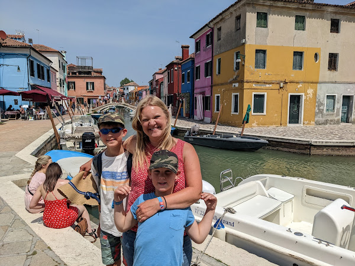
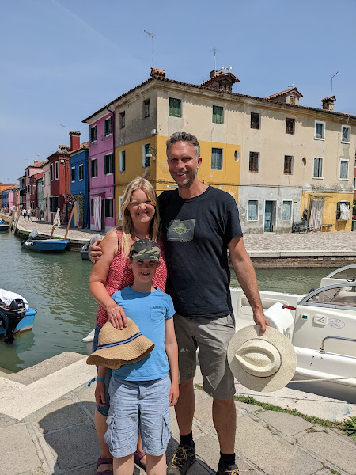
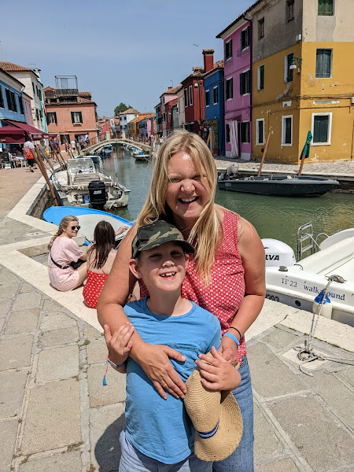
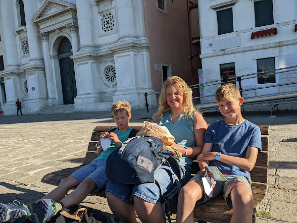

It is June 2022. COVID hove into view back in early 2020 and radically adjusted all our lives. Part of that was the ability (and ease) of travelling abroad. Like so many, the Reilly family were effectively grounded since then. We have made trips, but we never left England.

So when life started to seem less restrictive, we made plans. We found ourselves camping in a place called Cavallino in Italy. It looks on a map, as if it is near Venice. Looks can be deceiving. It turns out Swindon has better travel links to London than Cavallino has to Venice.

However, links it has, and links we have used. You can travel from Cavallino on the bus down to Punta Sabbioni and then switch to a boat for the trip into Venice (or rather "Venezia").

This is the Reilly family on Burano, an island to the north of Venice.

Having left the UK, where pretty much all COVID related mask restrictions were lifted some time ago, it was a surprise to discover that they are still in force in Italy. They're due to be relaxed in a week or so. For now though, bus, boat, plane and train travel requires a mask.

Generally I keep myself to myself whilst travelling. That's only emphasised when travelling abroad as my linguistic abilities beyond my native English are slight. However, as we bussed our way to Cavallino one day I found myself unable to resist the call to right a wrong.

As we swayed around successive roundabouts, gently swinging from handholds, I realised there was a very harassed looking mother and her young daughter in front of me. The mother was clearly tired. She grasped her daughter tightly to stop her from falling over as the bus variously accelerated and decelerated.

Nearby, a Venetian teenager was sat in a four seat space on the bus. He was pointedly not wearing a mask, and had carefully distributed his coat and bag on the seats around him. The lady was demonstrably in need and so I asked him in pidgeon Italian to move his things for the lady and her daughter. Rather than leaping to attention as I'd hoped, he looked at me with disinterest, rolled his eyes and then studiously ignored me.

I was surprised. Why wouldn't he want to help? And given it was clear that he didn't want to help his fellow humans, what to do? What, I asked myself, would Phileas Fogg do?

For those of you unacquainted, Mr Fogg is a fictional character who famously travelled around the world in eighty days. There was a television adaptation of his adventures on the BBC at Christmas. It was a big hit in the Reilly family, meeting each family member in a different way. Lisette remains an ardent fan of David Tennant and so was delighted by his playing the titular role. James was thrilled by the trains in one of the episodes. Benjamin thought the music was "ace". Everyone was happy; I digress....

Phileas would persist, I thought. So I persisted. I'm quite persistent.

After some time the youth was eventually persuaded (with a complete lack of grace) to let the mother and daughter sit. Rarely has a human huffed so much. I was entirely unreasonable, in his view. The Venetian Kevin the Teenager then slumped back in his seat and turned up his stereo in what we'll consider to be a passive aggressive protest against his new neighbours.

All things considered, I was pleased. I remained gently swinging from the handrail as the bus continued rounding roundabouts.

slug: what-would-phileas-fogg-do
---

The campsite we were staying on was named "Camping Village Garden Paradiso". Unlike your most basic of campsites which can be little more than a field with questionable plumbing, CVGP (as no-one called it) was a vast estate. It boasted not only a beach, but a swimming pool with multiple waterslides, a supermarket and a kind of town square complete with shops, restaurants and a stage where nightly shows would be performed. In addition, there was a resident glassblower from Murano who did daily demonstrations of the art of getting glass really hot, and then shaping it into miniature animals and the like. The campsite even had a "feeling spa" where it was possible to have "emotional showers". We never quite plucked up the courage to discover what those were.

Our typical parental standard of "boys in bed by eight" was massively disrupted by the nightly show. Benjamin and James would alternate between watching a multi talented lady named Thea perform on stage and staring glassy eyed at glass getting very hot. Thea, who also lead the swimming pool aqua aerobics in the morning, was a revelation. A one woman Amy Winehouse cover version singer, MC, dancer and director of campsite entertainment. She also appeared to be the doppelganger of a school mum friend Lisette and I knew back in England. Most disconcerting.

The gentle routine of campsite life was disrupted by an unexpected email. Lisette's Uncle Yves had died. Uncle Yves was the older brother of Lisette's mother. He had lived his whole life in Nantes, in Northern France. Unwell for some years; he moved to live in an assisted care home.

As it must for all us in the end, his time here came to an end. He left behind his wife (and Lisette's aunt) Nicole. The email was from Nicole's brother Jean-Yves, and said simply that Yves had died and that the funeral would be on June 7th, the Tuesday upcoming.

James can be a very caring boy. He said "I'm sorry your family dies a lot" and gave Lisette a cuddle. "I'm sorry too" said Lisette. She had sadly lost her mother Annie, Yves little sister, some years earlier. That had been a very difficult time and James remembered the toll it took. It was really touching to see him caring for Lisette.

The holiday then took an unexpected turn. Having previously been quite a relaxing time, it now became akin to a film script. Lisette had to travel from Eastern Italy to Northern France. Not the most straightforward journey at the best of times. This was not the best of times. After the height of the pandemic had kept the majority of people in the same country for some years, there was something of a "great unlocking" taking place. People realised they could travel, and so were travelling. Airlines were struggling to cope with the increase in demand and were cancelling flights.

EasyJet cancelled our flight home from Venice, booking us instead onto a flight that left at 11pm. That wasn't doable for us as all the trains would have stopped running by the time we arrived home. So instead we found ourselves cancelling that flight, finding one from the nearby city of Bologna, and planning to travel down to there to make our flight, trailing cancelled hotel reservations in our wake.

But now, it would be me doing that with the boys alone, as Lisette would be on her own Indiana Jones mission to get to Nantes. A day of travel, made up of multiple flights, boats, buses and taxis, awaited her.

Meanwhile, the Reilly lads would be similarly on our own pilgrimage. Catching the dawn bus along to Punta Sabbioni and clambering aboard a boat bound for St Mark's Square.

We had a final family breakfast together there, munching on rough sandwiches made of the leftover loaves, charcuterie and cheese we had. Then we had to part.

We caught a water taxi to the bus terminal. (Water taxis are \*ridiculously\* scenic by the way - looking out at the beauty that is Venice... Glorious!) We waited there for the number 5 bus to show itself. Then, after many hugs, and with tears, Lisette got onto the bus and disappeared off to the airport.

I won't dwell too much on the next 24 hours. Suffice to say, myself and the boys went to Bologna on the train. We stayed in a charming Air BnB called "Quattro Gatti", or "the 4 cats" hosted by a delightful man named Filippo. But whilst we were in 31 degrees heat, playing ping pong in the garden, Lisette was staying in a featureless hotel overlooking a Lidl. Then attending a funeral and a burial as it rained.

As Lisette reflected later, she was glad to have gone. But she was sad for what she missed too.

I leave you with Benjamin playing a song on the piano at Quattro Gatti. It's a song he's been writing with his friends with the name of "emotional damage". He has a flair for the dramatic, our boy.

<iframe width="560" height="315" src="https://www.youtube.com/embed/0v7mnpvg8Pk" title="YouTube video player" frameBorder="0" allow="accelerometer; autoplay; clipboard-write; encrypted-media; gyroscope; picture-in-picture" allowFullScreen=""></iframe>

