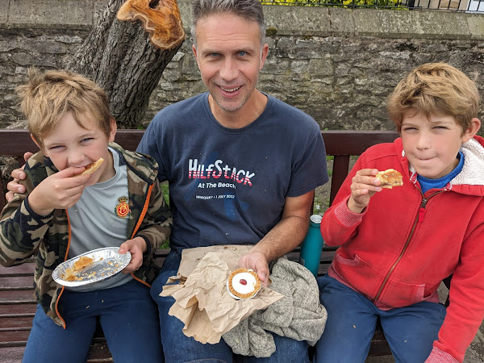
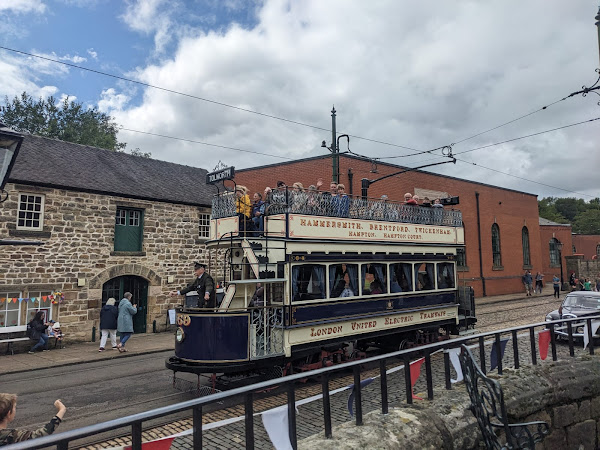
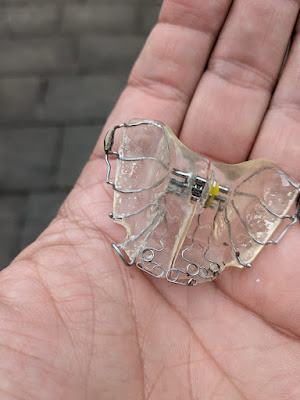

It was the start of the summer holidays. The Reilly family had headed North to the Peak District to go youth hostelling, prior to heading East to Newark for the Focus festival.

A good time had been had by all. We'd been staying in the picturesque and slightly remote village of Hartington. The weather had been typical of British summertime. Which is to say, a combination of not raining whilst looking like it might, actually raining and on occasion, being suspiciously pleasant. One must roll with whatever nature throws at you in this country.

The UK loves a railway. We have many. But we used to have more. Back in the 1960s a man named Dr Beeching wrote an infamous report on the profitability of our forest of railway lines. And as a consequence there was deforestation; many of those railways became ex-railways.

Death can lead to rebirth. Whilst many railways stopped being railways, they left behind them tracks, tunnels and paths that joined up destinations. By and large, these tracks were too small to become roads. So a number became walking paths and cycle tracks. We found a repurposed railway joining Bakewell to near Buxton. And, having rented bikes, rode it from end to end. We whizzed through tunnels, we looked out from viaducts and some of the bolder Reillys even stopped to paddle in chilly waters. There's something remarkably freeing about freewheeling along what used to be a railway station platform, imagining what it would have been like as steam trains whooshed into it a hundred years ago.

I mentioned Bakewell. It's a town famous for creating the Bakewell Pudding and the Bakewell Tart. The pudding is undeniably better, but strangely less well known. I blame Mr Kipling. (The cake guy, not the poet )

The Reillys very much like to try local food. Well, perhaps more accurately, we like to eat. Eating local food is as good a reason as any to eat, and if you look at it just right, it almost feels noble. "Support local" and all that. So we stopped in Bakewell, visited the famous pudding shop and purchased a number of puddings and tarts to eat by the river. Wildly unhealthy and delightfully enjoyable. Do we really need vegetables when we're on holiday? No!

Back in Hartington, there was also a possibility to eat some local food. Hartington has a noted cheese shop selling local cheeses. So on the day of our departure from the village, we popped in and Lisette purchased some ginger and mango cheese which she placed in her bag for later.

The plan for the day was to travel to the Crich (pronounced "Cryyy-ch") Tramway Museum. A thing we have learned about our boys, is that they are reliably fascinated by heavy machinery; cars, trains and the like. The tramway museum is exactly what it sounds like. It's a tribute to the age of trams, which has mostly passed in the UK. Buses are just easier to run. But there's a kind of magic around trams, and there's a lot of enthusiastic people who put a lot of energy (and their free time) into keeping the magic alive. Incidentally, there's definitely some kind of Venn diagram of tram enthusiasts and steam train enthusiasts which is almost entirely intersection.

Crich is an unusual place. It's effectively a model village with tracks laid down on the roads to allow trams to rumble back and forth, transporting grinning visitors around. There's old fashioned pubs and tea shops in the village and warehouses full of trams through the ages, telling the story of a now mostly sunsetted form of public transport. The boys loved it. They loved getting their tickets stamped. They loved waving at trams as they went past and waving to people on the street as they sat on the top deck of a tram trundling up the street.

The day was beginning to draw to a close. Before we departed, Lisette remembered she had the cheese in her bag. Knowing that cheese doesn't survive long outside of a fridge, we decided to consume it there and then.

Our eight year old currently has a brace in his mouth. Well I say a brace. I think technically it's an orthodontic plate. But that's a bit of a mouthful. (Pun not actually intended, but let's appreciate the accidental glory of it for a moment.) Anyway, expensive wire and plastic, intended to push his top teeth forward so they don't sit behind his bottom teeth. I had the same thing when I was his age, although funded by the NHS in my case.

It's the sort of brace, or plate rather, that has to be removed when eating. So James prepared himself for consumption and Lisette dug through the bag. Finally she unearthed the ginger and mango cheese and the Reilly family sat around a wall next to where the trams trundled past and chowed cheese.

We needed to get on the road to Focus where we'd be camping. We were just over an hour away from Newark. We packed up Grandma Ann's car, which she'd kindly leant to the Twickenham Reillys, and started travelling. Time passed, different family members drifting off to sleep and then waking up as we accelerated and decelerated. A terrible thing had happened, but as yet no-one in the car had realised it.

We rolled into Newark about 5pm, prepared to start putting up our tent and see our friends. It was at this moment that the most unwelcome sentence rung out in the car: "where's my brace?"

It was James. Having checked around the car, it became apparent that the brace wasn't present. After we got through the bitter recriminations and false accusations around who had had it most recently, we got into the fun memory game "where did you see it last?" A high stakes game with an unsatisfactory conclusion given you're never really too sure if you've landed on the right answer. It emerged that James last recalled taking it out of his mouth so he could eat cheese and resting it on the wall. I might add, this was a highly expensive piece of bespoke dental equipment. We'd blinked heavily when we paid the bill for it.

Lisette phoned the tramway museum, no-one picked up. It seemed there was nothing to be done. Just carry on. I am, in all honesty, not that great at "just carrying on". At least not when it comes to large sums of money being left on walls. It's one of my flaws.

So here I was at Focus, a Christian festival where people come hoping to connect with God and spend time enjoying the company of their friends and fellow believers. Whilst everyone around me seemed to be doing reasonably well at these noble goals, I was not. I burned with inner fury and frustration.

I'm not a good concealer of my emotions and so when people asked me how I was, I was honest. Pretty grumpy. I spoke to friends older and wiser than me, who reminded me that whilst it was indeed a lamentable situation, James was still happy and well. That mattered a great deal more. They were right. I knew they were right. But I struggled to get to actually feeling that way. I would in time. But I wasn't there then.

I am a prayer, and I often pray for important things. Really I do. For people who are suffering, for situations that are difficult. For things that really matter. At this moment, my prayers turned to a topic that was smaller and certainly self serving. I prayed for safe recovery of my boy's brace. And I encouraged the Christians around me to do likewise. If you ask a Christian to pray for you they kind of have to otherwise it would look terribly bad.

That night I slept badly and woke early. Partly that was down to sleeping in a tent next to a busy road. Partly it was down, no doubt, to the brace situation. I awoke with a plan. I believe in praying, but I also believe in meeting God halfway. If I was going to see the brace again, I figured I would increase my odds if I went to where it might be. In addition, I've found in life, that it's worth knowing yourself. I am incapable of "being". I have to "do". Sitting and waiting was incomprehensible to me. So I got in the car.

I drove for just over an hour, whizzing back from Newark towards the Peak District again. Rumbling into the carpark of the tramway museum before it opened, I took myself to the very much closed door and knocked.

"Excuse me, is anyone there?" A woman opened the door, suspicious of the interloper. I explained the situation, and after looking at me carefully and weighing me up, the lady opened the door and walked me down to the wall in the tramway museum; the cheese eating site. I looked around. I looked along the wall. I walked in ever expanding circles around the wall. Nothing. No brace. The museum lady went to check lost property. Nothing. I looked in the plant pots near the wall, hoping it had fallen in. Again, nothing.

I was done. I hadn't expected to find it. I hadn't found it. I had tried, and I was pleased about that. Not as pleased as if I'd found it. But I thought I'd done what I ought to, given the circumstances. I disagree with Yoda on this. There actually is try.

It was time to go back to Focus. I leaned against the wall, sighed and looked down. Staring back at me was that beautiful, revolting thing: my boy's brace.

Victory! Never has a hideous lump of wire and plastic seemed so glorious.

