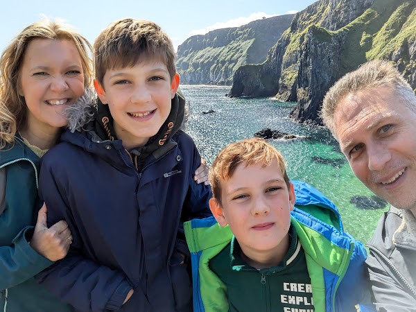

Working out where to go on holiday has always seemed like slightly hard work. How do you choose? Do we go to Italy? We've been before. Do we go to France? They'll only want us to wear Speedos at the swimming pool. So where shall we go?

We were delighted when we discovered a friend in Belfast, who had recently had a baby, would be up for a visit. A mutual friend of ours, was also planning a trip back to Ireland from where he lives. We've known each other for 25 years now, and have travelled before as a group. Why not get the band back together and spend some time in Ireland this summer? That was the thought, and so the Reilly family made plans.

Passage was booked on the Liverpool to Belfast ferry. Grandma Reilly kindly leant her car to the Twickenham Reillys, so that myself, Lisette and the boys could roll Northwards and over the Irish Sea to Ireland.

We were leaving an English summer that was that rarest of things: warm and sunny. The week before we'd left, Twickenham had been basking in temperatures of 31 degrees Celsius, and I'd been busy watering the lawn, for fear of the grass going brown. Ireland is known for having weather that's a little... less generous. Or, as one of my brothers had been known to say, "Remember there's a reason most Irish don't live in Ireland".

But it's not so far from England to Ireland. If you look at the globe, Britain is pretty close physically. How different could the weather really be? In my mind, I thought "maybe we'll drop five degrees - that's still pretty good!"

But somehow, in the time from leaving the M25 behind us, boarding the ferry in Liverpool, going to sleep and waking up in Belfast, we'd dropped from a sunny 31 degrees to a rainy 17 degrees. Baffled but optimistic, the Reilly family began their holiday.

---

The plan was a holiday of two halves. After popping in to meet our friend Una and the baby in Belfast, we'd head North to base ourselves in Portrush and tour around the top of Ireland for three days. Then we'd head down to Enniskillen and stay in a big house on Lough Erne with Una, Kelvin, the baby plus our other friend Conor and his boys.

We found ourselves roaming around and visiting sites like the Giant's Causeway (or as we came to think of them: the tremendous volcanic hexagons). We stopped the car at the side of the road when we saw people pointing out at the water, and got to see a pod of dolphins playing in the water. We headed to the Carrick-a-Rede rope bridge that allows you to sway over to a island covered in birds, which looks out towards the Scottish island of the Mull of Kintyre. I hadn't realised just how close to Scotland, Ireland is.

---

There's something inherently exciting about a boat trip. I have always loved the notion of getting away on the water. I would have made a great pirate. We discovered there's an island to the North of Ballycastle named Rathlin Island. It's a place to see puffins and to walk. It sits only 11 miles from the Scottish island of the Mull of Kintyre.

The closeness to Scotland has meant that both Scotland and Ireland have laid claim to the island over the years. Robert the Bruce hid out there at some point apparently.

You will remember the legend that St. Patrick banished all the snakes from Ireland. Inspired by this, in 1617 the disputing folks in charge used the snake story as a guide to determine belonging. They freed a snake on the island. If it lived, Rathlin was Scots, if it died, Irish. It died.

We discovered a boat would take us over. We booked a trip out from Ballycastle at 10am and a trip back on the 3pm. Demand was high and the boat entirely sold out after we booked our tickets. We were wary of seasickness after a recent traumatic crossing to Jersey, when the boat had heaved up and down, and passengers that had eaten a full English breakfast lived to heartily regret it. That trip has entered Reilly family folklore as "the time when daddy swore". I had, in my defence, had the fullest of full Englishes that morning.

But whilst the fifty minute trip to Rathlin was boisterous, it wasn't too excessive. Once we hit shore, our plan was to:

- hike west
- feel righteous
- see puffins.

<!-- -->

Rathlin, it turns out, has more up and down than you might expect. We set out on the hike imagining we'd be there and back in no time. But it became clear quickly that progress would be slow. By the time we'd got to the top of the first hill we were heaving and puffing. Puffing for puffins.

We pushed on, following the road as it weaved westward. Every now and then the "puffin bus" would ease past us and we'd have an image of rather more leisurely tourists gazing out of the window at the scenery as they were transported up hill and down dale. To our surprise, the landscape featured a good number of old abandoned cars. Presumably, if a car breaks down, it's pretty difficult to get it back up the road and onto the boat to Ireland. So instead, vehicles are left to moulder when they break.

People often say of English weather, that you can have four seasons in a day. Ireland is that premise on steroids. It's entirely possible to experience four seasons in ten minutes. And two of them may well be winter. As we tramped westwards we would take off our jackets and jumpers as we got hot, then put on the jumpers as the wind picked up, then put the coats on and hoods up as the rain kicked in. Then we'd do it all over again.

That level of variety in the weather is pretty tedious to my mind. But it did make me ponder what the consequences of living in that sort of weather perpetually might be. Irish people are, on average, far friendlier than English. Of course that's subjective, but I still think it's pretty accurate. I had more casual chats with folk in an afternoon in Ireland than in a month in London. Stereotype it may be, but it doesn't mean it isn't true.

In the end, we reached the bird centre on the west of the island. By the time we got there it was heading for two o'clock and it was apparent that we wouldn't be able to walk back to the boat on time. No problem, we thought, we can catch the bus back. I approached the driver who had just arrived and asked him if we could buy tickets to get back to the boat. "Well now", said the driver, "I'm not sure if there's space, but be ye here in an hour and we'll find out!" He seemed very upbeat in his response, but as I parsed his meaning I thought I'd better seek clarification. "So Francis" (someone had told me his name was Francis) "does that mean we might not get back for the boat?" Francis considered for a while and responded "hmmmm.. well be ye here in an hour and we'll see what happens!"

This didn't seem like commitment to me, but after a while I concluded that commitment wasn't on offer. Given that Francis had given us an opportunity, at the least, we decided the best we could do was take it. There followed an hour where we sought to see puffins through binoculars, and possibly did, but they flew past so quickly it was hard to appreciate the experience a great deal. Also, when the possibility of potential drama is present, it's a little tricky to experience the moment. Certainly Benjamin, our oldest, was demonstrating that he'd inherited his father's desire that things go according to plan, and attendant anxiety when they do not, or threaten not too.

Ben ran up and down at the bus stop wailing "we're totally screwed..…" This did not aid his father's anxiety one jot. By the time Francis swung round the corner in the bus, the Reilly family had entered a state of hypertension. The bus loaded up, and was full before the Reillys could board. All seemed lost, and Francis could see the crestfallen expression on our faces.

"We'll find a way" he said. And after a certain amount of negotiation, we found ourselves on board, with various Reillys sat on one another and sharing seats. I found myself sat on the floor of the bus, surrounded by legs, but entirely grateful to be on the vehicle. It started swaying its way back to the boat. Every now and then Francis would pause the bus to tell a story, point out where a viking was buried, where Robert the Bruce may have hidden and draw everyone's attention to a seal frolicking in the sea. I saw none of this, from my vantage point on the floor.

This was fine. We were going to make it back to Ireland, unlike all those abandoned cars. That was all I needed to know.

